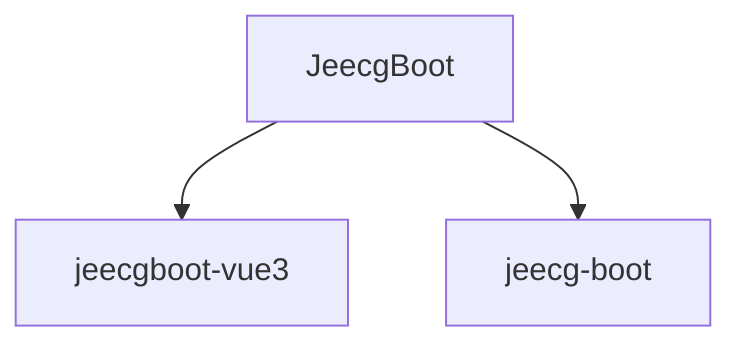

# 基础信息

|      |      |
|------|------|
| 名称 | JeecgBoot |
| 编码语言 | .java |
| 代码路径 | JeecgBoot |
| 概述说明 | JeecgBoot核心模块涵盖工具类、功能组件和业务逻辑，支持安全过滤、日期处理、数据加密、SQL解析、动态数据库、文件操作、短信发送、反射、日志、Token管理、应用上下文、常量、Elasticsearch集成、数据传输、异常处理、敏感数据、切面编程等，确保系统安全、灵活、高效。 |

# 说明

## 概述

该代码模块是JeecgBoot项目的核心部分，包含多个子模块，涵盖了从基础工具类到复杂业务场景的广泛功能。主要包括`jeecg-boot-base-core`、`jeecg-module-demo`和`jeecg-module-system`三个模块。这些模块提供了丰富的工具类、功能组件和业务处理逻辑，涵盖了字符串和文件的安全过滤、日期时间处理、数据加密、SQL解析、动态数据库管理、文件操作、短信发送、反射操作、浏览器检测、日志管理、Token管理、应用上下文管理、常量管理、Elasticsearch集成、数据传输与业务处理、异常处理、敏感数据处理、切面编程等多个方面。模块通过多种机制确保系统的安全性、灵活性和高效性，适用于复杂的业务场景和多样化的开发需求。

## 主要业务场景

1. **字符串和文件安全过滤**：
   - 防止字符串注入攻击和恶意文件上传，适用于表单提交、API请求、文件上传和下载操作。

2. **日期时间处理**：
   - 提供日期时间的格式化、转换、计算和比较功能，适用于处理日期时间相关需求。

3. **数据加密与安全**：
   - 简化AES加密的配置和使用，防止SQL注入攻击，适用于数据传输和存储的加密保护。

4. **SQL解析与管理**：
   - 解析SQL语句，提取表信息，支持动态生成SQL语句，适用于多表查询和嵌套查询场景。

5. **动态数据库管理**：
   - 识别数据库类型并返回相应的方言信息，支持动态数据源的切换和资源优化，适用于频繁切换数据源的场景。

6. **文件操作与管理**：
   - 支持文件的上传、下载和删除操作，适用于MinIO文件存储管理和多种下载方式。

7. **短信发送与限制**：
   - 提供短信发送功能，限制单一IP地址的短信发送频率，适用于短信发送频率控制。

8. **反射操作与工具类**：
   - 获取和设置对象的属性值，处理Map类型数据，适用于反射机制的核心应用场景。

9. **浏览器检测与日志管理**：
   - 检测浏览器类型、版本、语言及设备类型，保存和生成错误日志，适用于兼容性优化和用户行为分析。

10. **Token管理与应用上下文**：
    - 提取和验证token，获取应用中的Bean实例和处理HTTP请求，适用于用户认证和授权场景。

11. **数据安全与隐私保护**：
    - 拦截敏感SQL查询，提供AES加密、RSA签名和密钥生成功能，适用于数据的安全传输和存储。

12. **常量管理**：
    - 定义和使用常见的符号常量，减少代码中的硬编码，提高代码的可读性和一致性。

13. **Elasticsearch集成与操作**：
    - 灵活构建复杂的查询条件，封装与Elasticsearch交互的核心功能，适用于Elasticsearch数据管理场景。

14. **数据传输与业务处理**：
    - 处理文件上传和下载操作，封装和传递消息及模板信息，记录数据日志，适用于多种数据传输和业务处理场景。

15. **异常处理**：
    - 处理断言相关的异常、401未授权异常、业务逻辑中的错误提示、SQL注入相关的异常，确保系统在遇到异常时能够提供明确的反馈和指导。

16. **敏感数据处理**：
    - 对敏感数据进行脱敏、加密、解密、编码和解码操作，确保数据在存储和传输过程中的安全性。

17. **切面编程**：
    - 自动记录方法的执行时间、请求参数以及用户信息，处理请求路径，通过查询数据权限来验证用户是否有权访问特定资源，确保系统的安全性。

通过这些功能，该模块能够满足复杂业务场景下对安全性、灵活性和高效性的多样化需求，提升系统的整体性能和可维护性。

### 包内部结构视图

该流程图展示了JeecgBoot项目下的两个子模块：jeecgboot-vue3和jeecg-boot。JeecgBoot作为根目录，包含了这两个子模块，分别代表了不同的项目分支或版本。这种结构有助于开发者清晰地理解项目模块之间的层级关系，便于管理和维护。

# 文件列表 File List

| 名称   | 类型  | 说明 |
|-------|------|-------------|
| [jeecg-boot](jeecg-boot.md) | folder | JeecgBoot核心模块涵盖工具类、功能组件和业务逻辑，支持安全过滤、日期处理、数据加密、SQL解析、动态数据库、文件操作、短信发送、反射、日志、Token管理、应用上下文、常量、Elasticsearch集成、数据传输、异常处理、敏感数据、切面编程等，确保系统安全、灵活、高效。 |

