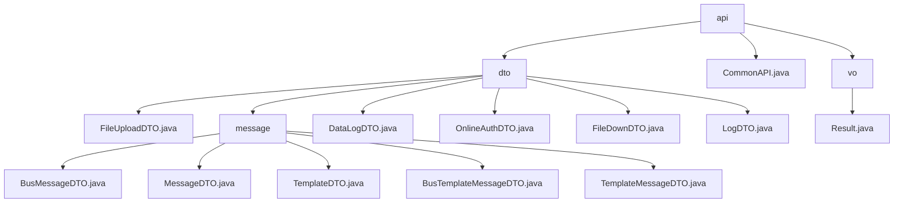

# 基础信息

|      |      |
|------|------|
| 名称 | api |
| 编码语言 | .java |
| 代码路径 | JeecgBoot/jeecg-boot/jeecg-boot-base-core/src/main/java/org/jeecg/common/api |
| 包名 | JeecgBoot.jeecg-boot.jeecg-boot-base-core.src.main.java.org.jeecg.common.api |
| 概述说明 | 多功能数据传输模块，支持文件操作、消息传输、模板管理、日志记录及在线认证。 |

# 说明

## 概述

该代码模块是一个多功能的数据传输和业务处理模块，涵盖了文件上传与下载、消息传输、模板管理、数据日志记录、在线认证以及日志管理等多个功能。模块通过多个数据传输对象（DTO）类来封装和传递不同业务场景下的数据，确保数据的完整性和一致性。核心类包括 `FileUploadDTO`、`FileDownDTO`、`MessageDTO`、`BusMessageDTO`、`TemplateDTO`、`TemplateMessageDTO`、`BusTemplateMessageDTO`、`DataLogDTO`、`OnlineAuthDTO` 和 `LogDTO`，它们分别用于处理文件操作、消息传输、模板管理、数据日志记录、在线认证以及日志管理。此外，`Result` 类用于封装接口返回的信息，提供操作是否成功、描述性信息、状态码、返回数据和时间戳等全面反馈。

## 主要业务场景

1. **文件上传与下载**：
   - `FileUploadDTO` 类用于处理文件上传操作，包含文件内容、上传路径、上传类型和自定义存储桶等属性，确保文件上传的统一管理和处理。
   - `FileDownDTO` 类用于处理文件下载操作，包含文件路径、上传路径、上传类型和HTTP响应对象等属性，确保文件下载功能的顺利实现。

2. **消息传输与模板管理**：
   - `MessageDTO` 类用于封装和传递消息的基本信息，支持邮件推送功能，确保消息能够通过多种渠道传递。
   - `BusMessageDTO` 类继承自 `MessageDTO`，新增了业务类型和业务ID两个属性，用于承载特定的业务信息。
   - `TemplateDTO` 类用于管理模板编码和参数，确保模板对象的完整性和一致性。
   - `TemplateMessageDTO` 类继承自 `TemplateDTO`，进一步扩展了消息相关的属性，支持序列化功能。
   - `BusTemplateMessageDTO` 类继承自 `TemplateMessageDTO`，主要用于处理业务相关的模板消息，新增了业务类型和业务ID两个字段。

3. **数据日志记录**：
   - `DataLogDTO` 类用于记录数据日志，包含表名、数据ID、内容、类型和创建者等字段，支持不同场景下的实例化需求。

4. **在线认证**：
   - `OnlineAuthDTO` 类用于在线认证，包含用户名、可能请求地址、online表单地址和工单地址等属性，支持序列化功能，确保数据在网络传输或存储时的完整性和一致性。

5. **日志管理**：
   - `LogDTO` 类用于记录日志信息，包含日志内容、日志类型、操作类型、用户信息、请求参数、请求路径、请求方法、用户账户信息、租户ID以及终端类型等字段，能够详细描述每一次操作的上下文信息，便于后续的日志分析和问题排查。

6. **接口返回信息封装**：
   - `Result` 类用于封装接口返回的信息，包含成功标志、消息、状态码、返回数据和时间戳等属性，提供接口调用的全面反馈，便于调用者理解和处理返回结果。

这些类共同构成了一个灵活且可扩展的数据传输和业务处理模块，适用于文件操作、消息传输、模板管理、数据日志记录、在线认证以及日志管理等多种业务场景。

### 包内部结构视图

该流程图展示了JeecgBoot项目中`api`模块的层级结构。`api`模块下包含`dto`、`CommonAPI.java`和`vo`三个主要部分。`dto`目录下进一步细分为`message`和其他多个DTO文件，而`vo`目录下则包含`Result.java`文件。该图清晰地反映了项目中的文件组织方式。

# 文件列表 File List

| 名称   | 类型  | 说明 |
|-------|------|-------------|
| [CommonAPI.java](CommonAPI.md) | file | 信息为空，无法生成概要描述。 |
| [vo](vo/_module.md) | package | Result类封装接口返回信息，含成功标志、消息、代码、数据和时间戳。 |
| [dto](dto/_module.md) | package | FileUploadDTO处理文件上传，包含文件、路径、上传类型和存储桶属性。消息传输和模板管理模块通过多个DTO类封装消息信息，支持邮件推送和业务模板处理。DataLogDTO记录数据，包含表名、数据ID、内容、类型和创建者。OnlineAuthDTO支持在线认证，包含用户名、请求地址、表单地址和工单地址。FileDownDTO处理文件下载，包含文件路径、上传路径、上传类型和HTTP响应对象。LogDTO记录日志，包含内容、类型、操作、用户信息等。 |

