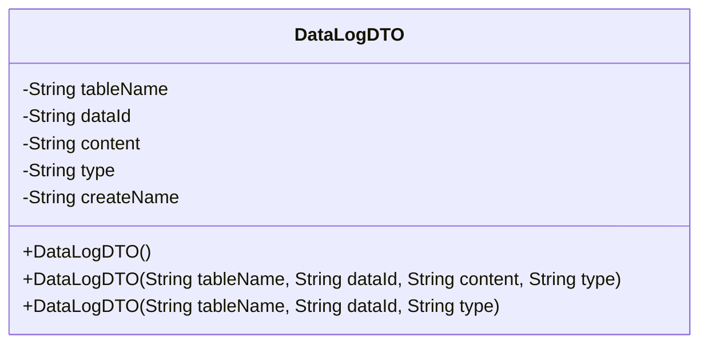
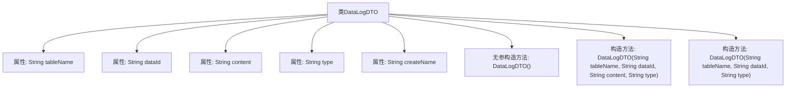

# 基础信息

|      |      |
|------|------|
| 名称 | DataLogDTO |
| 编码语言 | .java |
| 代码路径 | JeecgBoot/jeecg-boot/jeecg-boot-base-core/src/main/java/org/jeecg/common/api/dto/DataLogDTO.java |
| 包名 | org.jeecg.common.api.dto |
| 依赖项 | ['lombok.Data'] |
| 概述说明 | DataLogDTO类含表名、数据ID、内容、类型、创建者，支持多构造函数。 |

# 说明

DataLogDTO类是一个用于记录数据的对象，包含表名、数据ID、内容、类型和创建者五个关键字段。该类提供了多个构造函数，以支持不同场景下的实例化需求。表名字段用于标识数据所属的数据库表，数据ID字段用于唯一标识具体的数据记录，内容字段存储具体的数据信息，类型字段用于分类数据，创建者字段记录数据的创建者信息。通过多个构造函数，可以灵活地初始化DataLogDTO对象，适应不同的数据记录需求。

# 类列表 Class Summary

| 名称   | 类型  | 说明 |
|-------|------|-------------|
| DataLogDTO | class | DataLogDTO类包含表名、数据ID、内容、类型和创建者字段，提供多个构造函数。 |

## 类 DataLogDTO

|      |      |
|------|------|
| 访问范围 | @Data;public |
| 类型 | class |
| 名称 | DataLogDTO |
| 说明 | DataLogDTO类包含表名、数据ID、内容、类型和创建者字段，提供多个构造函数。 |

### UML类图

**描述**：  
`DataLogDTO` 类用于存储数据日志的相关信息，包含表名、数据ID、内容、类型和创建者名称等属性。该类提供了三个构造函数，分别用于不同的初始化场景：无参构造函数、包含表名、数据ID、内容和类型的构造函数，以及包含表名、数据ID和类型的构造函数。这些构造函数使得类在不同场景下能够灵活地初始化对象。

### 内部方法调用关系图

这段代码定义了一个名为 `DataLogDTO` 的类，该类用于存储日志数据。类中包含五个属性：`tableName`、`dataId`、`content`、`type` 和 `createName`，分别表示表名、数据ID、内容、类型和创建者名称。类提供了三个构造方法：一个无参构造方法，用于创建空对象；一个包含四个参数的构造方法，用于初始化 `tableName`、`dataId`、`content` 和 `type`；另一个包含三个参数的构造方法，用于初始化 `tableName`、`dataId` 和 `type`。这些构造方法允许在创建对象时灵活地初始化不同的属性组合。

### 字段列表 Field List

| 名称  | 类型  | 说明 |
|-------|-------|------|
| tableName | String | 私有字符串变量tableName。 |
| createName | String | 定义私有字符串变量createName。 |
| dataId | String | 定义一个私有字符串变量dataId。 |
| type | String | 定义了一个私有的字符串类型变量type。 |
| content | String | 定义了一个私有的字符串类型变量content。 |

### 方法列表 Method List

| 名称  | 类型  | 说明 |
|-------|-------|------|

