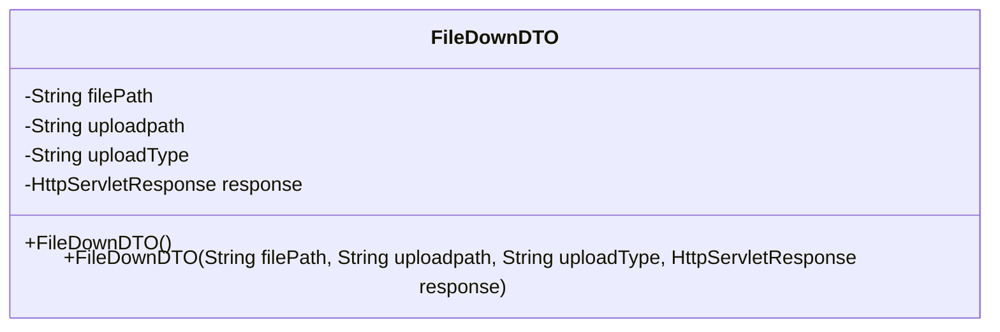
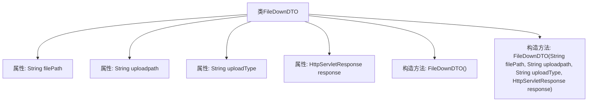

# 基础信息

|      |      |
|------|------|
| 名称 | FileDownDTO |
| 编码语言 | .java |
| 代码路径 | JeecgBoot/jeecg-boot/jeecg-boot-base-core/src/main/java/org/jeecg/common/api/dto/FileDownDTO.java |
| 包名 | org.jeecg.common.api.dto |
| 依赖项 | ['lombok.Data', 'javax.servlet.http.HttpServletResponse', 'java.io.Serializable'] |
| 概述说明 | FileDownDTO类用于文件下载，包含路径、类型和响应对象。 |

# 说明

FileDownDTO类用于处理文件下载操作，主要包含文件路径、上传路径、上传类型和HTTP响应对象等关键属性。文件路径指定了文件的存储位置，上传路径定义了文件上传的目标位置，上传类型标识了文件的格式或类别，而HTTP响应对象则用于管理与下载相关的HTTP响应信息。这些属性共同协作，确保文件下载功能的顺利实现。

# 类列表 Class Summary

| 名称   | 类型  | 说明 |
|-------|------|-------------|
| FileDownDTO | class | FileDownDTO类用于文件下载，包含文件路径、上传路径、上传类型和HTTP响应对象。 |

## 类 FileDownDTO

|      |      |
|------|------|
| 访问范围 | @Data;public |
| 类型 | class |
| 名称 | FileDownDTO |
| 说明 | FileDownDTO类用于文件下载，包含文件路径、上传路径、上传类型和HTTP响应对象。 |

### UML类图

**描述：**  
`FileDownDTO` 类是一个数据传输对象（DTO），用于封装文件下载的相关信息。它包含文件路径、上传路径、上传类型以及HTTP响应对象等私有属性。类提供了两个构造函数，一个无参构造函数和一个全参构造函数，用于初始化这些属性。该类实现了 `Serializable` 接口，表明其实例可以被序列化。

### 内部方法调用关系图

这段代码定义了一个名为 `FileDownDTO` 的类，该类实现了 `Serializable` 接口，表明其实例可以被序列化。类中包含四个私有属性：`filePath`、`uploadpath`、`uploadType` 和 `response`，分别表示文件路径、上传路径、上传类型和HTTP响应对象。类提供了两个构造方法：一个无参构造方法和一个带参构造方法，用于初始化类的属性。该类的设计主要用于文件下载时的数据传输。

### 字段列表 Field List

| 名称  | 类型  | 说明 |
|-------|-------|------|
| uploadpath | String | 定义了一个私有字符串变量uploadpath。 |
| filePath | String | 声明一个私有字符串变量filePath。 |
| serialVersionUID = 6749126258686446019L | long | 定义序列化版本号的静态常量。 |
| uploadType | String | 定义了一个私有字符串变量uploadType。 |
| response | HttpServletResponse | 定义了一个私有的HttpServletResponse类型的响应对象。 |

### 方法列表 Method List

| 名称  | 类型  | 说明 |
|-------|-------|------|

