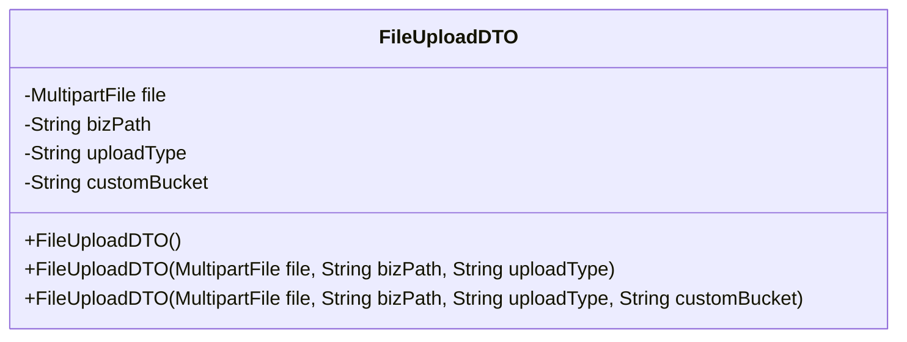
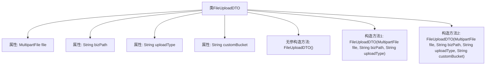

# 基础信息

|      |      |
|------|------|
| 名称 | FileUploadDTO |
| 编码语言 | .java |
| 代码路径 | JeecgBoot/jeecg-boot/jeecg-boot-base-core/src/main/java/org/jeecg/common/api/dto/FileUploadDTO.java |
| 包名 | org.jeecg.common.api.dto |
| 依赖项 | ['lombok.Data', 'org.springframework.web.multipart.MultipartFile', 'java.io.Serializable'] |
| 概述说明 | FileUploadDTO类用于文件上传，包含文件、路径、类型和存储桶属性。 |

# 说明

FileUploadDTO类是一个用于处理文件上传的数据传输对象，主要包含四个关键属性。首先是文件属性，用于存储上传的文件内容。其次是路径属性，指定文件上传的目标路径。第三个是上传类型属性，用于定义文件上传的具体方式或类型。最后是自定义存储桶属性，允许用户指定特定的存储桶来存放上传的文件。这些属性共同构成了一个完整的文件上传数据模型，便于在系统中进行统一管理和处理。

# 类列表 Class Summary

| 名称   | 类型  | 说明 |
|-------|------|-------------|
| FileUploadDTO | class | FileUploadDTO类用于文件上传，包含文件、路径、上传类型和自定义存储桶属性。 |

## 类 FileUploadDTO

|      |      |
|------|------|
| 访问范围 | @Data;public |
| 类型 | class |
| 名称 | FileUploadDTO |
| 说明 | FileUploadDTO类用于文件上传，包含文件、路径、上传类型和自定义存储桶属性。 |

### UML类图

**描述：**  
`FileUploadDTO` 类是一个用于文件上传的数据传输对象（DTO），实现了 `Serializable` 接口以确保对象可以被序列化。该类包含四个私有字段：`file`（上传的文件）、`bizPath`（业务路径）、`uploadType`（上传类型）和 `customBucket`（自定义存储桶）。类中提供了三个构造函数，分别用于不同场景下的文件上传：默认构造函数、简单上传构造函数和带有自定义存储桶的上传构造函数。这些构造函数允许在创建对象时初始化不同的字段组合。

### 内部方法调用关系图

这段代码定义了一个名为 `FileUploadDTO` 的类，用于处理文件上传的数据传输对象。类中包含四个属性：`file`、`bizPath`、`uploadType` 和 `customBucket`，分别表示上传的文件、业务路径、上传类型和自定义存储桶。类提供了三个构造方法：一个无参构造方法和两个有参构造方法，分别用于初始化不同的属性组合。无参构造方法用于默认初始化，而两个有参构造方法分别用于简单上传和带有自定义存储桶的文件上传场景。

### 字段列表 Field List

| 名称  | 类型  | 说明 |
|-------|-------|------|
| bizPath | String | 私有字符串变量bizPath。 |
| customBucket | String | 定义了一个私有的字符串变量customBucket。 |
| uploadType | String | 定义私有字符串变量uploadType。 |
| file | MultipartFile | 定义一个私有MultipartFile类型的文件变量。 |
| serialVersionUID = -4111953058578954386L | long | 定义私有静态常量serialVersionUID，值为-4111953058578954386L。 |

### 方法列表 Method List

| 名称  | 类型  | 说明 |
|-------|-------|------|

