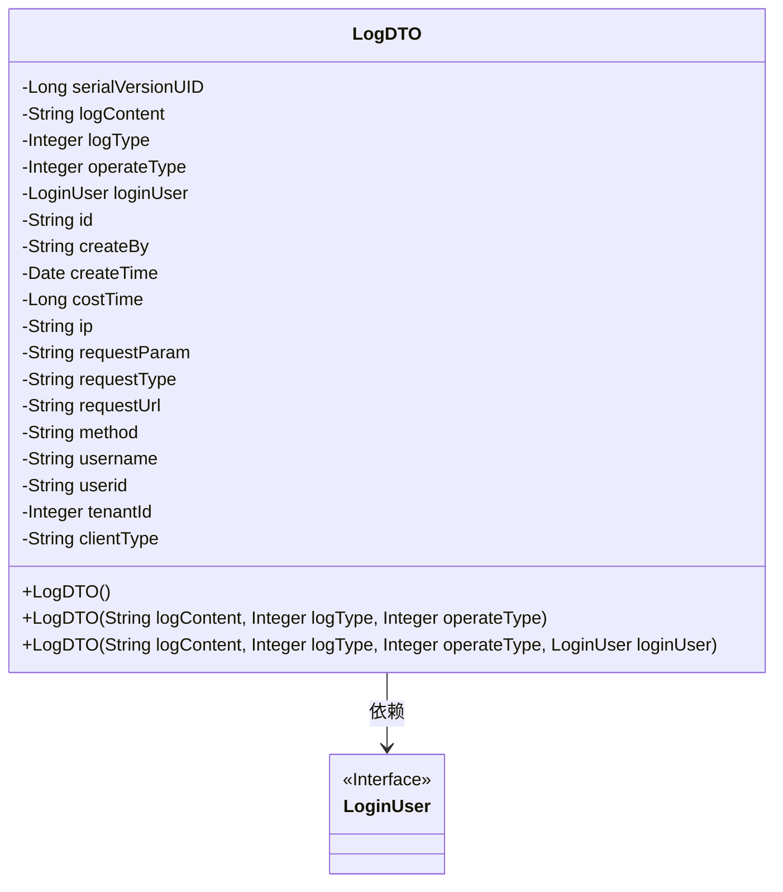

# 基础信息

|      |      |
|------|------|
| 名称 | LogDTO |
| 编码语言 | .java |
| 代码路径 | JeecgBoot/jeecg-boot/jeecg-boot-base-core/src/main/java/org/jeecg/common/api/dto/LogDTO.java |
| 包名 | org.jeecg.common.api.dto |
| 依赖项 | ['lombok.Data', 'org.jeecg.common.aspect.annotation.Dict', 'org.jeecg.common.system.vo.LoginUser', 'java.io.Serializable', 'java.util.Date'] |
| 概述说明 | LogDTO类包含日志内容、类型、操作、用户信息、请求参数等字段。 |

# 说明

LogDTO类是一个用于记录日志信息的实体类，包含了多个关键字段。这些字段包括日志的具体内容、日志类型、操作类型、用户的相关信息、请求的参数、请求的路径、请求的方法、用户账户信息、租户ID以及终端类型。这些字段共同构成了一个全面的日志记录，能够详细描述每一次操作的上下文信息，便于后续的日志分析和问题排查。

# 类列表 Class Summary

| 名称   | 类型  | 说明 |
|-------|------|-------------|
| LogDTO | class | LogDTO类包含日志内容、类型、操作类型、用户信息、请求参数、路径、方法、用户账户、租户ID和终端类型等字段。 |

## 类 LogDTO

|      |      |
|------|------|
| 访问范围 | @Data;public |
| 类型 | class |
| 名称 | LogDTO |
| 说明 | LogDTO类包含日志内容、类型、操作类型、用户信息、请求参数、路径、方法、用户账户、租户ID和终端类型等字段。 |

### UML类图

这段代码定义了一个名为 `LogDTO` 的类，该类实现了 `Serializable` 接口，用于日志数据传输。类中包含多个私有字段，如日志内容、日志类型、操作类型、登录用户信息等，并提供了三个构造函数用于初始化对象。`LogDTO` 类依赖于 `LoginUser` 接口，表示日志中的用户信息。

### 内部方法调用关系图

```mermaid
graph TD
    A["类LogDTO"]
    B["属性: String logContent"]
    C["属性: Integer logType"]
    D["属性: Integer operateType"]
    E["属性: LoginUser loginUser"]
    F["属性: String id"]
    G["属性: String createBy"]
    H["属性: Date createTime"]
    I["属性: Long costTime"]
    J["属性: String ip"]
    K["属性: String requestParam"]
    L["属性: String requestType"]
    M["属性: String requestUrl"]
    N["属性: String method"]
    O["属性: String username"]
    P["属性: String userid"]
    Q["属性: Integer tenantId"]
    R["属性: String clientType"]
    S["构造方法: LogDTO()"]
    T["构造方法: LogDTO(String logContent, Integer logType, Integer operatetype)"]
    U["构造方法: LogDTO(String logContent, Integer logType, Integer operatetype, LoginUser loginUser)"]

    A --> B
    A --> C
    A --> D
    A --> E
    A --> F
    A --> G
    A --> H
    A --> I
    A --> J
    A --> K
    A --> L
    A --> M
    A --> N
    A --> O
    A --> P
    A --> Q
    A --> R
    A --> S
    A --> T
    A --> U
```

该流程图展示了`LogDTO`类的结构和属性，以及其构造方法。`LogDTO`类包含多个属性，如`logContent`、`logType`、`operateType`等，用于记录日志的详细信息。类中还定义了三个构造方法，分别用于初始化不同的属性组合。通过该流程图，可以清晰地看到类的内部结构及其构造方法的调用关系。

### 字段列表 Field List

| 名称  | 类型  | 说明 |
|-------|-------|------|
| serialVersionUID = 8482720462943906924L | long | 定义序列化版本UID为8482720462943906924L。 |
| logContent | String | 日志内容存储变量。 |
| operateType | Integer | 操作类型为私有整型变量。 |
| ip | String | 定义私有字符串变量ip。 |
| requestType | String | 定义私有字符串变量requestType。 |
| clientType | String | 定义私有字符串变量clientType。 |
| username | String | 声明了一个私有字符串类型的用户名变量。 |
| id | String | 定义了一个私有字符串类型的变量id。 |
| createBy | String | 私有字符串变量createBy用于存储创建者信息。 |
| method | String | 定义了一个私有字符串变量`method`。 |
| createTime | Date | 私有日期类型变量createTime。 |
| costTime | Long | 记录耗时信息的长整型变量。 |
| requestParam | String | 定义了一个名为requestParam的私有字符串变量。 |
| loginUser | LoginUser | 声明私有LoginUser类型的loginUser变量。 |
| tenantId | Integer | 定义私有整型变量tenantId。 |
| userid | String | 定义私有字符串变量userid。 |
| logType | Integer | 私有整型变量logType定义日志类型。 |
| requestUrl | String | 定义了私有字符串变量requestUrl。 |

### 方法列表 Method List

| 名称  | 类型  | 说明 |
|-------|-------|------|

