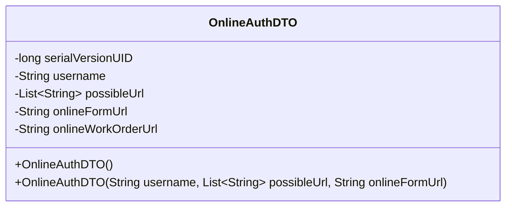
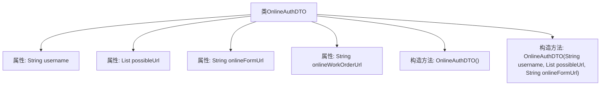

# 基础信息

|      |      |
|------|------|
| 名称 | OnlineAuthDTO |
| 编码语言 | .java |
| 代码路径 | JeecgBoot/jeecg-boot/jeecg-boot-base-core/src/main/java/org/jeecg/common/api/dto/OnlineAuthDTO.java |
| 包名 | org.jeecg.common.api.dto |
| 依赖项 | ['lombok.Data', 'java.io.Serializable', 'java.util.List'] |
| 概述说明 | OnlineAuthDTO类包含用户名、请求地址、表单地址和工单地址，支持序列化。 |

# 说明

OnlineAuthDTO类是一个用于在线认证的数据传输对象，包含四个主要属性：用户名、可能请求地址、online表单地址和工单地址。该类支持序列化功能，确保数据在网络传输或存储时的完整性和一致性。这些属性分别用于标识用户身份、记录可能的请求地址、提供在线表单的访问路径以及关联相关的工单信息，从而全面支持在线认证流程的各个环节。

# 类列表 Class Summary

| 名称   | 类型  | 说明 |
|-------|------|-------------|
| OnlineAuthDTO | class | OnlineAuthDTO类包含用户名、可能请求地址、online表单地址和工单地址，支持序列化。 |

## 类 OnlineAuthDTO

|      |      |
|------|------|
| 访问范围 | @Data;public |
| 类型 | class |
| 名称 | OnlineAuthDTO |
| 说明 | OnlineAuthDTO类包含用户名、可能请求地址、online表单地址和工单地址，支持序列化。 |

### UML类图

类图描述：`OnlineAuthDTO` 类是一个数据传输对象（DTO），用于封装在线认证的相关信息。它包含用户名、可能的请求地址、在线开发菜单地址和在线工单地址等私有属性。类中提供了两个构造函数，一个无参构造函数和一个带参构造函数，用于初始化对象的属性。该类实现了 `Serializable` 接口，表明其实例可以被序列化。

### 内部方法调用关系图

这段代码定义了一个名为 `OnlineAuthDTO` 的类，该类实现了 `Serializable` 接口，表明其实例可以被序列化。类中包含四个属性：`username`、`possibleUrl`、`onlineFormUrl` 和 `onlineWorkOrderUrl`，分别用于存储用户名、可能的请求地址、online开发的菜单地址以及online工单的地址。类中提供了两个构造方法，一个无参构造方法和一个带参构造方法，用于初始化类的实例。这段代码主要用于处理在线认证相关的数据传输。

### 字段列表 Field List

| 名称  | 类型  | 说明 |
|-------|-------|------|
| serialVersionUID = 1771827545416418203L | long | 定义序列化版本号的静态常量。 |
| possibleUrl | List<String> | 私有字符串列表变量possibleUrl |
| onlineWorkOrderUrl | String | 在线工单URL变量声明。 |
| onlineFormUrl | String | 在线表单URL的私有字符串变量。 |
| username | String | 定义私有字符串类型变量username。 |

### 方法列表 Method List

| 名称  | 类型  | 说明 |
|-------|-------|------|

