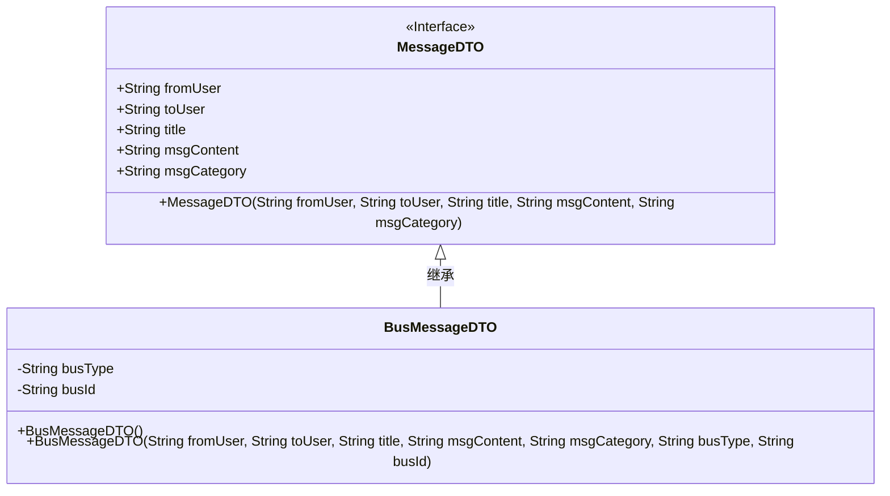
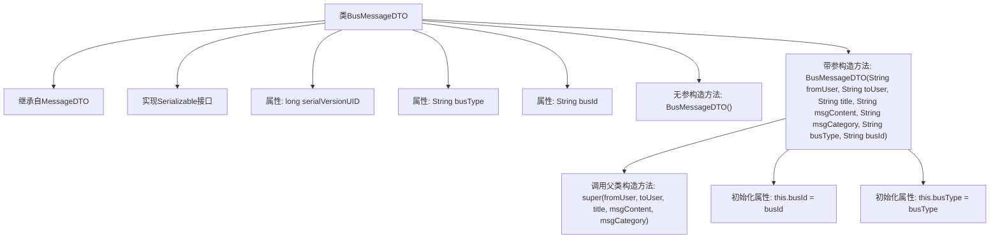

# 基础信息

|      |      |
|------|------|
| 名称 | BusMessageDTO |
| 编码语言 | .java |
| 代码路径 | JeecgBoot/jeecg-boot/jeecg-boot-base-core/src/main/java/org/jeecg/common/api/dto/message/BusMessageDTO.java |
| 包名 | org.jeecg.common.api.dto.message |
| 依赖项 | ['lombok.Data', 'java.io.Serializable'] |
| 概述说明 | BusMessageDTO继承MessageDTO，含业务类型和ID，支持带业务参数的构造函数。 |

# 说明

BusMessageDTO类继承自MessageDTO类，新增了业务类型和业务ID两个属性。该类提供了一个带业务参数的构造函数，用于初始化这些业务相关的属性。这种设计使得BusMessageDTO能够承载特定的业务信息，同时保留了MessageDTO的基础功能。

# 类列表 Class Summary

| 名称   | 类型  | 说明 |
|-------|------|-------------|
| BusMessageDTO | class | BusMessageDTO类继承MessageDTO，包含业务类型和业务ID属性，提供带业务参数的构造函数。 |

## 类 BusMessageDTO

|      |      |
|------|------|
| 访问范围 | @Data;public |
| 类型 | class |
| 名称 | BusMessageDTO |
| 说明 | BusMessageDTO类继承MessageDTO，包含业务类型和业务ID属性，提供带业务参数的构造函数。 |

### UML类图

这段代码描述了一个 `BusMessageDTO` 类，该类继承自 `MessageDTO` 接口。`BusMessageDTO` 类包含两个私有属性 `busType` 和 `busId`，分别表示业务类型和业务ID。该类提供了两个构造函数，一个是无参构造函数，另一个是带参数的构造函数，用于初始化消息的发送者、接收者、标题、内容、类别以及业务类型和业务ID。通过继承 `MessageDTO` 接口，`BusMessageDTO` 类继承了接口中的属性和方法，并在此基础上扩展了业务相关的属性。

### 内部方法调用关系图

这段代码定义了一个名为 `BusMessageDTO` 的类，该类继承自 `MessageDTO` 并实现了 `Serializable` 接口。类中包含两个业务相关的属性 `busType` 和 `busId`，以及一个无参构造方法和一个带参构造方法。带参构造方法在初始化时会调用父类的构造方法，并设置 `busType` 和 `busId` 的值。该类的设计主要用于封装带有业务类型的消息数据。

### 字段列表 Field List

| 名称  | 类型  | 说明 |
|-------|-------|------|
| busType | String | 定义了一个私有的字符串类型变量busType。 |
| busId | String | 定义了一个私有的字符串类型变量busId。 |
| serialVersionUID = 9104793287983367669L | long | 定义了一个私有的静态最终长整型序列化版本UID。 |

### 方法列表 Method List

| 名称  | 类型  | 说明 |
|-------|-------|------|

