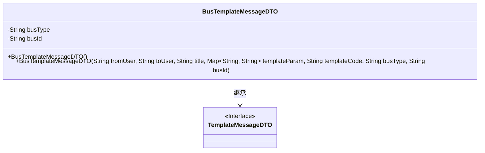
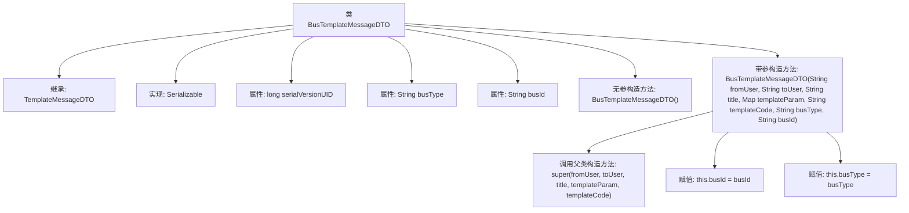

# 基础信息

|      |      |
|------|------|
| 名称 | BusTemplateMessageDTO |
| 编码语言 | .java |
| 代码路径 | JeecgBoot/jeecg-boot/jeecg-boot-base-core/src/main/java/org/jeecg/common/api/dto/message/BusTemplateMessageDTO.java |
| 包名 | org.jeecg.common.api.dto.message |
| 依赖项 | ['lombok.Data', 'java.io.Serializable', 'java.util.Map'] |
| 概述说明 | BusTemplateMessageDTO继承TemplateMessageDTO，含业务类型和ID字段，提供构造方法。 |

# 说明

BusTemplateMessageDTO类继承自TemplateMessageDTO类，主要用于处理业务相关的模板消息。该类包含两个关键字段：业务类型和业务ID，分别用于标识业务的具体类型和唯一标识。为了便于初始化，该类提供了一个构造方法，用于在创建对象时设置业务类型和业务ID的值。通过继承TemplateMessageDTO类，BusTemplateMessageDTO类继承了父类的属性和方法，同时扩展了特定于业务的功能。

# 类列表 Class Summary

| 名称   | 类型  | 说明 |
|-------|------|-------------|
| BusTemplateMessageDTO | class | BusTemplateMessageDTO类继承TemplateMessageDTO，包含业务类型和业务ID字段，提供构造方法。 |

## 类 BusTemplateMessageDTO

|      |      |
|------|------|
| 访问范围 | @Data;public |
| 类型 | class |
| 名称 | BusTemplateMessageDTO |
| 说明 | BusTemplateMessageDTO类继承TemplateMessageDTO，包含业务类型和业务ID字段，提供构造方法。 |

### UML类图

**描述：**  
`BusTemplateMessageDTO` 类继承自 `TemplateMessageDTO` 接口，并实现了 `Serializable` 接口。该类包含两个私有属性 `busType` 和 `busId`，分别表示业务类型和业务ID。类中定义了两个构造函数，一个无参构造函数用于默认初始化，另一个带参构造函数用于初始化父类属性及业务相关属性。该类主要用于封装带有业务参数的模板消息数据。

### 内部方法调用关系图

该流程图描述了`BusTemplateMessageDTO`类的结构及其内部方法调用关系。`BusTemplateMessageDTO`继承自`TemplateMessageDTO`并实现了`Serializable`接口。类中包含两个属性`busType`和`busId`，以及两个构造方法：一个无参构造方法和一个带参构造方法。带参构造方法在初始化时调用父类的构造方法，并对`busType`和`busId`进行赋值。

### 字段列表 Field List

| 名称  | 类型  | 说明 |
|-------|-------|------|
| busId | String | 私有字符串变量 busId 定义。 |
| busType | String | 定义了一个私有字符串类型的变量busType。 |
| serialVersionUID = -4277810906346929459L | long | 定义了一个私有静态常量序列化版本号。 |

### 方法列表 Method List

| 名称  | 类型  | 说明 |
|-------|-------|------|

