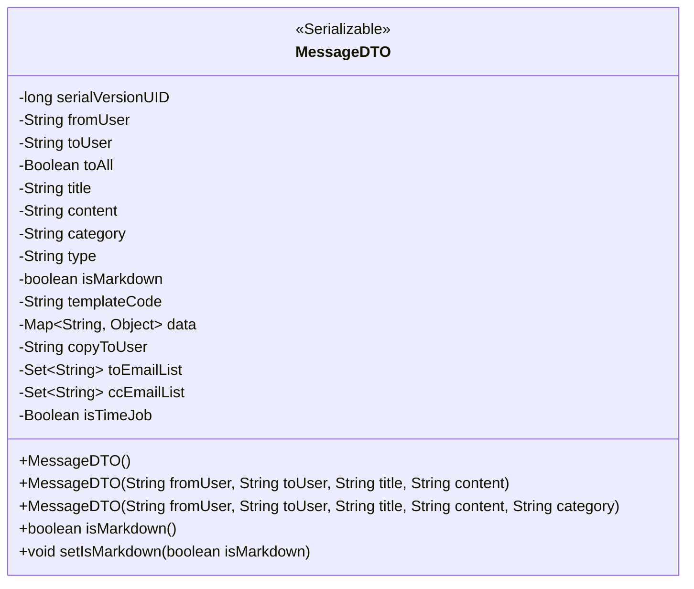

# 基础信息

|      |      |
|------|------|
| 名称 | MessageDTO |
| 编码语言 | .java |
| 代码路径 | JeecgBoot/jeecg-boot/jeecg-boot-base-core/src/main/java/org/jeecg/common/api/dto/message/MessageDTO.java |
| 包名 | org.jeecg.common.api.dto.message |
| 依赖项 | ['lombok.Data', 'org.jeecg.common.constant.CommonConstant', 'java.io.Serializable', 'java.util'] |
| 概述说明 | MessageDTO类用于消息传输，包含发送人、接收人、内容、类型及邮件参数。 |

# 说明

MessageDTO类是一个用于消息传输的数据传输对象，其主要功能是封装和传递消息相关的信息。该类包含多个关键属性，包括消息的发送人、接收人、消息内容以及消息类型。此外，MessageDTO类还支持邮件推送功能，因此还包含与邮件推送相关的参数。通过这些属性，MessageDTO类能够有效地管理和传递消息数据，确保消息在发送和接收过程中的完整性和准确性。

# 类列表 Class Summary

| 名称   | 类型  | 说明 |
|-------|------|-------------|
| MessageDTO | class | MessageDTO类用于消息传输，包含发送人、接收人、消息内容、类型及邮件推送参数。 |

## 类 MessageDTO

|      |      |
|------|------|
| 访问范围 | @Data;public |
| 类型 | class |
| 名称 | MessageDTO |
| 说明 | MessageDTO类用于消息传输，包含发送人、接收人、消息内容、类型及邮件推送参数。 |

### UML类图

**描述：**  
`MessageDTO` 类是一个数据传输对象（DTO），用于封装消息相关的数据。它实现了 `Serializable` 接口，支持序列化。类中包含多个字段，如消息的发送人、接收人、消息主题、内容、类型等。此外，还包含与推送模板和邮件相关的参数。类提供了多个构造器，用于不同场景下的消息初始化，并提供了 `isMarkdown` 和 `setIsMarkdown` 方法用于操作 `isMarkdown` 字段。

### 内部方法调用关系图

```mermaid
graph TD
    A["类MessageDTO"]
    B["属性: String fromUser"]
    C["属性: String toUser"]
    D["属性: Boolean toAll"]
    E["属性: String title"]
    F["属性: String content"]
    G["属性: String category"]
    H["属性: String type"]
    I["属性: boolean isMarkdown"]
    J["属性: String templateCode"]
    K["属性: Map<String, Object> data"]
    L["属性: String copyToUser"]
    M["属性: Set<String> toEmailList"]
    N["属性: Set<String> ccEmailList"]
    O["属性: Boolean isTimeJob"]
    P["默认构造方法: MessageDTO()"]
    Q["构造方法1: MessageDTO(String fromUser, String toUser, String title, String content)"]
    R["构造方法2: MessageDTO(String fromUser, String toUser, String title, String content, String category)"]
    S["方法: boolean isMarkdown()"]
    T["方法: void setIsMarkdown(boolean isMarkdown)"]

    A --> B
    A --> C
    A --> D
    A --> E
    A --> F
    A --> G
    A --> H
    A --> I
    A --> J
    A --> K
    A --> L
    A --> M
    A --> N
    A --> O
    A --> P
    A --> Q
    A --> R
    A --> S
    A --> T
```

该流程图展示了`MessageDTO`类的结构和内部关系。`MessageDTO`类是一个数据传输对象（DTO），用于封装消息相关的数据。类中包含多个属性，如发送人、接收人、消息主题、内容等，以及两个构造方法和两个方法。构造方法用于初始化对象，方法用于获取和设置`isMarkdown`属性的值。流程图清晰地展示了类的属性和方法之间的层级关系。

### 字段列表 Field List

| 名称  | 类型  | 说明 |
|-------|-------|------|
| isMarkdown | boolean | 定义受保护的布尔类型变量isMarkdown。 |
| title | String | 定义一个受保护的字符串类型变量title。 |
| fromUser | String | 定义了一个受保护的字符串变量fromUser。 |
| isTimeJob = false | Boolean | 变量isTimeJob为布尔类型，初始值为false。 |
| templateCode | String | 定义了一个受保护的字符串变量templateCode。 |
| copyToUser | String | 定义私有字符串变量copyToUser。 |
| category | String | 定义了一个受保护的字符串变量`category`。 |
| ccEmailList | Set<String> | 受保护的字符串集合用于存储抄送邮件列表。 |
| toAll | Boolean | 布尔类型变量toAll，用于控制是否应用于所有对象。 |
| toEmailList | Set<String> | 受保护的字符串集合变量toEmailList。 |
| data | Map<String, Object> | 保护类型为Map的data变量，键为String，值为Object。 |
| content | String | 定义了一个受保护的字符串类型变量content。 |
| toUser | String | 定义了一个受保护的字符串变量toUser。 |
| type | String | 定义了一个受保护的字符串类型变量。 |
| serialVersionUID = -5690444483968058442L | long | 定义私有静态长整型常量serialVersionUID，用于序列化版本控制。 |

### 方法列表 Method List

| 名称  | 类型  | 说明 |
|-------|-------|------|
| isMarkdown | boolean | 该方法返回布尔值，表示是否为Markdown格式。 |
| setIsMarkdown | void | 设置是否为Markdown格式的方法。 |

