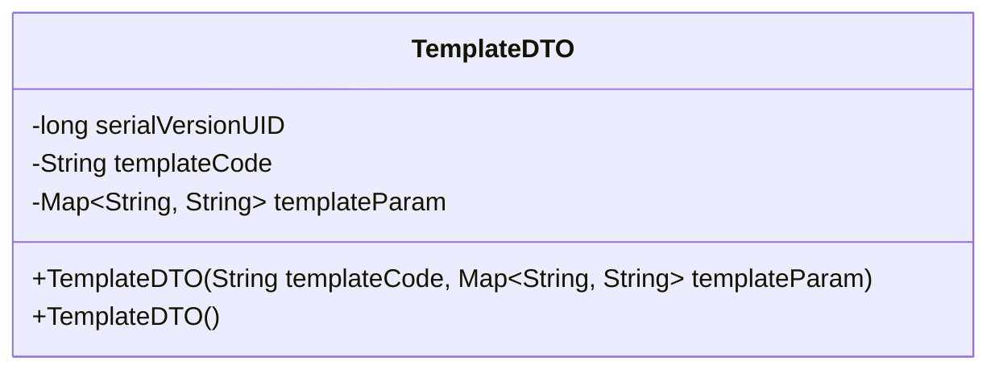
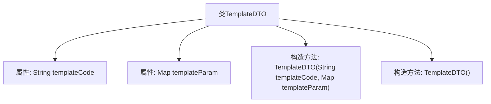

# 基础信息

|      |      |
|------|------|
| 名称 | TemplateDTO |
| 编码语言 | .java |
| 代码路径 | JeecgBoot/jeecg-boot/jeecg-boot-base-core/src/main/java/org/jeecg/common/api/dto/message/TemplateDTO.java |
| 包名 | org.jeecg.common.api.dto.message |
| 依赖项 | ['lombok.Data', 'java.io.Serializable', 'java.util.Map'] |
| 概述说明 | TemplateDTO类含模板编码和参数，支持构造器初始化。 |

# 说明

TemplateDTO类是一个用于管理模板编码和参数的数据传输对象。该类提供了构造器，允许在初始化时直接设置模板编码和参数值。通过这种方式，可以方便地创建和配置模板对象，确保数据的完整性和一致性。

# 类列表 Class Summary

| 名称   | 类型  | 说明 |
|-------|------|-------------|
| TemplateDTO | class | TemplateDTO类包含模板编码和参数，提供构造器初始化。 |

## 类 TemplateDTO

|      |      |
|------|------|
| 访问范围 | @Data;public |
| 类型 | class |
| 名称 | TemplateDTO |
| 说明 | TemplateDTO类包含模板编码和参数，提供构造器初始化。 |

### UML类图

**描述：**  
`TemplateDTO` 类是一个数据传输对象（DTO），实现了 `Serializable` 接口，用于序列化。它包含两个主要属性：`templateCode`（模板编码）和 `templateParam`（模板参数），类型分别为 `String` 和 `Map<String, String>`。类提供了两个构造函数，一个用于初始化模板编码和模板参数，另一个为默认构造函数。该类的主要作用是通过模板编码和参数来获取消息内容。

### 内部方法调用关系图

这段代码定义了一个名为`TemplateDTO`的类，该类实现了`Serializable`接口，表明其实例可以被序列化。类中包含两个属性：`templateCode`和`templateParam`，分别表示模板编码和模板参数。类提供了两个构造方法，一个用于初始化模板编码和模板参数，另一个为默认的无参构造方法。该类的设计主要用于通过设置模板参数和模板编码来获取消息内容。

### 字段列表 Field List

| 名称  | 类型  | 说明 |
|-------|-------|------|
| serialVersionUID = 5848247133907528650L | long | 定义序列化版本UID为5848247133907528650L。 |
| templateCode | String | 定义了一个受保护的字符串变量templateCode。 |
| templateParam | Map<String, String> | 保护模板参数字符串映射。 |

### 方法列表 Method List

| 名称  | 类型  | 说明 |
|-------|-------|------|

