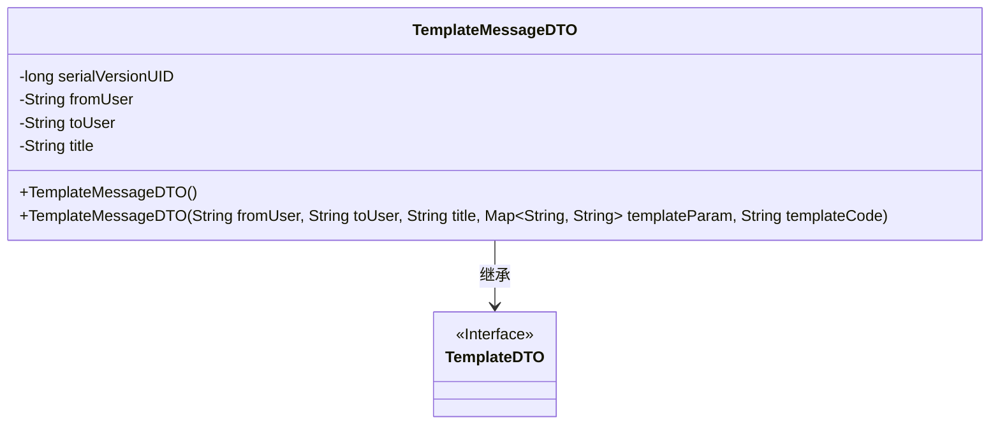
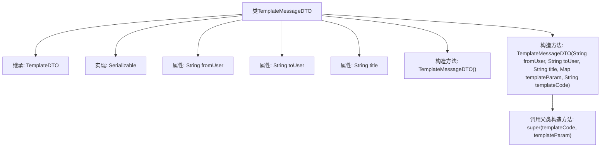

# 基础信息

|      |      |
|------|------|
| 名称 | TemplateMessageDTO |
| 编码语言 | .java |
| 代码路径 | JeecgBoot/jeecg-boot/jeecg-boot-base-core/src/main/java/org/jeecg/common/api/dto/message/TemplateMessageDTO.java |
| 包名 | org.jeecg.common.api.dto.message |
| 依赖项 | ['lombok.Data', 'java.io.Serializable', 'java.util.Map'] |
| 概述说明 | TemplateMessageDTO继承TemplateDTO，包含发送人、接收人、消息主题，支持序列化。 |

# 说明

TemplateMessageDTO类继承自TemplateDTO，主要用于处理消息相关的数据传输。该类包含多个关键属性，如发送人、接收人和消息主题，这些属性用于标识消息的发送者、接收者以及消息的主要内容。此外，TemplateMessageDTO类支持序列化功能，使其能够在网络传输或存储过程中保持数据的完整性和一致性。通过继承TemplateDTO，TemplateMessageDTO类可以复用父类的属性和方法，进一步简化了开发流程。

# 类列表 Class Summary

| 名称   | 类型  | 说明 |
|-------|------|-------------|
| TemplateMessageDTO | class | TemplateMessageDTO类继承TemplateDTO，包含发送人、接收人、消息主题等属性，支持序列化。 |

## 类 TemplateMessageDTO

|      |      |
|------|------|
| 访问范围 | @Data;public |
| 类型 | class |
| 名称 | TemplateMessageDTO |
| 说明 | TemplateMessageDTO类继承TemplateDTO，包含发送人、接收人、消息主题等属性，支持序列化。 |

### UML类图

这段代码定义了一个`TemplateMessageDTO`类，该类继承自`TemplateDTO`接口并实现了`Serializable`接口。`TemplateMessageDTO`类包含三个受保护的字符串类型属性：`fromUser`、`toUser`和`title`，以及一个静态的`serialVersionUID`。类中提供了两个构造函数，一个是默认构造函数，另一个是带有参数的构造函数，用于初始化`fromUser`、`toUser`、`title`以及从父类继承的`templateParam`和`templateCode`。通过继承，`TemplateMessageDTO`类可以使用`TemplateDTO`接口中定义的方法和属性。

### 内部方法调用关系图

这段代码定义了一个名为 `TemplateMessageDTO` 的类，该类继承自 `TemplateDTO` 并实现了 `Serializable` 接口。类中包含三个属性：`fromUser`、`toUser` 和 `title`，分别表示发送人、接收人和消息主题。类中提供了两个构造方法：一个无参构造方法和一个带有多个参数的构造方法，后者在初始化时会调用父类的构造方法。这段代码主要用于处理模板消息的发送，通过构造方法可以方便地初始化消息的各个属性。

### 字段列表 Field List

| 名称  | 类型  | 说明 |
|-------|-------|------|
| fromUser | String | 定义了一个受保护的字符串变量fromUser。 |
| title | String | 定义一个受保护的字符串类型变量title。 |
| toUser | String | 定义了一个受保护的字符串变量toUser。 |
| serialVersionUID = 411137565170647585L | long | 定义了一个私有静态长整型常量serialVersionUID，值为411137565170647585L。 |

### 方法列表 Method List

| 名称  | 类型  | 说明 |
|-------|-------|------|

