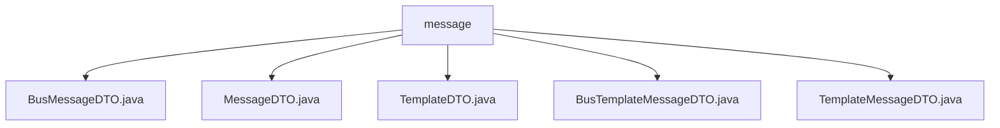

# 基础信息

|      |      |
|------|------|
| 名称 | message |
| 编码语言 | .java |
| 代码路径 | JeecgBoot/jeecg-boot/jeecg-boot-base-core/src/main/java/org/jeecg/common/api/dto/message |
| 包名 | JeecgBoot.jeecg-boot.jeecg-boot-base-core.src.main.java.org.jeecg.common.api.dto.message |
| 概述说明 | BusMessageDTO继承MessageDTO，新增业务类型和ID，支持业务信息传输。 |

# 说明

## 概述

该代码模块主要涉及消息传输和模板管理的功能，通过多个数据传输对象（DTO）类来封装和传递消息相关的信息。这些类通过继承和扩展的方式，逐步增加业务相关的属性，确保消息在发送和接收过程中的完整性和准确性。模块的核心类包括 `MessageDTO`、`BusMessageDTO`、`TemplateDTO`、`TemplateMessageDTO` 和 `BusTemplateMessageDTO`，它们分别用于处理基础消息、业务消息、模板管理以及业务模板消息。

## 主要业务场景

1. **消息传输**：
   - `MessageDTO` 类用于封装和传递消息的基本信息，包括发送人、接收人、消息内容和消息类型。此外，它还支持邮件推送功能，确保消息能够通过多种渠道传递。
   - `BusMessageDTO` 类继承自 `MessageDTO`，新增了业务类型和业务ID两个属性，用于承载特定的业务信息。这种设计使得 `BusMessageDTO` 能够在处理基础消息的同时，支持业务相关的需求。

2. **模板管理**：
   - `TemplateDTO` 类用于管理模板编码和参数，提供了构造器以便在初始化时直接设置模板编码和参数值，确保模板对象的完整性和一致性。
   - `TemplateMessageDTO` 类继承自 `TemplateDTO`，进一步扩展了消息相关的属性，如发送人、接收人和消息主题。该类支持序列化功能，确保数据在网络传输或存储过程中的一致性。

3. **业务模板消息处理**：
   - `BusTemplateMessageDTO` 类继承自 `TemplateMessageDTO`，主要用于处理业务相关的模板消息。它新增了业务类型和业务ID两个字段，用于标识业务的具体类型和唯一标识。通过继承，该类复用父类的属性和方法，同时扩展了特定于业务的功能。

这些类共同构成了一个灵活且可扩展的消息传输和模板管理模块，适用于各种业务场景，如邮件推送、消息通知以及业务模板消息的处理。

### 包内部结构视图

该流程图展示了在`message`文件夹下的多个Java文件之间的层级关系。所有文件都直接位于`message`文件夹下，没有进一步的子文件夹结构。这些文件包括`BusMessageDTO.java`、`MessageDTO.java`、`TemplateDTO.java`、`BusTemplateMessageDTO.java`和`TemplateMessageDTO.java`。

# 文件列表 File List

| 名称   | 类型  | 说明 |
|-------|------|-------------|
| [TemplateMessageDTO.java](TemplateMessageDTO.md) | file | TemplateMessageDTO继承TemplateDTO，包含发送人、接收人、消息主题，支持序列化。 |
| [TemplateDTO.java](TemplateDTO.md) | file | TemplateDTO类含模板编码和参数，支持构造器初始化。 |
| [BusTemplateMessageDTO.java](BusTemplateMessageDTO.md) | file | BusTemplateMessageDTO继承TemplateMessageDTO，含业务类型和ID字段，提供构造方法。 |
| [MessageDTO.java](MessageDTO.md) | file | MessageDTO类用于消息传输，包含发送人、接收人、内容、类型及邮件参数。 |
| [BusMessageDTO.java](BusMessageDTO.md) | file | BusMessageDTO继承MessageDTO，含业务类型和ID，支持带业务参数的构造函数。 |

