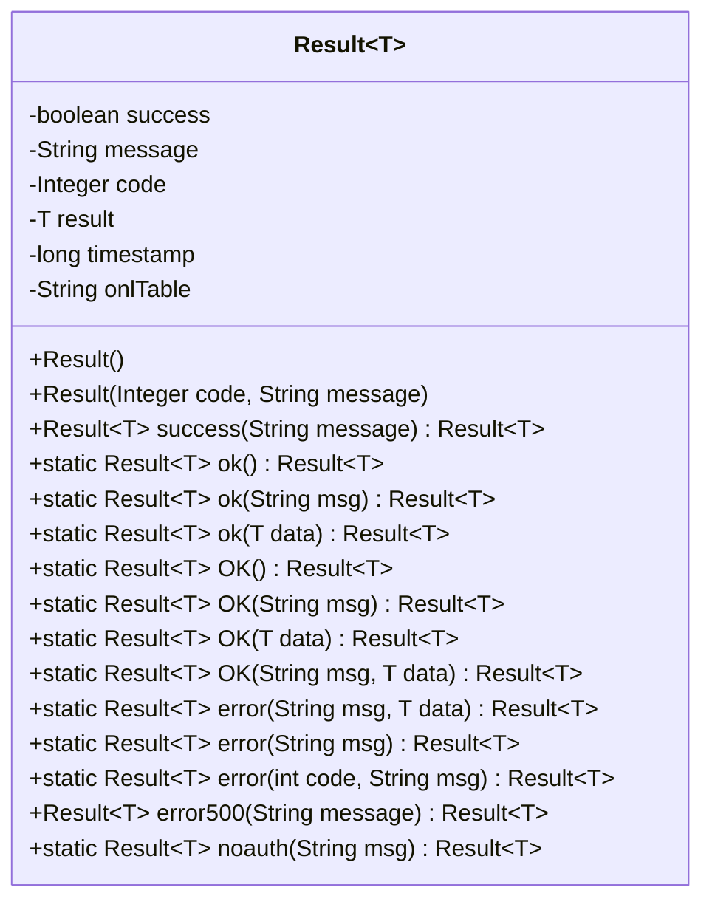

# 基础信息

|      |      |
|------|------|
| 名称 | Result |
| 编码语言 | .java |
| 代码路径 | JeecgBoot/jeecg-boot/jeecg-boot-base-core/src/main/java/org/jeecg/common/api/vo/Result.java |
| 包名 | org.jeecg.common.api.vo |
| 依赖项 | ['com.fasterxml.jackson.annotation.JsonIgnore', 'io.swagger.v3.oas.annotations.media.Schema', 'lombok.Data', 'org.jeecg.common.constant.CommonConstant', 'java.io.Serializable'] |
| 概述说明 | Result类封装接口返回信息，含成功标志、消息、代码、数据和时间戳。 |

# 说明

Result类用于封装接口返回的信息，包含五个主要属性：成功标志用于表示操作是否成功，消息用于传递描述性信息，代码用于标识特定的状态或错误，数据用于存储返回的具体内容，时间戳用于记录操作发生的时间。这些属性共同提供了接口调用的全面反馈，便于调用者理解和处理返回结果。

# 类列表 Class Summary

| 名称   | 类型  | 说明 |
|-------|------|-------------|
| Result | class | Result类封装接口返回信息，包含成功标志、消息、代码、数据和时间戳。 |

## 类 Result

|      |      |
|------|------|
| 访问范围 | @Data;@Schema(description="接口返回对象");public |
| 类型 | class |
| 名称 | Result |
| 说明 | Result类封装接口返回信息，包含成功标志、消息、代码、数据和时间戳。 |

### UML类图

这段代码定义了一个泛型类 `Result<T>`，用于封装接口返回的对象。类中包含了一些标志位（如 `success`、`code`、`message` 等）以及返回的数据对象 `result`。类提供了多个静态方法用于创建不同类型的 `Result` 对象，如成功、错误、无权限等。通过这些方法，可以方便地构建和返回不同状态的响应对象。

### 内部方法调用关系图

```mermaid
graph TD
    A["类Result<T>"]
    B["属性: boolean success"]
    C["属性: String message"]
    D["属性: Integer code"]
    E["属性: T result"]
    F["属性: long timestamp"]
    G["构造方法: Result()"]
    H["构造方法: Result(Integer code, String message)"]
    I["方法: Result<T> success(String message)"]
    J["静态方法: Result<T> ok()"]
    K["静态方法: Result<T> ok(String msg)"]
    L["静态方法: Result<T> ok(T data)"]
    M["静态方法: Result<T> OK()"]
    N["静态方法: Result<T> OK(String msg)"]
    O["静态方法: Result<T> OK(T data)"]
    P["静态方法: Result<T> OK(String msg, T data)"]
    Q["静态方法: Result<T> error(String msg, T data)"]
    R["静态方法: Result<T> error(String msg)"]
    S["静态方法: Result<T> error(int code, String msg)"]
    T["方法: Result<T> error500(String message)"]
    U["静态方法: Result<T> noauth(String msg)"]
    V["属性: String onlTable"]

    A --> B
    A --> C
    A --> D
    A --> E
    A --> F
    A --> G
    A --> H
    A --> I
    A --> J
    A --> K
    A --> L
    A --> M
    A --> N
    A --> O
    A --> P
    A --> Q
    A --> R
    A --> S
    A --> T
    A --> U
    A -.-> V
```

这段代码定义了一个泛型类 `Result<T>`，用于封装接口返回的数据。类中包含多个属性如 `success`、`message`、`code`、`result` 和 `timestamp`，分别表示操作是否成功、返回消息、状态码、返回数据和时间戳。类提供了多个构造方法和静态方法，用于创建不同类型的返回结果，包括成功、错误和无权限访问的情况。代码还包含一个用于兼容升级的 `OK` 方法，以及一个用于处理错误500的方法。

### 字段列表 Field List

| 名称  | 类型  | 说明 |
|-------|-------|------|
| success = true | boolean | 成功标志，默认值为true。 |
| message = "" | String | 返回处理消息的字符串变量。 |
| serialVersionUID = 1L | long | 定义私有静态不可变长整型序列化版本号。 |
| result | T | 返回数据对象存储在result变量中。 |
| timestamp = System.currentTimeMillis() | long | 定义时间戳字段并初始化为当前系统时间。 |
| code = 0 | Integer | 返回代码字段，默认值为0。 |
| onlTable | String | 忽略JSON序列化中的onlTable字段。 |

### 方法列表 Method List

| 名称  | 类型  | 说明 |
|-------|-------|------|
| ok | Result<T> | 静态方法返回成功结果，设置成功标志和状态码200。 |
| ok | Result<T> | 静态方法返回成功结果，包含数据和状态码200。 |
| noauth | Result<T> | 无权限时返回错误结果，包含消息和状态码。 |
| OK | Result<T> | 静态方法OK返回成功结果，包含消息和数据。 |
| OK | Result<T> | 静态方法OK返回成功结果，设置状态码200和消息。 |
| error | Result<T> | 静态方法error返回失败结果，包含错误信息、数据和状态码500。 |
| error500 | Result<T> | 方法error500设置500错误消息，标记失败并返回结果。 |
| error | Result<T> | 静态方法error返回包含错误信息和500状态码的Result对象。 |
| OK | Result<T> | 静态方法OK返回成功Result对象，设置状态为true和代码为200。 |
| ok | Result<T> | 静态方法ok返回成功结果，设置状态码200和消息。 |
| error | Result<T> | 静态方法error返回包含错误代码和消息的失败Result对象。 |
| OK | Result<T> | 静态方法OK返回包含成功状态、200状态码和数据的Result对象。 |
| success | Result<T> | 方法返回成功结果，设置消息、状态码和成功标志。 |

