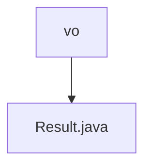

# 基础信息

|      |      |
|------|------|
| 名称 | vo |
| 编码语言 | .java |
| 代码路径 | JeecgBoot/jeecg-boot/jeecg-boot-base-core/src/main/java/org/jeecg/common/api/vo |
| 包名 | JeecgBoot.jeecg-boot.jeecg-boot-base-core.src.main.java.org.jeecg.common.api.vo |
| 概述说明 | Result类封装接口返回信息，含成功标志、消息、代码、数据和时间戳。 |

# 说明

Result类用于封装接口返回的信息，包含五个主要属性：成功标志用于表示操作是否成功，消息用于传递描述性信息，代码用于标识特定的状态或错误，数据用于存储返回的具体内容，时间戳用于记录操作发生的时间。这些属性共同提供了接口调用的全面反馈，便于调用者理解和处理返回结果。

### 包内部结构视图

该流程图展示了路径的层级关系，其中 `vo` 是文件夹节点，`Result.java` 是文件节点。`vo` 文件夹包含 `Result.java` 文件，表示文件位于该文件夹内。这种层级关系清晰简洁，便于理解文件在项目中的位置。

# 文件列表 File List

| 名称   | 类型  | 说明 |
|-------|------|-------------|
| [Result.java](Result.md) | file | Result类封装接口返回信息，含成功标志、消息、代码、数据和时间戳。 |

