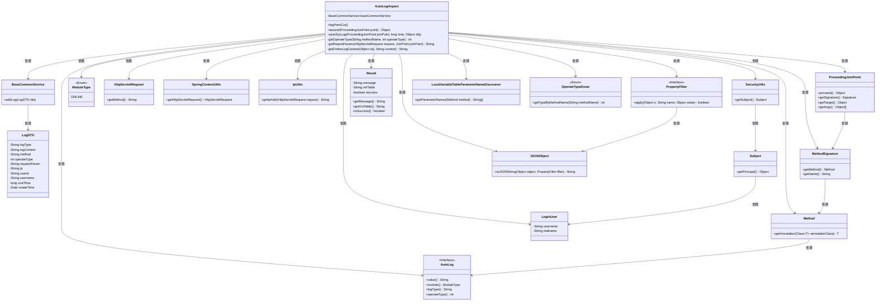
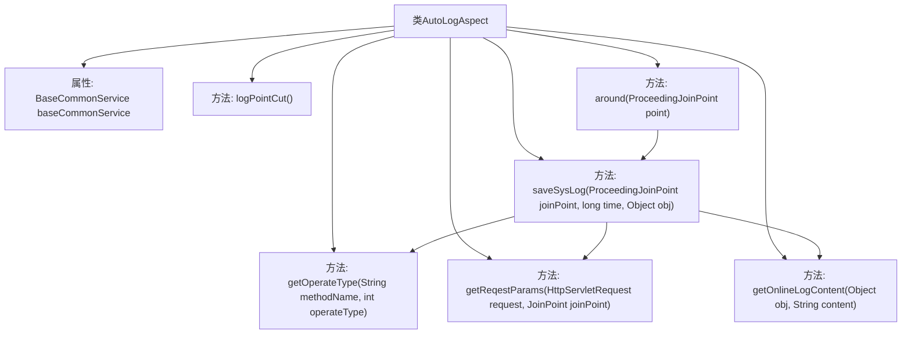

# 基础信息

|      |      |
|------|------|
| 名称 | AutoLogAspect |
| 编码语言 | .java |
| 代码路径 | JeecgBoot/jeecg-boot/jeecg-boot-base-core/src/main/java/org/jeecg/common/aspect/AutoLogAspect.java |
| 包名 | org.jeecg.common.aspect |
| 依赖项 | ['com.alibaba.fastjson.JSONObject', 'com.alibaba.fastjson.serializer.PropertyFilter', 'org.apache.shiro.SecurityUtils', 'org.aspectj.lang.JoinPoint', 'org.aspectj.lang.ProceedingJoinPoint', 'org.aspectj.lang.annotation.Around', 'org.aspectj.lang.annotation.Aspect', 'org.aspectj.lang.annotation.Pointcut', 'org.aspectj.lang.reflect.MethodSignature', 'org.jeecg.common.api.dto.LogDTO', 'org.jeecg.common.api.vo.Result', 'org.jeecg.common.aspect.annotation.AutoLog', 'org.jeecg.common.constant.CommonConstant', 'org.jeecg.common.constant.enums.ModuleType', 'org.jeecg.common.constant.enums.OperateTypeEnum', 'org.jeecg.modules.base.service.BaseCommonService', 'org.jeecg.common.system.vo.LoginUser', 'org.jeecg.common.util.IpUtils', 'org.jeecg.common.util.SpringContextUtils', 'org.jeecg.common.util.oConvertUtils', 'org.springframework.core.LocalVariableTableParameterNameDiscoverer', 'org.springframework.stereotype.Component', 'org.springframework.validation.BindingResult', 'org.springframework.web.multipart.MultipartFile', 'javax.annotation.Resource', 'javax.servlet.ServletRequest', 'javax.servlet.ServletResponse', 'javax.servlet.http.HttpServletRequest', 'java.lang.reflect.Method', 'java.util.Date'] |
| 概述说明 | AutoLogAspect类使用切面记录方法执行日志，涵盖耗时、请求参数和用户信息。 |

# 说明

AutoLogAspect类通过切面编程技术实现方法执行日志的记录。它能够捕获并记录方法的执行时间、请求参数以及用户信息等关键数据。这种机制有助于开发者监控和调试应用程序，提升系统的可维护性和可追溯性。

# 类列表 Class Summary

| 名称   | 类型  | 说明 |
|-------|------|-------------|
| AutoLogAspect | class | AutoLogAspect类通过切面记录方法执行日志，包括耗时、请求参数、用户信息等。 |

## 类 AutoLogAspect

|      |      |
|------|------|
| 访问范围 | @Aspect;@Component;public |
| 类型 | class |
| 名称 | AutoLogAspect |
| 说明 | AutoLogAspect类通过切面记录方法执行日志，包括耗时、请求参数、用户信息等。 |

### UML类图

这段代码定义了一个`AutoLogAspect`类，它是一个切面类，用于在方法执行前后自动记录日志。`AutoLogAspect`类依赖于多个其他类，如`BaseCommonService`用于保存日志，`ProceedingJoinPoint`用于获取方法执行的上下文信息，`MethodSignature`和`Method`用于获取方法签名和注解信息，`AutoLog`注解用于标记需要记录日志的方法，`HttpServletRequest`用于获取HTTP请求信息，`SpringContextUtils`用于获取Spring上下文，`IpUtils`用于获取IP地址，`SecurityUtils`用于获取用户信息，`LoginUser`表示登录用户，`Result`表示操作结果，`PropertyFilter`用于过滤日志数据，`JSONObject`用于序列化日志数据，`LocalVariableTableParameterNameDiscoverer`用于获取方法参数名，`OperateTypeEnum`用于获取操作类型。通过这些依赖关系，`AutoLogAspect`类能够自动记录方法的执行日志，并将其保存到系统中。

### 内部方法调用关系图

这段代码定义了一个切面类 `AutoLogAspect`，用于在方法执行前后自动记录日志。`logPointCut()` 方法定义了切点，`around()` 方法在切点处执行，记录方法执行时间并调用 `saveSysLog()` 方法保存日志。`saveSysLog()` 方法通过解析方法签名和注解，获取日志内容、请求参数、操作类型等信息，并将日志保存到系统中。`getOperateType()` 方法用于获取操作类型，`getReqestParams()` 方法用于获取请求参数，`getOnlineLogContent()` 方法用于拼接在线日志内容。整个流程通过切面技术实现了日志的自动记录和保存。

### 字段列表 Field List

| 名称  | 类型  | 说明 |
|-------|-------|------|
| baseCommonService | BaseCommonService | 使用@Resource注解注入BaseCommonService实例。 |

### 方法列表 Method List

| 名称  | 类型  | 说明 |
|-------|-------|------|
| around | Object | 环绕通知记录方法执行时间并保存日志。 |
| logPointCut | void | 定义切点，匹配带AutoLog注解的方法。 |
| getReqestParams | String | 根据请求方法获取并处理参数，过滤非序列化对象和长数据。 |
| getOperateType | int | 方法根据operateType判断，大于0则返回，否则通过methodName获取OperateTypeEnum类型。 |
| saveSysLog | void | 方法保存系统日志，包含操作类型、内容、方法名、请求参数、IP、用户信息和耗时。 |
| getOnlineLogContent | String | 方法根据对象类型生成日志内容，包含表名和操作结果信息。 |

