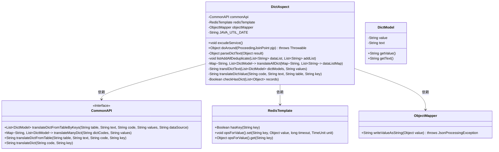
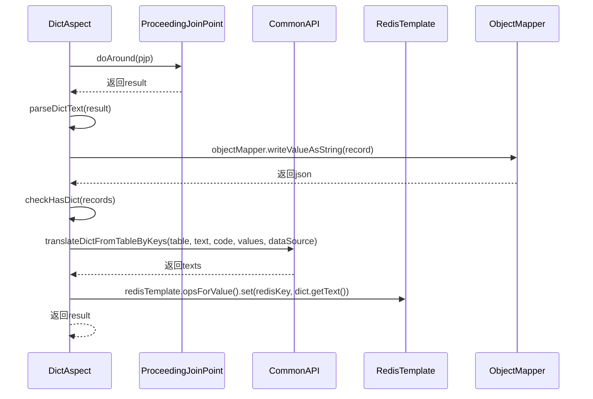

# 基础信息

|      |      |
|------|------|
| 名称 | DictAspect |
| 编码语言 | .java |
| 代码路径 | JeecgBoot/jeecg-boot/jeecg-boot-base-core/src/main/java/org/jeecg/common/aspect/DictAspect.java |
| 包名 | org.jeecg.common.aspect |
| 依赖项 | ['com.alibaba.fastjson.JSON', 'com.alibaba.fastjson.JSONObject', 'com.alibaba.fastjson.parser.Feature', 'com.baomidou.mybatisplus.core.metadata.IPage', 'com.fasterxml.jackson.core.JsonProcessingException', 'com.fasterxml.jackson.databind.ObjectMapper', 'lombok.extern.slf4j.Slf4j', 'org.aspectj.lang.ProceedingJoinPoint', 'org.aspectj.lang.annotation.Around', 'org.aspectj.lang.annotation.Aspect', 'org.aspectj.lang.annotation.Pointcut', 'org.jeecg.common.api.CommonAPI', 'org.jeecg.common.api.vo.Result', 'org.jeecg.common.aspect.annotation.Dict', 'org.jeecg.common.constant.CommonConstant', 'org.jeecg.common.system.vo.DictModel', 'org.jeecg.common.util.oConvertUtils', 'org.springframework.beans.factory.annotation.Autowired', 'org.springframework.context.annotation.Lazy', 'org.springframework.data.redis.core.RedisTemplate', 'org.springframework.stereotype.Component', 'org.springframework.util.StringUtils', 'java.lang.reflect.Field', 'java.util', 'java.util.concurrent.TimeUnit', 'java.util.stream.Collectors'] |
| 概述说明 | Spring框架中DictAspect类通过切面实现字典数据注入，支持单字典和表字典自动翻译，利用Redis缓存优化性能。 |

# 说明

DictAspect类是Spring框架中的一个切面类，主要用于实现字典数据的自动注入。它支持单字典和表字典的自动翻译功能，能够根据配置将字典数据转换为对应的显示值。为了提高性能，该类还集成了Redis缓存机制，通过缓存字典数据来减少数据库查询次数，从而提升系统的响应速度和效率。

# 类列表 Class Summary

| 名称   | 类型  | 说明 |
|-------|------|-------------|
| DictAspect | class | DictAspect类用于在Spring框架中通过切面实现字典数据注入，支持单字典和表字典的自动翻译，并利用Redis缓存优化性能。 |

## 类 DictAspect

|      |      |
|------|------|
| 访问范围 | @Aspect;@Component;@Slf4j;public |
| 类型 | class |
| 名称 | DictAspect |
| 说明 | DictAspect类用于在Spring框架中通过切面实现字典数据注入，支持单字典和表字典的自动翻译，并利用Redis缓存优化性能。 |

### UML类图

**描述：**  
`DictAspect` 是一个切面类，用于在Spring Boot应用中处理字典数据的自动注入。它通过AOP机制拦截Controller层的返回结果，并在结果中自动注入字典文本。`CommonAPI` 是一个接口，提供了从数据库或缓存中获取字典数据的方法。`RedisTemplate` 用于操作Redis缓存，`ObjectMapper` 用于JSON序列化与反序列化。`DictModel` 是一个简单的数据模型类，用于存储字典的值和对应的文本。该切面类通过解析注解、调用翻译方法并将结果注入到返回数据中，实现了字典数据的自动处理。

### 内部方法调用关系图

```mermaid
graph TD
    A["类DictAspect"]
    B["属性: CommonAPI commonApi"]
    C["属性: RedisTemplate redisTemplate"]
    D["属性: ObjectMapper objectMapper"]
    E["属性: String JAVA_UTIL_DATE"]
    F["方法: excudeService()"]
    G["方法: doAround(ProceedingJoinPoint pjp)"]
    H["方法: parseDictText(Object result)"]
    I["方法: listAddAllDeduplicate(List<String> dataList, List<String> addList)"]
    J["方法: translateAllDict(Map<String, List<String>> dataListMap)"]
    K["方法: translDictText(List<DictModel> dictModels, String values)"]
    L["方法: translateDictValue(String code, String text, String table, String key)"]
    M["方法: checkHasDict(List<Object> records)"]

    A --> B
    A --> C
    A --> D
    A --> E
    A --> F
    A --> G
    A --> H
    A --> I
    A --> J
    A --> K
    A --> L
    A --> M
```

**描述：**  
`DictAspect` 类是一个Spring AOP切面，用于在控制器方法执行前后进行字典翻译操作。通过 `@Around` 注解的 `doAround` 方法，捕获控制器方法的执行，并在方法执行后调用 `parseDictText` 方法对返回结果进行字典翻译。`parseDictText` 方法会检查返回结果中的字段是否包含 `@Dict` 注解，并通过 `CommonAPI` 和 `RedisTemplate` 进行字典翻译和缓存处理。最终将翻译后的结果返回给前端，减少前端字典转换的工作量。

### 字段列表 Field List

| 名称  | 类型  | 说明 |
|-------|-------|------|
| commonApi | CommonAPI | 懒加载注入CommonAPI实例。 |
| redisTemplate | RedisTemplate | 自动注入RedisTemplate实例。 |
| objectMapper | ObjectMapper | 自动注入ObjectMapper对象。 |
| JAVA_UTIL_DATE = "java.util.Date" | String | 定义常量JAVA_UTIL_DATE，值为"java.util.Date"。 |

### 方法列表 Method List

| 名称  | 类型  | 说明 |
|-------|-------|------|
| listAddAllDeduplicate | void | 合并去重列表，保留唯一数据。 |
| translDictText | String | 方法将逗号分隔值转换为字典文本并返回结果字符串。 |
| doAround | Object | 环绕通知记录执行时间，解析并注入字典到JSON数据。 |
| parseDictText | Object | 解析字典文本，筛选注解字段，翻译并填充结果。 |
| translateDictValue | String | 废弃方法，通过Redis缓存优化字典翻译性能，减少微服务应用加载缓慢问题。 |
| checkHasDict | Boolean | 检查记录列表是否包含字典注解，存在则返回真。 |
| translateAllDict | Map<String, List<DictModel>> | 方法翻译字典数据，优先从Redis缓存获取，缺失则查询数据库并缓存结果。 |
| excudeService | void | Spring切点定义，匹配RestController、Controller和AutoDict注解的公共方法。 |

