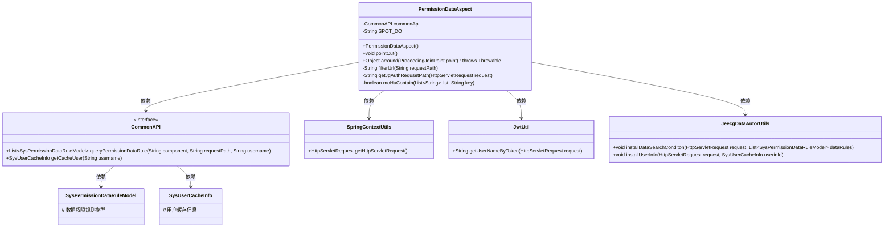

# 基础信息

|      |      |
|------|------|
| 名称 | PermissionDataAspect |
| 编码语言 | .java |
| 代码路径 | JeecgBoot/jeecg-boot/jeecg-boot-base-core/src/main/java/org/jeecg/common/aspect/PermissionDataAspect.java |
| 包名 | org.jeecg.common.aspect |
| 依赖项 | ['lombok.extern.slf4j.Slf4j', 'org.aspectj.lang.ProceedingJoinPoint', 'org.aspectj.lang.annotation.Around', 'org.aspectj.lang.annotation.Aspect', 'org.aspectj.lang.annotation.Pointcut', 'org.aspectj.lang.reflect.MethodSignature', 'org.jeecg.common.api.CommonAPI', 'org.jeecg.common.aspect.annotation.PermissionData', 'org.jeecg.common.constant.CommonConstant', 'org.jeecg.common.constant.SymbolConstant', 'org.jeecg.common.system.query.QueryRuleEnum', 'org.jeecg.common.system.util.JeecgDataAutorUtils', 'org.jeecg.common.system.util.JwtUtil', 'org.jeecg.common.system.vo.SysPermissionDataRuleModel', 'org.jeecg.common.system.vo.SysUserCacheInfo', 'org.jeecg.common.util.SpringContextUtils', 'org.jeecg.common.util.oConvertUtils', 'org.springframework.beans.factory.annotation.Autowired', 'org.springframework.context.annotation.Lazy', 'org.springframework.stereotype.Component', 'javax.servlet.http.HttpServletRequest', 'java.lang.reflect.Method', 'java.util.List'] |
| 概述说明 | 权限切面类处理请求路径，查询数据权限并存储用户信息。 |

# 说明

权限切面类负责处理请求路径，通过查询数据权限来验证用户是否有权访问特定资源。在验证过程中，该类还会存储与用户相关的信息，以便后续操作或权限管理使用。这一过程确保了系统在访问控制上的安全性和准确性。

# 类列表 Class Summary

| 名称   | 类型  | 说明 |
|-------|------|-------------|
| PermissionDataAspect | class | 权限切面类处理请求路径，查询数据权限并存储用户信息。 |

## 类 PermissionDataAspect

|      |      |
|------|------|
| 访问范围 | @Aspect;@Component;@Slf4j;public |
| 类型 | class |
| 名称 | PermissionDataAspect |
| 说明 | 权限切面类处理请求路径，查询数据权限并存储用户信息。 |

### UML类图

**描述：**
`PermissionDataAspect` 是一个切面类，用于处理权限数据的拦截和验证。它依赖于 `CommonAPI` 接口来查询权限规则和获取用户缓存信息，同时使用 `SpringContextUtils` 获取 HTTP 请求对象，并通过 `JwtUtil` 解析用户信息。`JeecgDataAutorUtils` 用于临时存储数据权限条件和用户信息。该切面类通过 `@Around` 注解在方法执行前后进行拦截，确保请求符合权限规则。

### 内部方法调用关系图

```mermaid
graph TD
    A["类PermissionDataAspect"]
    B["属性: CommonAPI commonApi"]
    C["属性: String SPOT_DO"]
    D["方法: pointCut()"]
    E["方法: arround(ProceedingJoinPoint point)"]
    F["方法: filterUrl(String requestPath)"]
    G["方法: getJgAuthRequsetPath(HttpServletRequest request)"]
    H["方法: moHuContain(List<String> list, String key)"]

    A --> B
    A --> C
    A --> D
    A --> E
    A --> F
    A --> G
    A --> H

    E --> E1["获取HttpServletRequest对象"]
    E --> E2["获取MethodSignature对象"]
    E --> E3["获取Method对象"]
    E --> E4["获取PermissionData注解"]
    E --> E5["获取请求路径和请求方法"]
    E --> E6["过滤请求路径"]
    E --> E7["判断是否为online报表请求"]
    E --> E8["获取地址栏参数"]
    E --> E9["记录日志"]
    E --> E10["获取用户名"]
    E --> E11["查询数据权限信息"]
    E --> E12["临时存储数据权限信息"]
    E --> E13["获取用户缓存信息"]
    E --> E14["继续执行原方法"]

    F --> F1["替换反斜杠为斜杠"]
    F --> F2["替换双斜杠为单斜杠"]
    F --> F3["递归过滤URL"]

    G --> G1["获取查询字符串"]
    G --> G2["拼接请求路径和查询字符串"]
    G --> G3["去掉其他参数"]
    G --> G4["去掉项目路径"]
    G --> G5["过滤URL"]

    H --> H1["遍历列表"]
    H --> H2["判断是否包含关键字"]
```

**描述**：该流程图展示了`PermissionDataAspect`类的结构和主要方法调用关系。`PermissionDataAspect`类是一个切面类，用于处理权限数据的拦截和处理。主要方法包括`arround`用于拦截请求并处理权限数据，`filterUrl`用于过滤请求路径，`getJgAuthRequsetPath`用于获取请求地址，`moHuContain`用于模糊匹配。每个方法内部都有详细的步骤，如获取请求对象、过滤路径、查询权限信息等。

### 字段列表 Field List

| 名称  | 类型  | 说明 |
|-------|-------|------|
| commonApi | CommonAPI | 懒加载注入CommonAPI实例。 |
| SPOT_DO = ".do" | String | 私有静态常量字符串SPOT_DO值为".do"。 |

### 方法列表 Method List

| 名称  | 类型  | 说明 |
|-------|-------|------|
| pointCut | void | 定义切点，拦截带有PermissionData注解的方法。 |
| getJgAuthRequsetPath | String | 废弃方法：获取请求路径并过滤多余参数和项目路径。 |
| filterUrl | String | 过滤URL路径，替换反斜杠为斜杠，并去除重复斜杠。 |
| moHuContain | boolean | 废弃方法：模糊匹配列表中是否包含关键字。 |
| arround | Object | 环绕通知处理请求权限，获取请求路径、方法及用户信息，查询并应用数据权限规则。 |

