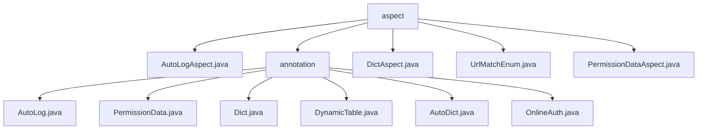

# 基础信息

|      |      |
|------|------|
| 名称 | aspect |
| 编码语言 | .java |
| 代码路径 | JeecgBoot/jeecg-boot/jeecg-boot-base-core/src/main/java/org/jeecg/common/aspect |
| 包名 | JeecgBoot.jeecg-boot.jeecg-boot-base-core.src.main.java.org.jeecg.common.aspect |
| 概述说明 | AutoLogAspect类通过切面编程记录方法执行日志，提升系统可维护性。 |

# 说明

## 概述
该代码模块是JeecgBoot框架的核心部分，主要包含了一系列与切面（Aspect）相关的类。这些类通过切面编程技术实现了自动化日志记录、权限控制、数据字典处理、动态表处理以及在线认证等功能。通过这些功能，开发者可以以声明式的方式简化代码，提高开发效率，并确保系统的安全性和可维护性。

## 主要业务场景
1. **自动化日志记录**：通过`AutoLogAspect`类，系统可以自动记录方法的执行时间、请求参数以及用户信息等关键数据，便于后续的日志分析和问题排查。
2. **权限控制**：`PermissionDataAspect`类负责处理请求路径，通过查询数据权限来验证用户是否有权访问特定资源，确保只有具备相应权限的用户才能访问特定的资源或执行特定的操作。
3. **数据字典处理**：`DictAspect`类实现了字典数据的自动注入，支持单字典和表字典的自动翻译功能，并集成了Redis缓存机制，通过缓存字典数据来减少数据库查询次数，从而提升系统的响应速度和效率。
4. **动态表处理**：`DynamicTable`注解允许在运行时动态切换或处理数据库表，适用于多租户或动态数据源场景。
5. **在线认证**：`OnlineAuth`注解用于实现用户的在线认证功能，确保用户在访问系统资源时处于登录状态。

这些功能共同构成了JeecgBoot框架的基础功能，支持开发者快速构建高效、安全的应用程序。

### 包内部结构视图

该流程图展示了JeecgBoot项目中`aspect`模块的层级结构。`aspect`目录下包含多个Java文件和`annotation`子目录，`annotation`子目录中又包含了多个注解类文件。这些文件和子目录共同构成了`aspect`模块的核心功能，用于处理日志、权限、字典等不同方面的切面逻辑。

# 文件列表 File List

| 名称   | 类型  | 说明 |
|-------|------|-------------|
| [PermissionDataAspect.java](PermissionDataAspect.md) | file | 权限切面类处理请求路径，查询数据权限并存储用户信息。 |
| [UrlMatchEnum.java](UrlMatchEnum.md) | file | 信息为空，无法生成概要描述。 |
| [DictAspect.java](DictAspect.md) | file | Spring框架中DictAspect类通过切面实现字典数据注入，支持单字典和表字典自动翻译，利用Redis缓存优化性能。 |
| [AutoLogAspect.java](AutoLogAspect.md) | file | AutoLogAspect类使用切面记录方法执行日志，涵盖耗时、请求参数和用户信息。 |
| [annotation](annotation/_module.md) | package | 输入内容为空，无法生成总结描述。请提供具体内容。 |

