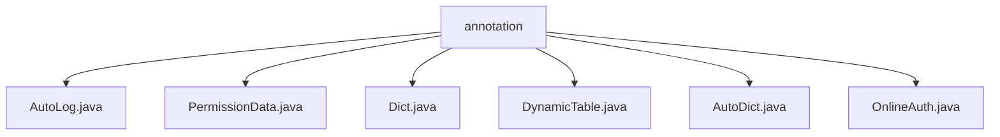

# 基础信息

|      |      |
|------|------|
| 名称 | annotation |
| 编码语言 | .java |
| 代码路径 | JeecgBoot/jeecg-boot/jeecg-boot-base-core/src/main/java/org/jeecg/common/aspect/annotation |
| 包名 | JeecgBoot.jeecg-boot.jeecg-boot-base-core.src.main.java.org.jeecg.common.aspect.annotation |
| 概述说明 | 输入内容为空，无法生成总结描述。请提供具体内容。 |

# 说明

## 概述
该代码模块是JeecgBoot框架的核心部分，主要包含了一系列与切面（Aspect）相关的注解。这些注解用于在业务逻辑中实现自动化日志记录、权限控制、数据字典处理、动态表处理以及在线认证等功能。通过这些注解，开发者可以以声明式的方式简化代码，提高开发效率，并确保系统的安全性和可维护性。

## 主要业务场景
1. **自动化日志记录**：通过`AutoLog`注解，系统可以自动记录方法的调用信息，便于后续的日志分析和问题排查。
2. **权限控制**：`PermissionData`注解用于在方法或类级别上定义权限数据，确保只有具备相应权限的用户才能访问特定的资源或执行特定的操作。
3. **数据字典处理**：`Dict`和`AutoDict`注解用于处理数据字典的映射和转换，简化数据字典的使用和管理。
4. **动态表处理**：`DynamicTable`注解允许在运行时动态切换或处理数据库表，适用于多租户或动态数据源场景。
5. **在线认证**：`OnlineAuth`注解用于实现用户的在线认证功能，确保用户在访问系统资源时处于登录状态。

这些注解共同构成了JeecgBoot框架的基础功能，支持开发者快速构建高效、安全的应用程序。

### 包内部结构视图

该流程图展示了`annotation`文件夹下的多个Java文件，包括`AutoLog.java`、`PermissionData.java`、`Dict.java`、`DynamicTable.java`、`AutoDict.java`和`OnlineAuth.java`。这些文件都位于`annotation`目录下，且没有进一步的子目录层级。

# 文件列表 File List

| 名称   | 类型  | 说明 |
|-------|------|-------------|
| [AutoDict.java](AutoDict.md) | file | 输入内容为空，无法生成概要描述。 |
| [Dict.java](Dict.md) | file | 输入内容为空，请提供具体信息以便生成概要描述。 |
| [AutoLog.java](AutoLog.md) | file | 输入内容为空，无法生成概要描述。 |
| [OnlineAuth.java](OnlineAuth.md) | file | 信息为空，无法生成概要描述。 |
| [DynamicTable.java](DynamicTable.md) | file | 无内容，无法生成概要描述。 |
| [PermissionData.java](PermissionData.md) | file | 无内容可总结。 |

