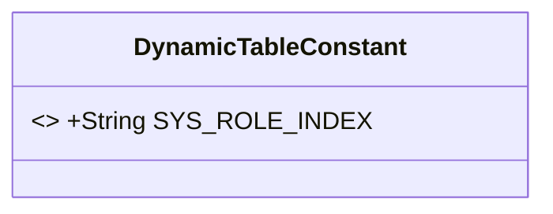
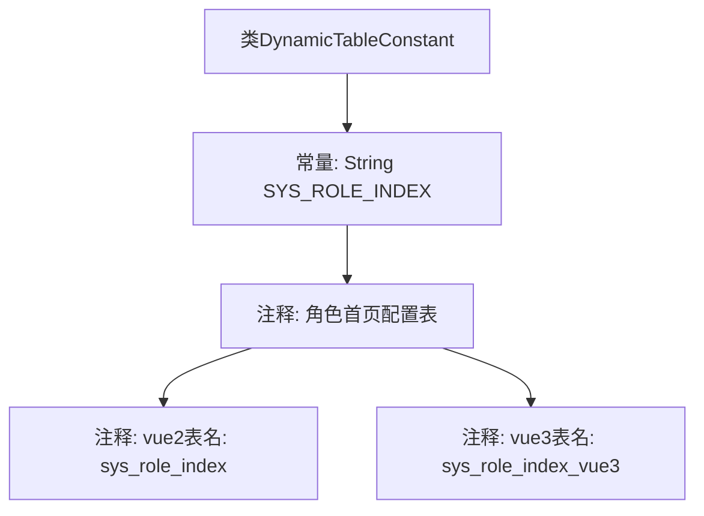

# 基础信息

|      |      |
|------|------|
| 名称 | DynamicTableConstant |
| 编码语言 | .java |
| 代码路径 | JeecgBoot/jeecg-boot/jeecg-boot-base-core/src/main/java/org/jeecg/common/constant/DynamicTableConstant.java |
| 包名 | org.jeecg.common.constant |
| 依赖项 | [] |
| 概述说明 | DynamicTableConstant类定义角色首页配置表名，兼容Vue2和Vue3。 |

# 说明

DynamicTableConstant类用于定义角色首页配置表名，兼容Vue2和Vue3框架。该类的主要功能是管理和维护角色首页的配置信息，确保在不同版本的Vue框架下都能正常使用。通过定义表名，该类为角色首页的配置提供了统一的接口和标准，便于开发者在不同环境中进行调用和扩展。

# 类列表 Class Summary

| 名称   | 类型  | 说明 |
|-------|------|-------------|
| DynamicTableConstant | class | DynamicTableConstant类定义角色首页配置表名，支持Vue2和Vue3。 |

## 类 DynamicTableConstant

|      |      |
|------|------|
| 访问范围 | public |
| 类型 | class |
| 名称 | DynamicTableConstant |
| 说明 | DynamicTableConstant类定义角色首页配置表名，支持Vue2和Vue3。 |

### UML类图

这段代码定义了一个名为 `DynamicTableConstant` 的类，其中包含一个静态常量 `SYS_ROLE_INDEX`，用于存储角色首页配置表的表名。该常量在代码中被标记为 `final`，表示其值不可更改。类图展示了 `DynamicTableConstant` 类的结构，突出了其唯一的公有常量成员。这个类主要用于集中管理表名，便于在不同版本的系统中统一使用和修改。

### 内部方法调用关系图

这段代码定义了一个名为 `DynamicTableConstant` 的类，其中包含一个静态常量 `SYS_ROLE_INDEX`，其值为 `"sys_role_index"`。代码通过注释说明了该常量对应的角色首页配置表在不同版本（vue2 和 vue3）中的表名。流程图展示了类与常量之间的关系，以及注释与常量之间的关联。

### 字段列表 Field List

| 名称  | 类型  | 说明 |
|-------|-------|------|
| SYS_ROLE_INDEX = "sys_role_index" | String | 定义系统角色索引常量"SYS_ROLE_INDEX"。 |

### 方法列表 Method List

| 名称  | 类型  | 说明 |
|-------|-------|------|

