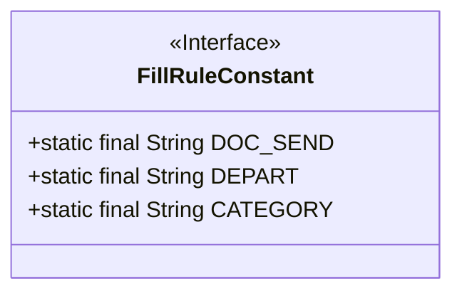
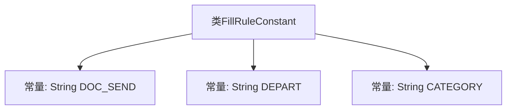

# 基础信息

|      |      |
|------|------|
| 名称 | FillRuleConstant |
| 编码语言 | .java |
| 代码路径 | JeecgBoot/jeecg-boot/jeecg-boot-base-core/src/main/java/org/jeecg/common/constant/FillRuleConstant.java |
| 包名 | org.jeecg.common.constant |
| 依赖项 | [] |
| 概述说明 | 类FillRuleConstant定义公文、部门及分类的编码常量。 |

# 说明

类FillRuleConstant用于定义公文发文、部门和分类字典编码的常量。该类提供了一系列预定义的常量值，用于在系统中统一标识和管理公文发文的相关信息、部门信息以及分类字典编码。通过使用这些常量，可以确保系统在处理公文发文、部门管理和分类编码时的一致性和准确性，减少因手动输入或编码不一致导致的错误。该类的主要功能是简化代码中的硬编码，提高代码的可读性和可维护性。

# 类列表 Class Summary

| 名称   | 类型  | 说明 |
|-------|------|-------------|
| FillRuleConstant | class | 类FillRuleConstant定义公文发文、部门和分类字典编码常量。 |

## 类 FillRuleConstant

|      |      |
|------|------|
| 访问范围 | public |
| 类型 | class |
| 名称 | FillRuleConstant |
| 说明 | 类FillRuleConstant定义公文发文、部门和分类字典编码常量。 |

### UML类图

**描述：**  
`FillRuleConstant` 类是一个包含常量的接口，用于存储公文发文编码、部门编码和分类字典编码的常量值。这些常量分别命名为 `DOC_SEND`、`DEPART` 和 `CATEGORY`，并分别赋值为 `"doc_send_code"`、`"org_num_role"` 和 `"category_code_rule"`。该类的作用是提供一个统一的常量定义，便于在代码中引用这些固定的编码规则。

### 内部方法调用关系图

该流程图展示了`FillRuleConstant`类中定义的三个常量：`DOC_SEND`、`DEPART`和`CATEGORY`。这些常量分别用于表示公文发文编码、部门编码和分类字典编码。流程图清晰地展示了类与常量之间的关系，便于理解类中定义的静态常量及其用途。

### 字段列表 Field List

| 名称  | 类型  | 说明 |
|-------|-------|------|
| DOC_SEND = "doc_send_code" | String | 定义常量字符串DOC_SEND为"doc_send_code"。 |
| CATEGORY = "category_code_rule" | String | 定义常量CATEGORY，值为"category_code_rule"。 |
| DEPART = "org_num_role" | String | 定义常量DEPART，值为"org_num_role"。 |

### 方法列表 Method List

| 名称  | 类型  | 说明 |
|-------|-------|------|

