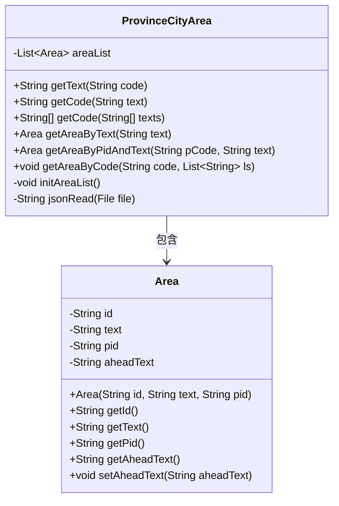
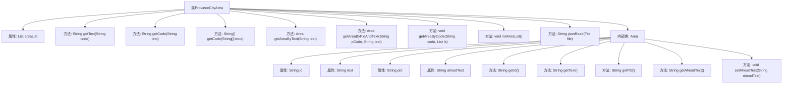

# 基础信息

|      |      |
|------|------|
| 名称 | ProvinceCityArea |
| 编码语言 | .java |
| 代码路径 | JeecgBoot/jeecg-boot/jeecg-boot-base-core/src/main/java/org/jeecg/common/constant/ProvinceCityArea.java |
| 包名 | org.jeecg.common.constant |
| 依赖项 | ['com.alibaba.fastjson.JSONObject', 'org.apache.commons.lang3.StringUtils', 'org.jeecg.common.util.oConvertUtils', 'org.springframework.beans.factory.annotation.Value', 'org.springframework.core.io.Resource', 'org.springframework.stereotype.Component', 'java.io.File', 'java.io.IOException', 'java.util.ArrayList', 'java.util.Scanner', 'java.util.Set', 'java.util.List'] |
| 概述说明 | ProvinceCityArea类处理省市区数据，支持文本编码获取和精准匹配。 |

# 说明

ProvinceCityArea类用于处理省市区数据，提供获取文本和编码的功能。该类支持精准匹配，能够准确识别和返回省市区信息。同时，该类还支持初始化数据，确保在处理过程中数据的完整性和准确性。通过该类的功能，用户可以方便地获取和管理省市区相关数据。

# 类列表 Class Summary

| 名称   | 类型  | 说明 |
|-------|------|-------------|
| ProvinceCityArea | class | ProvinceCityArea类处理省市区数据，提供获取文本和编码功能，支持精准匹配和初始化数据。 |

## 类 ProvinceCityArea

|      |      |
|------|------|
| 访问范围 | @Component("pca");public |
| 类型 | class |
| 名称 | ProvinceCityArea |
| 说明 | ProvinceCityArea类处理省市区数据，提供获取文本和编码功能，支持精准匹配和初始化数据。 |

### UML类图

### 描述
`ProvinceCityArea` 类是一个用于处理省市区数据的组件，包含多个方法来根据编码或文本获取省市区信息。它内部维护了一个 `Area` 类的列表，用于存储省市区数据。`Area` 类表示一个省市区对象，包含 `id`、`text`、`pid` 和 `aheadText` 等属性。`ProvinceCityArea` 类通过 `initAreaList` 方法从 JSON 文件中初始化省市区数据，并通过 `getAreaByText` 和 `getAreaByPidAndText` 等方法进行数据查询。整个类的设计旨在提供高效、准确的省市区数据查询功能。

### 内部方法调用关系图

这段代码定义了一个`ProvinceCityArea`类，用于处理省市区数据的查询和转换。类中包含多个方法，如`getText`、`getCode`、`getAreaByText`等，用于根据编码或文本获取对应的省市区信息。`initAreaList`方法用于初始化省市区数据列表，`Area`内部类用于表示省市区的基本信息。代码通过读取JSON文件来加载省市区数据，并提供了多种查询方式以满足不同需求。

### 字段列表 Field List

| 名称  | 类型  | 说明 |
|-------|-------|------|
| areaList | List<Area> | areaList存储区域对象列表。 |

### 方法列表 Method List

| 名称  | 类型  | 说明 |
|-------|-------|------|
| jsonRead | String | 读取文件内容并返回字符串。 |
| getAreaByCode | void | 通过代码递归获取区域信息并添加到列表中。 |
| getAreaByPidAndText | Area | 通过pCode和text查找Area对象，未找到返回null。 |
| initAreaList | void | 初始化地区列表，从JSON文件加载省市区数据并添加到列表中。 |
| getAreaByText | Area | 通过文本查找并返回对应区域对象，若无匹配则返回空。 |
| getCode | String | 方法通过遍历区域列表，匹配文本并返回对应区域ID。 |
| getCode | String[] | 该方法根据输入文本数组生成对应编码数组，若输入无效或区域列表为空则返回null。 |
| getText | String | 根据代码获取文本，若代码非空且区域列表有效，返回拼接的字符串，否则返回空。 |

