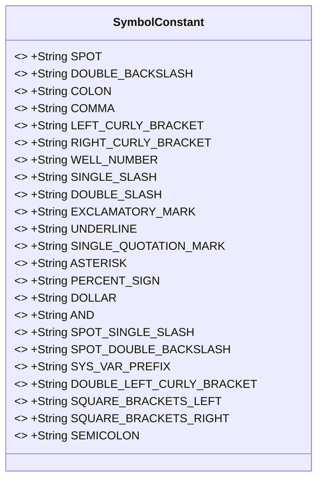

# 基础信息

|      |      |
|------|------|
| 名称 | SymbolConstant |
| 编码语言 | .java |
| 代码路径 | JeecgBoot/jeecg-boot/jeecg-boot-base-core/src/main/java/org/jeecg/common/constant/SymbolConstant.java |
| 包名 | org.jeecg.common.constant |
| 依赖项 | [] |
| 概述说明 | SymbolConstant类定义了点、斜杠、冒号、花括号等常用符号常量。 |

# 说明

SymbolConstant类是一个用于定义常用符号常量的类，它包含了多种常见的符号，例如点、斜杠、冒号、花括号等。这些常量在编程中经常被使用，能够提高代码的可读性和一致性。通过将这些符号定义为常量，开发者可以避免在代码中重复书写相同的符号，从而减少错误并提升开发效率。

# 类列表 Class Summary

| 名称   | 类型  | 说明 |
|-------|------|-------------|
| SymbolConstant | class | SymbolConstant类定义了多个常用符号常量，如点、斜杠、冒号、花括号等。 |

## 类 SymbolConstant

|      |      |
|------|------|
| 访问范围 | public |
| 类型 | class |
| 名称 | SymbolConstant |
| 说明 | SymbolConstant类定义了多个常用符号常量，如点、斜杠、冒号、花括号等。 |

### UML类图

### 描述
`SymbolConstant` 类是一个包含常用符号常量的工具类。它定义了多个静态的、不可变的字符串常量，如点、斜杠、冒号、逗号、花括号、井号、感叹号等。这些常量可以在代码中直接引用，避免硬编码，提高代码的可读性和可维护性。由于所有字段都是 `public static final`，因此它们可以在不实例化类的情况下直接使用。

### 内部方法调用关系图

```mermaid
graph TD
    A["类SymbolConstant"]
    B["常量: SPOT = '.'"]
    C["常量: DOUBLE_BACKSLASH = '\\'"]
    D["常量: COLON = ':'"]
    E["常量: COMMA = ','"]
    F["常量: LEFT_CURLY_BRACKET = '{'"]
    G["常量: RIGHT_CURLY_BRACKET = '}'"]
    H["常量: WELL_NUMBER = '#'"]
    I["常量: SINGLE_SLASH = '/'"]
    J["常量: DOUBLE_SLASH = '//'"]
    K["常量: EXCLAMATORY_MARK = '!'"]
    L["常量: UNDERLINE = '_'"]
    M["常量: SINGLE_QUOTATION_MARK = '''"]
    N["常量: ASTERISK = '*'"]
    O["常量: PERCENT_SIGN = '%'"]
    P["常量: DOLLAR = '$'"]
    Q["常量: AND = '&'"]
    R["常量: SPOT_SINGLE_SLASH = '../'"]
    S["常量: SPOT_DOUBLE_BACKSLASH = '..\\'"]
    T["常量: SYS_VAR_PREFIX = '#{'"]
    U["常量: DOUBLE_LEFT_CURLY_BRACKET = '{{'"]
    V["常量: SQUARE_BRACKETS_LEFT = '['"]
    W["常量: SQUARE_BRACKETS_RIGHT = ']'"]
    X["常量: SEMICOLON = ';'"]

    A --> B
    A --> C
    A --> D
    A --> E
    A --> F
    A --> G
    A --> H
    A --> I
    A --> J
    A --> K
    A --> L
    A --> M
    A --> N
    A --> O
    A --> P
    A --> Q
    A --> R
    A --> S
    A --> T
    A --> U
    A --> V
    A --> W
    A --> X
```

这段代码定义了一个名为`SymbolConstant`的类，其中包含了多个静态常量，这些常量代表常见的符号和字符串。每个常量都被赋予了一个特定的符号或字符串值，例如点、冒号、逗号等。这些常量可以在程序的其他部分被引用，以避免硬编码符号或字符串，提高代码的可读性和可维护性。

### 字段列表 Field List

| 名称  | 类型  | 说明 |
|-------|-------|------|
| SYS_VAR_PREFIX = "#{" | String | 系统变量前缀定义为“#{”。 |
| SPOT = "." | String | 定义静态常量SPOT，值为句点符号。 |
| COMMA = "," | String | 定义常量字符串COMMA，值为逗号。 |
| LEFT_CURLY_BRACKET = "{" | String | 定义静态常量字符串为左花括号。 |
| DOUBLE_BACKSLASH = "\\" | String | 定义常量DOUBLE_BACKSLASH，值为反斜杠"\\"。 |
| SQUARE_BRACKETS_RIGHT = "]" | String | 定义静态常量字符串表示右方括号。 |
| COLON = ":" | String | 定义常量字符串 COLON 值为冒号。 |
| PERCENT_SIGN = "%" | String | 定义常量PERCENT_SIGN，值为百分号"%"。 |
| WELL_NUMBER = "#" | String | 定义静态常量WELL_NUMBER，值为"#"。 |
| ASTERISK = "*" | String | 定义静态常量ASTERISK，值为"*"。 |
| RIGHT_CURLY_BRACKET = "}" | String | 定义字符串常量RIGHT_CURLY_BRACKET，值为右花括号。 |
| AND = "&" | String | 定义常量AND，值为"&"。 |
| UNDERLINE = "_" | String | 定义常量字符串UNDERLINE，值为下划线"_"。 |
| EXCLAMATORY_MARK = "!" | String | 定义静态常量字符串EXCLAMATORY_MARK，值为"!"。 |
| SINGLE_SLASH = "/" | String | 定义常量SINGLE_SLASH为斜杠字符"/"。 |
| DOUBLE_LEFT_CURLY_BRACKET = "{{" | String | 定义常量DOUBLE_LEFT_CURLY_BRACKET为"{{"。 |
| SQUARE_BRACKETS_LEFT = "[" | String | 定义静态常量SQUARE_BRACKETS_LEFT，值为"["。 |
| DOLLAR = "$" | String | 定义了一个静态不可变的字符串常量DOLLAR，其值为"$"。 |
| SPOT_DOUBLE_BACKSLASH = "..\\" | String | 定义静态常量SPOT_DOUBLE_BACKSLASH值为"..\\"。 |
| DOUBLE_SLASH = "//" | String | 定义静态常量DOUBLE_SLASH，值为双斜杠"//"。 |
| SEMICOLON = ";" | String | 定义静态常量字符串SEMICOLON，值为分号。 |
| SINGLE_QUOTATION_MARK = "'" | String | 定义了一个静态常量SINGLE_QUOTATION_MARK，值为单引号。 |
| SPOT_SINGLE_SLASH = "../" | String | 定义静态常量字符串，值为相对路径 "../"。 |

### 方法列表 Method List

| 名称  | 类型  | 说明 |
|-------|-------|------|

