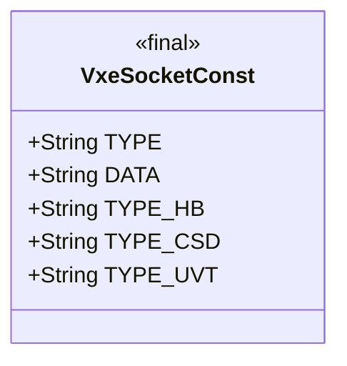
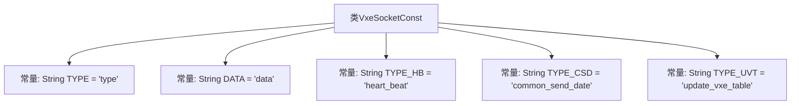

# 基础信息

|      |      |
|------|------|
| 名称 | VxeSocketConst |
| 编码语言 | .java |
| 代码路径 | JeecgBoot/jeecg-boot/jeecg-boot-base-core/src/main/java/org/jeecg/common/constant/VxeSocketConst.java |
| 包名 | org.jeecg.common.constant |
| 依赖项 | [] |
| 概述说明 | VxeSocketConst定义消息类型和数据常量，涵盖心跳、数据传输和vxe table更新。 |

# 说明

VxeSocketConst定义了消息类型和数据常量，主要用于心跳检测、通用数据传递以及更新vxe table数据。这些常量确保系统在通信过程中能够准确识别和处理不同类型的消息，从而维持系统的稳定性和数据的一致性。通过定义这些常量，VxeSocketConst为vxe table的数据更新和通信提供了可靠的基础支持。

# 类列表 Class Summary

| 名称   | 类型  | 说明 |
|-------|------|-------------|
| VxeSocketConst | class | VxeSocketConst定义消息类型和数据常量，包括心跳检测、通用数据传递和更新vxe table数据。 |

## 类 VxeSocketConst

|      |      |
|------|------|
| 访问范围 | public |
| 类型 | class |
| 名称 | VxeSocketConst |
| 说明 | VxeSocketConst定义消息类型和数据常量，包括心跳检测、通用数据传递和更新vxe table数据。 |

### UML类图

**描述：**  
`VxeSocketConst` 类是一个常量类，用于定义与 `VxeSocket` 相关的消息类型和数据字段。它包含五个静态常量：`TYPE` 表示消息类型，`DATA` 表示消息数据，`TYPE_HB` 表示心跳检测消息类型，`TYPE_CSD` 表示通用数据传递消息类型，`TYPE_UVT` 表示更新 `vxe table` 数据的消息类型。这些常量在整个应用程序中用于标识和处理不同的消息类型和数据。

### 内部方法调用关系图

该流程图展示了类`VxeSocketConst`的结构，其中包含了五个静态常量，分别用于定义消息类型和消息数据的标识符。这些常量在类中被声明为`public static final`，表示它们是公共的、不可修改的常量。通过这些常量，代码可以在处理不同类型的消息时进行统一标识和处理，确保消息传递的一致性和可维护性。

### 字段列表 Field List

| 名称  | 类型  | 说明 |
|-------|-------|------|
| DATA = "data" | String | 定义常量字符串DATA，值为"data"。 |
| TYPE_HB = "heart_beat" | String | 定义静态常量TYPE_HB，值为"heart_beat"。 |
| TYPE_UVT = "update_vxe_table" | String | 定义常量TYPE_UVT，值为"update_vxe_table"。 |
| TYPE_CSD = "common_send_date" | String | 定义常量TYPE_CSD，值为"common_send_date"。 |
| TYPE = "type" | String | 定义了一个名为TYPE的公共静态常量字符串，值为"type"。 |

### 方法列表 Method List

| 名称  | 类型  | 说明 |
|-------|-------|------|

