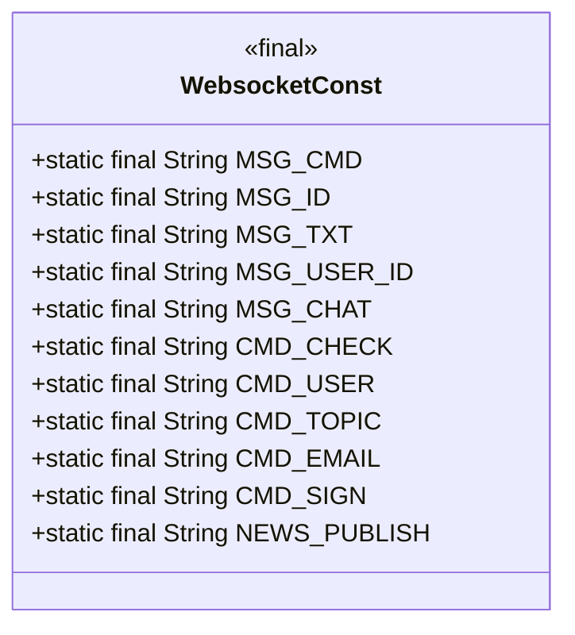
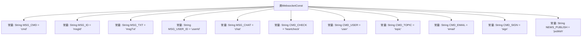

# 基础信息

|      |      |
|------|------|
| 名称 | WebsocketConst |
| 编码语言 | .java |
| 代码路径 | JeecgBoot/jeecg-boot/jeecg-boot-base-core/src/main/java/org/jeecg/common/constant/WebsocketConst.java |
| 包名 | org.jeecg.common.constant |
| 依赖项 | [] |
| 概述说明 | WebsocketConst类定义消息JSON键和类型常量。 |

# 说明

WebsocketConst类是一个用于定义消息JSON键和类型常量的类。该类的主要目的是为WebSocket通信中的消息提供标准化的键名和数据类型，确保消息格式的一致性和可维护性。通过定义这些常量，开发者可以在处理WebSocket消息时避免硬编码，提高代码的可读性和可维护性。该类通常包含多个静态常量，每个常量代表一个特定的JSON键或数据类型，适用于各种WebSocket消息的解析和构造。

# 类列表 Class Summary

| 名称   | 类型  | 说明 |
|-------|------|-------------|
| WebsocketConst | class | WebsocketConst类定义消息JSON键和类型常量。 |

## 类 WebsocketConst

|      |      |
|------|------|
| 访问范围 | public |
| 类型 | class |
| 名称 | WebsocketConst |
| 说明 | WebsocketConst类定义消息JSON键和类型常量。 |

### UML类图

**描述：**  
`WebsocketConst` 类是一个常量类，用于定义WebSocket通信中的消息类型和JSON键值。它包含了多个静态常量字段，如 `MSG_CMD`、`MSG_ID`、`MSG_TXT` 等，这些字段用于标识消息的不同部分和类型。例如，`CMD_CHECK` 表示心跳检查消息，`CMD_USER` 表示用户消息，`CMD_TOPIC` 表示系统通知等。这个类的主要作用是提供一组标准化的常量，以便在WebSocket通信中统一使用，减少硬编码和错误。

### 内部方法调用关系图

这段代码定义了一个名为`WebsocketConst`的类，其中包含了一系列用于WebSocket消息处理的常量。这些常量分别表示消息的不同键和类型，如`MSG_CMD`表示消息的命令键，`CMD_CHECK`表示心跳检查消息类型等。这些常量在WebSocket通信中用于标识和解析消息的不同部分，确保消息的正确处理和分类。

### 字段列表 Field List

| 名称  | 类型  | 说明 |
|-------|-------|------|
| MSG_CMD = "cmd" | String | 定义静态常量字符串MSG_CMD，值为"cmd"。 |
| MSG_ID = "msgId" | String | 定义静态常量MSG_ID，值为"msgId"。 |
| MSG_TXT = "msgTxt" | String | 定义常量MSG_TXT，值为"msgTxt"。 |
| MSG_CHAT = "chat" | String | 定义常量字符串MSG_CHAT，值为"chat"。 |
| CMD_USER = "user" | String | 定义常量CMD_USER，值为"user"。 |
| MSG_USER_ID = "userId" | String | 定义常量MSG_USER_ID，值为"userId"。 |
| CMD_EMAIL = "email" | String | 定义了一个静态常量CMD_EMAIL，值为"email"。 |
| NEWS_PUBLISH = "publish" | String | 定义常量NEWS_PUBLISH，值为"publish"。 |
| CMD_TOPIC = "topic" | String | 定义静态常量CMD_TOPIC，值为"topic"。 |
| CMD_SIGN = "sign" | String | 定义了一个静态常量CMD_SIGN，值为"sign"。 |
| CMD_CHECK = "heartcheck" | String | 定义了一个公共静态常量CMD_CHECK，其值为"heartcheck"。 |

### 方法列表 Method List

| 名称  | 类型  | 说明 |
|-------|-------|------|

