# 基础信息

|      |      |
|------|------|
| 名称 | constant |
| 编码语言 | .java |
| 代码路径 | JeecgBoot/jeecg-boot/jeecg-boot-base-core/src/main/java/org/jeecg/common/constant |
| 包名 | JeecgBoot.jeecg-boot.jeecg-boot-base-core.src.main.java.org.jeecg.common.constant |
| 概述说明 | 多个Java常量类用于定义系统常量和枚举，提升代码可读性和一致性。 |

# 说明

## 概述
该代码模块主要包含了一系列常量定义类文件，这些文件位于 `JeecgBoot/jeecg-boot/jeecg-boot-base-core/src/main/java/org/jeecg/common/constant/` 目录下。这些常量类用于定义系统中各种常用的常量值，包括符号常量、数据库常量、角色首页配置表名、省市区数据、消息类型、WebSocket通信常量等。通过这些常量类，系统能够统一管理和使用这些常量值，从而提高代码的可读性、可维护性和一致性。

## 主要业务场景
这些常量类文件的主要业务场景包括但不限于：
1. **符号常量管理**：通过 `SymbolConstant.java` 类，系统可以定义和使用常见的符号常量，如点、斜杠、冒号等，减少代码中的硬编码，提高代码的可读性和一致性。
2. **数据库常量管理**：`DataBaseConstant.java` 类用于定义与数据库相关的常量，如表名、字段名等，便于在数据库操作时进行统一管理。
3. **角色首页配置管理**：`DynamicTableConstant.java` 类用于定义角色首页配置表名，兼容Vue2和Vue3框架，确保在不同版本的Vue框架下都能正常使用。
4. **省市区数据管理**：`ProvinceCityArea.java` 类用于处理省市区数据，提供获取文本和编码的功能，支持精准匹配和初始化数据，确保数据的完整性和准确性。
5. **消息类型管理**：`VxeSocketConst.java` 类定义了消息类型和数据常量，主要用于心跳检测、通用数据传递以及更新vxe table数据，确保系统通信的稳定性和数据的一致性。
6. **WebSocket通信管理**：`WebsocketConst.java` 类用于定义WebSocket通信中的消息JSON键和类型常量，确保消息格式的一致性和可维护性。
7. **公文发文管理**：`FillRuleConstant.java` 类用于定义公文发文、部门和分类字典编码的常量，确保在处理公文发文、部门管理和分类编码时的一致性和准确性。
8. **枚举常量管理**：`enums` 目录下的枚举类文件用于定义系统中各种常量类型，如模块类型、消息类型、文件类型、操作类型等，为系统提供了统一的常量定义，使得代码更加规范化和易于维护。

这些常量类文件为系统提供了统一的常量定义，使得代码更加规范化、易于维护，并在各种业务场景中提供了可靠的支持。

### 包内部结构视图

```mermaid
graph TD
    constant --> TenantConstant.java
    constant --> DataBaseConstant.java
    constant --> SymbolConstant.java
    constant --> DynamicTableConstant.java
    constant --> enums
    constant --> ProvinceCityArea.java
    constant --> VxeSocketConst.java
    constant --> CommonConstant.java
    constant --> ServiceNameConstants.java
    constant --> FillRuleConstant.java
    constant --> WebsocketConst.java
    constant --> CommonSendStatus.java
    enums --> ModuleType.java
    enums --> Vue3MessageHrefEnum.java
    enums --> SysAnnmentTypeEnum.java
    enums --> CgformEnum.java
    enums --> ClientTerminalTypeEnum.java
    enums --> DySmsEnum.java
    enums --> DateRangeEnum.java
    enums --> FileTypeEnum.java
    enums --> EmailTemplateEnum.java
    enums --> MessageTypeEnum.java
    enums --> RoleIndexConfigEnum.java
    enums --> OperateTypeEnum.java
```

该流程图展示了JeecgBoot项目中`constant`文件夹及其子文件夹`enums`的文件结构。`constant`文件夹包含多个常量类文件，如`TenantConstant.java`和`CommonConstant.java`，而`enums`文件夹则包含多个枚举类文件，如`ModuleType.java`和`Vue3MessageHrefEnum.java`。整个结构清晰地反映了项目的模块化设计。

# 文件列表 File List

| 名称   | 类型  | 说明 |
|-------|------|-------------|
| [CommonSendStatus.java](CommonSendStatus.md) | file | 信息为空，无法生成概要描述。 |
| [ServiceNameConstants.java](ServiceNameConstants.md) | file | 输入内容为空，请提供具体信息以便生成概要描述。 |
| [CommonConstant.java](CommonConstant.md) | file | 信息为空，无法生成概要描述。 |
| [SymbolConstant.java](SymbolConstant.md) | file | SymbolConstant类定义了点、斜杠、冒号、花括号等常用符号常量。 |
| [TenantConstant.java](TenantConstant.md) | file | 输入内容为空，无法生成概要描述。 |
| [ProvinceCityArea.java](ProvinceCityArea.md) | file | ProvinceCityArea类处理省市区数据，支持文本编码获取和精准匹配。 |
| [FillRuleConstant.java](FillRuleConstant.md) | file | 类FillRuleConstant定义公文、部门及分类的编码常量。 |
| [VxeSocketConst.java](VxeSocketConst.md) | file | VxeSocketConst定义消息类型和数据常量，涵盖心跳、数据传输和vxe table更新。 |
| [WebsocketConst.java](WebsocketConst.md) | file | WebsocketConst类定义消息JSON键和类型常量。 |
| [DynamicTableConstant.java](DynamicTableConstant.md) | file | DynamicTableConstant类定义角色首页配置表名，兼容Vue2和Vue3。 |
| [DataBaseConstant.java](DataBaseConstant.md) | file | 信息为空，无法生成概要描述。 |
| [enums](enums/_module.md) | package | 内容为空，无法进行总结描述。请提供具体信息。 |

