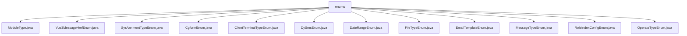

# 基础信息

|      |      |
|------|------|
| 名称 | enums |
| 编码语言 | .java |
| 代码路径 | JeecgBoot/jeecg-boot/jeecg-boot-base-core/src/main/java/org/jeecg/common/constant/enums |
| 包名 | JeecgBoot.jeecg-boot.jeecg-boot-base-core.src.main.java.org.jeecg.common.constant.enums |
| 概述说明 | 内容为空，无法进行总结描述。请提供具体信息。 |

# 说明

## 概述
该代码模块主要包含了一系列枚举类文件，这些枚举类文件位于 `JeecgBoot/jeecg-boot/jeecg-boot-base-core/src/main/java/org/jeecg/common/constant/enums/` 目录下。这些枚举类用于定义系统中各种常量类型，如模块类型、消息类型、文件类型、操作类型等。每个枚举类都代表了一组特定的常量值，这些常量值在系统中被广泛使用，以提高代码的可读性和可维护性。

## 主要业务场景
这些枚举类文件的主要业务场景包括但不限于：
1. **模块类型管理**：通过 `ModuleType.java` 枚举类，系统可以定义和管理不同的模块类型，便于在代码中区分和操作不同的模块。
2. **消息类型管理**：`MessageTypeEnum.java` 枚举类用于定义系统中不同类型的消息，如通知、警告、错误等，以便在消息处理时进行区分。
3. **文件类型管理**：`FileTypeEnum.java` 枚举类用于定义系统中支持的文件类型，如文本文件、图片文件、视频文件等，便于在文件上传和下载时进行类型校验。
4. **操作类型管理**：`OperateTypeEnum.java` 枚举类用于定义系统中不同的操作类型，如新增、修改、删除等，便于在日志记录和权限控制时进行区分。
5. **客户端终端类型管理**：`ClientTerminalTypeEnum.java` 枚举类用于定义不同类型的客户端终端，如PC端、移动端等，便于在系统适配时进行区分。
6. **短信模板管理**：`DySmsEnum.java` 枚举类用于定义系统中不同的短信模板，便于在发送短信时选择合适的模板。
7. **日期范围管理**：`DateRangeEnum.java` 枚举类用于定义不同的日期范围，如今天、本周、本月等，便于在数据查询时进行日期范围的选择。
8. **角色索引配置管理**：`RoleIndexConfigEnum.java` 枚举类用于定义系统中不同角色的索引配置，便于在角色管理和权限控制时进行配置。

这些枚举类文件为系统提供了统一的常量定义，使得代码更加规范化和易于维护。

### 包内部结构视图

该流程图展示了`enums`目录下的多个枚举类文件，所有文件均直接位于`enums`目录下，没有进一步的子目录结构。每个枚举类文件都从`enums`节点分支出来，清晰地展示了文件与目录的层级关系。

# 文件列表 File List

| 名称   | 类型  | 说明 |
|-------|------|-------------|
| [OperateTypeEnum.java](OperateTypeEnum.md) | file | 信息为空，无法生成概要描述。 |
| [RoleIndexConfigEnum.java](RoleIndexConfigEnum.md) | file | 输入内容为空，无法生成概要描述。 |
| [EmailTemplateEnum.java](EmailTemplateEnum.md) | file | 无内容，无法生成概要描述。 |
| [FileTypeEnum.java](FileTypeEnum.md) | file | 输入为空，无法生成概要描述。 |
| [DySmsEnum.java](DySmsEnum.md) | file | 输入为空，无法生成概要描述。 |
| [CgformEnum.java](CgformEnum.md) | file | 无内容，无法生成概要描述。 |
| [Vue3MessageHrefEnum.java](Vue3MessageHrefEnum.md) | file | 信息为空，无法生成概要描述。 |
| [MessageTypeEnum.java](MessageTypeEnum.md) | file | 输入内容为空，无法生成概要描述。 |
| [DateRangeEnum.java](DateRangeEnum.md) | file | 信息未提供，无法生成概要描述。 |
| [ClientTerminalTypeEnum.java](ClientTerminalTypeEnum.md) | file | 无内容提供，无法生成概要描述。 |
| [SysAnnmentTypeEnum.java](SysAnnmentTypeEnum.md) | file | 无内容提供，无法生成概要描述。 |
| [ModuleType.java](ModuleType.md) | file | 信息为空，无法生成概要描述。 |

