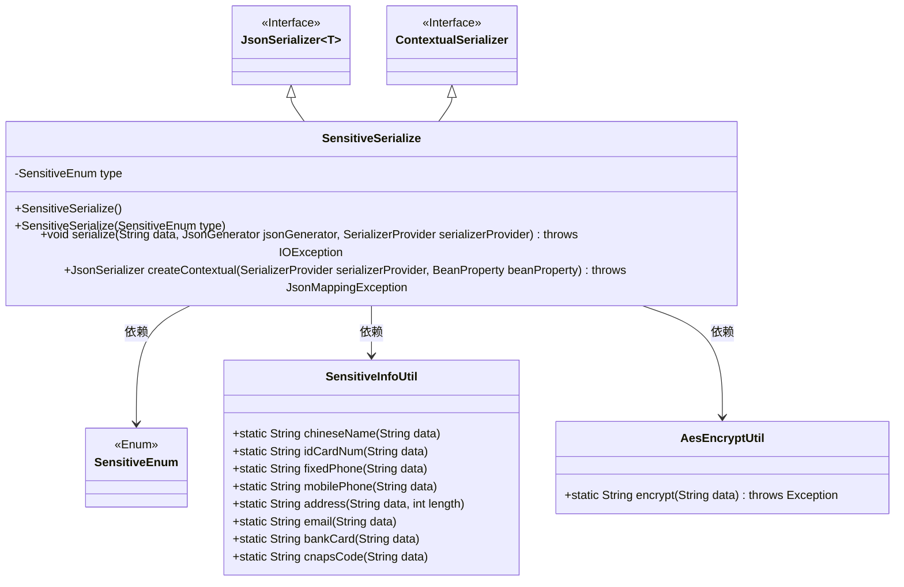
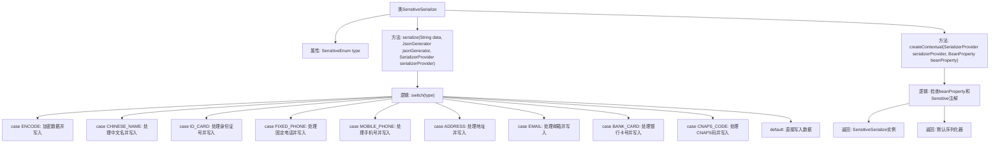

# 基础信息

|      |      |
|------|------|
| 名称 | SensitiveSerialize |
| 编码语言 | .java |
| 代码路径 | JeecgBoot/jeecg-boot/jeecg-boot-base-core/src/main/java/org/jeecg/common/desensitization/SensitiveSerialize.java |
| 包名 | org.jeecg.common.desensitization |
| 依赖项 | ['com.fasterxml.jackson.core.JsonGenerator', 'com.fasterxml.jackson.databind.BeanProperty', 'com.fasterxml.jackson.databind.JsonMappingException', 'com.fasterxml.jackson.databind.JsonSerializer', 'com.fasterxml.jackson.databind.SerializerProvider', 'com.fasterxml.jackson.databind.ser.ContextualSerializer', 'lombok.AllArgsConstructor', 'lombok.NoArgsConstructor', 'lombok.extern.slf4j.Slf4j', 'org.jeecg.common.desensitization.annotation.Sensitive', 'org.jeecg.common.desensitization.enums.SensitiveEnum', 'org.jeecg.common.desensitization.util.SensitiveInfoUtil', 'org.jeecg.common.util.encryption.AesEncryptUtil', 'java.io.IOException', 'java.util.Objects'] |
| 概述说明 | SensitiveSerialize类实现JSON序列化，支持敏感信息加密与脱敏。 |

# 说明

SensitiveSerialize类是一个专门用于JSON序列化的工具，其主要功能是支持多种敏感信息的加密和脱敏处理。该类能够确保在序列化过程中，敏感数据得到有效保护，防止泄露。通过内置的加密和脱敏机制，SensitiveSerialize类在处理包含敏感信息的JSON数据时，能够自动识别并应用相应的保护措施，从而提升数据安全性。

# 类列表 Class Summary

| 名称   | 类型  | 说明 |
|-------|------|-------------|
| SensitiveSerialize | class | SensitiveSerialize类实现JSON序列化，支持多种敏感信息加密和脱敏处理。 |

## 类 SensitiveSerialize

|      |      |
|------|------|
| 访问范围 | @NoArgsConstructor;@AllArgsConstructor;@Slf4j;public |
| 类型 | class |
| 名称 | SensitiveSerialize |
| 说明 | SensitiveSerialize类实现JSON序列化，支持多种敏感信息加密和脱敏处理。 |

### UML类图

**描述**：`SensitiveSerialize`类是一个用于序列化敏感信息的自定义JSON序列化器，实现了`JsonSerializer`和`ContextualSerializer`接口。它根据`SensitiveEnum`类型对字符串数据进行不同的处理，如加密、姓名脱敏、身份证号脱敏等。该类依赖于`SensitiveInfoUtil`和`AesEncryptUtil`工具类来实现具体的脱敏和加密操作。`createContextual`方法用于根据注解动态创建序列化器实例。

### 内部方法调用关系图

这段代码定义了一个名为 `SensitiveSerialize` 的类，用于根据不同的敏感数据类型对字符串进行序列化处理。`serialize` 方法根据 `type` 的值调用不同的工具类方法对数据进行处理，并写入 `jsonGenerator`。`createContextual` 方法用于根据 `beanProperty` 和 `Sensitive` 注解创建相应的序列化器实例。代码通过 `switch` 语句处理多种敏感数据类型，确保数据在序列化时得到适当的处理。

### 字段列表 Field List

| 名称  | 类型  | 说明 |
|-------|-------|------|
| type | SensitiveEnum | 私有敏感枚举类型声明。 |

### 方法列表 Method List

| 名称  | 类型  | 说明 |
|-------|-------|------|
| serialize | void | 根据类型加密或脱敏数据并生成JSON字符串。 |
| createContextual | JsonSerializer<?> | 重写方法，根据属性类型和注解返回相应的JSON序列化器。 |

