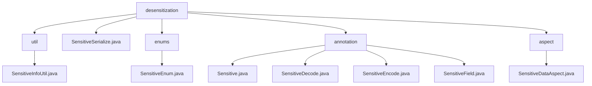

# 基础信息

|      |      |
|------|------|
| 名称 | desensitization |
| 编码语言 | .java |
| 代码路径 | JeecgBoot/jeecg-boot/jeecg-boot-base-core/src/main/java/org/jeecg/common/desensitization |
| 包名 | JeecgBoot.jeecg-boot.jeecg-boot-base-core.src.main.java.org.jeecg.common.desensitization |
| 概述说明 | JeecgBoot模块实现数据脱敏，支持加密解密和格式化操作，提升敏感数据安全性。 |

# 说明

## 概述
该代码模块属于 JeecgBoot 项目中的 `jeecg-boot-base-core` 模块，专注于敏感数据的处理和保护。模块通过一系列工具类、注解和切面实现了对敏感数据的脱敏、加密、解密、编码和解码操作。主要组件包括 `SensitiveInfoUtil`、`SensitiveSerialize`、`SensitiveDataAspect` 以及多个注解（如 `Sensitive`、`SensitiveDecode`、`SensitiveEncode`、`SensitiveField`）。这些组件共同协作，确保敏感数据在存储、传输和展示过程中得到有效保护，同时提供了灵活的配置和自动化处理能力。

## 主要业务场景
1. **数据脱敏**：在展示或传输敏感信息（如身份证号、手机号、邮箱等）时，使用 `Sensitive` 和 `SensitiveField` 注解对数据进行脱敏处理，确保敏感信息不会直接暴露。
2. **数据加密与解密**：通过 `SensitiveInfoUtil` 和 `SensitiveDataAspect` 对敏感数据进行加密和解密操作，确保数据在存储和传输过程中的安全性。
3. **数据编码与解码**：使用 `SensitiveEncode` 和 `SensitiveDecode` 注解对敏感数据进行编码和解码，以便在特定场景下保护数据的隐私并恢复原始数据。
4. **JSON 序列化中的敏感数据处理**：通过 `SensitiveSerialize` 类在 JSON 序列化过程中自动识别并保护敏感数据，防止数据泄露。
5. **灵活配置与自动化处理**：通过注解和切面，开发者可以灵活配置哪些字段需要脱敏、加密、解密、编码或解码，同时实现自动化处理，提高代码的可维护性和安全性。

该模块的设计旨在简化敏感数据的处理流程，提升数据安全性，同时保持代码的可读性和可维护性，适用于复杂数据结构中的敏感信息管理。

### 包内部结构视图

该流程图展示了`desensitization`模块的层级结构，包含`util`、`enums`、`annotation`和`aspect`四个子模块，每个子模块下分别包含相关的Java文件。`util`模块包含`SensitiveInfoUtil.java`，`enums`模块包含`SensitiveEnum.java`，`annotation`模块包含多个注解类，`aspect`模块包含`SensitiveDataAspect.java`。

# 文件列表 File List

| 名称   | 类型  | 说明 |
|-------|------|-------------|
| [SensitiveSerialize.java](SensitiveSerialize.md) | file | SensitiveSerialize类实现JSON序列化，支持敏感信息加密与脱敏。 |
| [aspect](aspect/_module.md) | package | SensitiveDataAspect类负责敏感数据的加密解密，通过切点和注解实现。 |
| [annotation](annotation/_module.md) | package | 提供内容为空，无法总结描述。 |
| [enums](enums/_module.md) | package | 提供简洁明了的软件工程信息总结，确保关键点完整且不超过100字符。 |
| [util](util/_module.md) | package | SensitiveInfoUtil类处理嵌套对象、加密解密及格式化多种数据类型。 |

