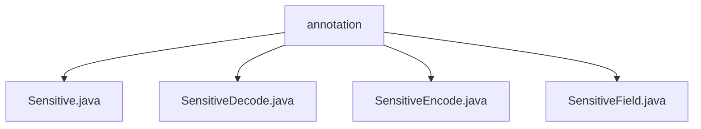

# 基础信息

|      |      |
|------|------|
| 名称 | annotation |
| 编码语言 | .java |
| 代码路径 | JeecgBoot/jeecg-boot/jeecg-boot-base-core/src/main/java/org/jeecg/common/desensitization/annotation |
| 包名 | JeecgBoot.jeecg-boot.jeecg-boot-base-core.src.main.java.org.jeecg.common.desensitization.annotation |
| 概述说明 | 提供内容为空，无法总结描述。 |

# 说明

## 概述
该代码模块属于 JeecgBoot 项目中的 `jeecg-boot-base-core` 模块，主要涉及数据脱敏功能的实现。模块通过定义一系列注解（如 `Sensitive`、`SensitiveDecode`、`SensitiveEncode`、`SensitiveField`）来支持对敏感数据的处理，包括数据的脱敏、编码和解码操作。这些注解可以应用于实体类的字段或方法上，以便在数据处理过程中自动执行相应的脱敏逻辑。

## 主要业务场景
1. **数据脱敏**：在需要对敏感信息（如身份证号、手机号、邮箱等）进行展示或传输时，使用 `Sensitive` 和 `SensitiveField` 注解对数据进行脱敏处理，确保敏感信息不会直接暴露。
2. **数据编码**：通过 `SensitiveEncode` 注解对敏感数据进行编码，以便在存储或传输过程中保护数据的隐私。
3. **数据解码**：使用 `SensitiveDecode` 注解对已编码的敏感数据进行解码，恢复原始数据以便后续处理。
4. **灵活配置**：通过注解的方式，开发者可以灵活地配置哪些字段需要脱敏、编码或解码，从而满足不同业务场景的需求。

该模块的设计旨在简化敏感数据的处理流程，提高数据安全性，同时保持代码的可读性和可维护性。

### 包内部结构视图

该流程图展示了`annotation`文件夹下的四个文件之间的层级关系。`annotation`作为根节点，包含了`Sensitive.java`、`SensitiveDecode.java`、`SensitiveEncode.java`和`SensitiveField.java`四个文件。这些文件都与数据脱敏相关的注解有关，体现了它们在项目中的功能分类和依赖关系。

# 文件列表 File List

| 名称   | 类型  | 说明 |
|-------|------|-------------|
| [SensitiveField.java](SensitiveField.md) | file | 信息为空，无法生成概要描述。 |
| [SensitiveDecode.java](SensitiveDecode.md) | file | 信息为空，无法生成概要描述。 |
| [Sensitive.java](Sensitive.md) | file | 信息为空，无法生成概要描述。 |
| [SensitiveEncode.java](SensitiveEncode.md) | file | 无内容提供，无法生成概要描述。 |

