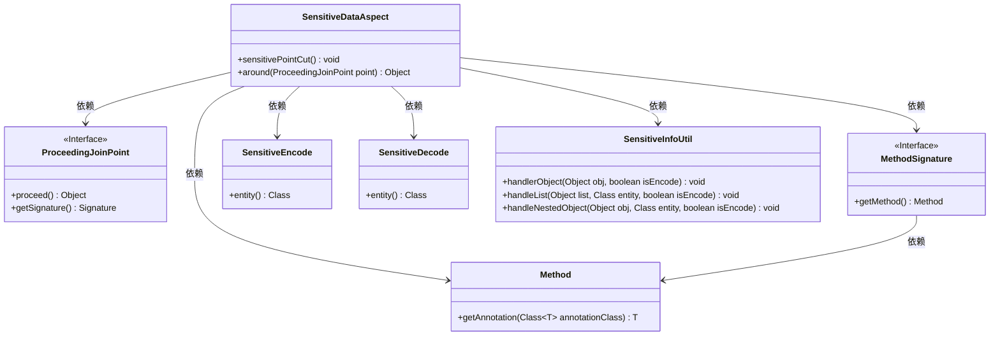
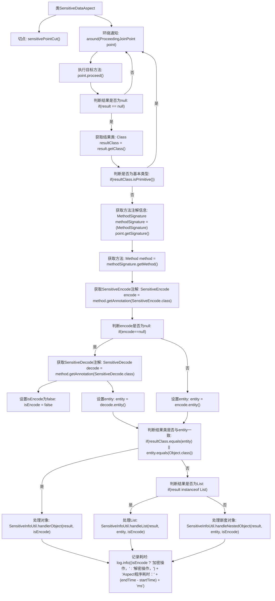

# 基础信息

|      |      |
|------|------|
| 名称 | SensitiveDataAspect |
| 编码语言 | .java |
| 代码路径 | JeecgBoot/jeecg-boot/jeecg-boot-base-core/src/main/java/org/jeecg/common/desensitization/aspect/SensitiveDataAspect.java |
| 包名 | org.jeecg.common.desensitization.aspect |
| 依赖项 | ['lombok.extern.slf4j.Slf4j', 'org.aspectj.lang.ProceedingJoinPoint', 'org.aspectj.lang.annotation.Around', 'org.aspectj.lang.annotation.Aspect', 'org.aspectj.lang.annotation.Pointcut', 'org.aspectj.lang.reflect.MethodSignature', 'org.jeecg.common.desensitization.annotation.SensitiveDecode', 'org.jeecg.common.desensitization.annotation.SensitiveEncode', 'org.jeecg.common.desensitization.util.SensitiveInfoUtil', 'org.springframework.stereotype.Component', 'java.lang.reflect.Method', 'java.util.List'] |
| 概述说明 | SensitiveDataAspect类负责敏感数据的加密解密，通过切点和注解实现。 |

# 说明

SensitiveDataAspect类专门负责处理敏感数据的加密和解密操作。它通过切点和方法注解的方式实现功能，确保在特定方法执行前后自动进行数据的加密或解密处理。这种设计提高了代码的安全性和可维护性，使得敏感数据的保护更加高效和自动化。

# 类列表 Class Summary

| 名称   | 类型  | 说明 |
|-------|------|-------------|
| SensitiveDataAspect | class | SensitiveDataAspect类用于处理敏感数据加密解密操作，通过切点和方法注解实现。 |

## 类 SensitiveDataAspect

|      |      |
|------|------|
| 访问范围 | @Slf4j;@Aspect;@Component;public |
| 类型 | class |
| 名称 | SensitiveDataAspect |
| 说明 | SensitiveDataAspect类用于处理敏感数据加密解密操作，通过切点和方法注解实现。 |

### UML类图

### 描述
`SensitiveDataAspect` 类是一个切面类，用于处理敏感数据的加密和解密操作。它通过定义切点 `sensitivePointCut` 来拦截带有 `SensitiveEncode` 或 `SensitiveDecode` 注解的方法。在 `around` 方法中，它根据方法的返回类型和注解信息，调用 `SensitiveInfoUtil` 类中的相应方法进行数据处理。该类依赖于 `ProceedingJoinPoint`、`MethodSignature`、`Method`、`SensitiveEncode`、`SensitiveDecode` 和 `SensitiveInfoUtil` 等类来完成其功能。

### 内部方法调用关系图

**描述：**  
该流程图展示了`SensitiveDataAspect`类中`around`方法的执行流程。首先，方法通过`point.proceed()`执行目标方法并获取结果。接着，判断结果是否为null或基本类型，如果是则直接返回。否则，获取方法注解信息，判断是加密还是解密操作，并根据结果的类型（对象、List或嵌套对象）调用相应的处理方法。最后，记录操作耗时并返回结果。整个流程确保了敏感数据的正确处理和日志记录。

### 字段列表 Field List

| 名称  | 类型  | 说明 |
|-------|-------|------|

### 方法列表 Method List

| 名称  | 类型  | 说明 |
|-------|-------|------|
| sensitivePointCut | void | 切面方法，用于处理敏感数据编码和解码注解。 |
| around | Object | 该方法通过AOP处理敏感信息，判断加密或解密操作，并记录耗时。 |

