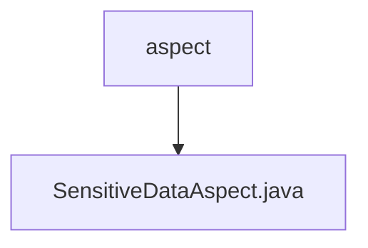

# 基础信息

|      |      |
|------|------|
| 名称 | aspect |
| 编码语言 | .java |
| 代码路径 | JeecgBoot/jeecg-boot/jeecg-boot-base-core/src/main/java/org/jeecg/common/desensitization/aspect |
| 包名 | JeecgBoot.jeecg-boot.jeecg-boot-base-core.src.main.java.org.jeecg.common.desensitization.aspect |
| 概述说明 | SensitiveDataAspect类负责敏感数据的加密解密，通过切点和注解实现。 |

# 说明

SensitiveDataAspect类专门负责处理敏感数据的加密和解密操作。它通过切点和方法注解的方式实现功能，确保在特定方法执行前后自动进行数据的加密或解密处理。这种设计提高了代码的安全性和可维护性，使得敏感数据的保护更加高效和自动化。

### 包内部结构视图

该流程图展示了JeecgBoot项目中`desensitization/aspect`目录与其子文件`SensitiveDataAspect.java`之间的层级关系。`aspect`是目录节点，`SensitiveDataAspect.java`是该目录下的唯一文件，表示该文件位于`aspect`目录中。

# 文件列表 File List

| 名称   | 类型  | 说明 |
|-------|------|-------------|
| [SensitiveDataAspect.java](SensitiveDataAspect.md) | file | SensitiveDataAspect类负责敏感数据的加密解密，通过切点和注解实现。 |

