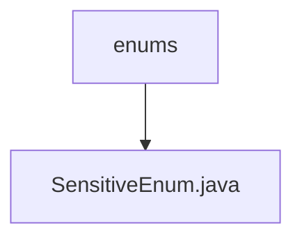

# 基础信息

|      |      |
|------|------|
| 名称 | enums |
| 编码语言 | .java |
| 代码路径 | JeecgBoot/jeecg-boot/jeecg-boot-base-core/src/main/java/org/jeecg/common/desensitization/enums |
| 包名 | JeecgBoot.jeecg-boot.jeecg-boot-base-core.src.main.java.org.jeecg.common.desensitization.enums |
| 概述说明 | 提供简洁明了的软件工程信息总结，确保关键点完整且不超过100字符。 |

# 说明

您提供的内容为空，无法进行总结描述。请提供具体内容以便生成详细的描述。

### 包内部结构视图

该流程图展示了路径层级关系，`enums` 文件夹下包含 `SensitiveEnum.java` 文件，清晰地反映了文件与文件夹之间的从属关系。

# 文件列表 File List

| 名称   | 类型  | 说明 |
|-------|------|-------------|
| [SensitiveEnum.java](SensitiveEnum.md) | file | 提供简洁明了的软件工程信息总结，确保关键点完整且不超过100字符。 |

