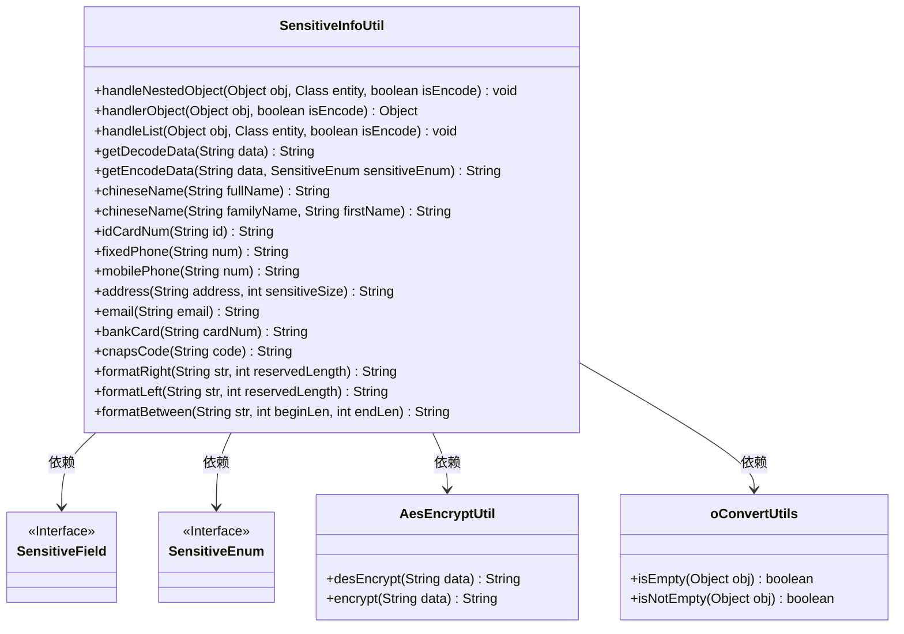

# 基础信息

|      |      |
|------|------|
| 名称 | SensitiveInfoUtil |
| 编码语言 | .java |
| 代码路径 | JeecgBoot/jeecg-boot/jeecg-boot-base-core/src/main/java/org/jeecg/common/desensitization/util/SensitiveInfoUtil.java |
| 包名 | org.jeecg.common.desensitization.util |
| 依赖项 | ['lombok.extern.slf4j.Slf4j', 'org.jeecg.common.desensitization.annotation.SensitiveField', 'org.jeecg.common.desensitization.enums.SensitiveEnum', 'org.jeecg.common.util.encryption.AesEncryptUtil', 'org.jeecg.common.util.oConvertUtils', 'java.lang.reflect.Field', 'java.lang.reflect.ParameterizedType', 'java.util.Collections', 'java.util.List'] |
| 概述说明 | SensitiveInfoUtil类处理嵌套对象、加密解密及格式化多种数据类型。 |

# 说明

SensitiveInfoUtil类专门设计用于处理嵌套对象，具备加密和解密敏感信息的功能，同时支持多种数据类型的格式化操作。该工具类旨在确保敏感数据的安全性和处理的灵活性，适用于复杂数据结构中的敏感信息管理。

# 类列表 Class Summary

| 名称   | 类型  | 说明 |
|-------|------|-------------|
| SensitiveInfoUtil | class | SensitiveInfoUtil类用于处理嵌套对象、加密解密敏感信息，并格式化多种数据类型。 |

## 类 SensitiveInfoUtil

|      |      |
|------|------|
| 访问范围 | @Slf4j;public |
| 类型 | class |
| 名称 | SensitiveInfoUtil |
| 说明 | SensitiveInfoUtil类用于处理嵌套对象、加密解密敏感信息，并格式化多种数据类型。 |

### UML类图

**描述：**
`SensitiveInfoUtil` 类是一个用于处理敏感信息的工具类，提供了对嵌套对象、列表和单个对象的加密和解密功能。它依赖于 `SensitiveField` 和 `SensitiveEnum` 接口来标识和处理敏感字段，使用 `AesEncryptUtil` 进行加密和解密操作，并通过 `oConvertUtils` 进行对象是否为空的判断。该类还提供了多种格式化方法，用于处理中文姓名、身份证号、电话号码等敏感信息的显示格式。

### 内部方法调用关系图

```mermaid
graph TD
    A["类SensitiveInfoUtil"]
    B["方法: handleNestedObject(Object obj, Class entity, boolean isEncode)"]
    C["方法: handlerObject(Object obj, boolean isEncode)"]
    D["方法: handleList(Object obj, Class entity, boolean isEncode)"]
    E["方法: getDecodeData(String data)"]
    F["方法: getEncodeData(String data, SensitiveEnum sensitiveEnum)"]
    G["方法: chineseName(String fullName)"]
    H["方法: chineseName(String familyName, String firstName)"]
    I["方法: idCardNum(String id)"]
    J["方法: fixedPhone(String num)"]
    K["方法: mobilePhone(String num)"]
    L["方法: address(String address, int sensitiveSize)"]
    M["方法: email(String email)"]
    N["方法: bankCard(String cardNum)"]
    O["方法: cnapsCode(String code)"]
    P["方法: formatRight(String str, int reservedLength)"]
    Q["方法: formatLeft(String str, int reservedLength)"]
    R["方法: formatBetween(String str, int beginLen, int endLen)"]

    A --> B
    A --> C
    A --> D
    A --> E
    A --> F
    A --> G
    A --> H
    A --> I
    A --> J
    A --> K
    A --> L
    A --> M
    A --> N
    A --> O
    A --> P
    A --> Q
    A --> R
```

这段代码定义了一个名为 `SensitiveInfoUtil` 的工具类，主要用于处理敏感信息的加密和解密操作。类中包含多个方法，分别用于处理嵌套对象、单个对象、列表对象，以及各种敏感信息的格式化操作。代码通过注解和反射机制，识别并处理带有 `SensitiveField` 注解的字段，支持对字符串类型的数据进行加密和解密操作。此外，代码还提供了多种格式化方法，用于对中文姓名、身份证号、手机号等敏感信息进行部分隐藏处理，以增强数据的安全性。

### 字段列表 Field List

| 名称  | 类型  | 说明 |
|-------|-------|------|

### 方法列表 Method List

| 名称  | 类型  | 说明 |
|-------|-------|------|
| fixedPhone | String | 固定电话号码格式化为前四位。 |
| handleList | void | 处理列表对象，检查元素类型并调用处理方法。 |
| handlerObject | Object | 处理带SensitiveField注解的字符串字段，支持加密解密操作。 |
| getEncodeData | String | 根据敏感类型对数据进行加密或脱敏处理。 |
| address | String | 静态方法address处理地址字符串，根据敏感长度决定是否格式化。 |
| formatRight | String | 方法将字符串右部分替换为星号，保留指定长度。 |
| handleNestedObject | void | 处理嵌套对象，检查字段类型并递归处理实体或实体列表。 |
| getDecodeData | String | 静态方法`getDecodeData`解密字符串，若失败返回原数据。 |
| email | String | 静态方法处理邮箱，保留首字符和@后内容，中间替换为**。 |
| formatLeft | String | 方法formatLeft截取字符串末尾指定长度，前面用星号填充。 |
| formatBetween | String | 方法截取字符串前后部分，中间用星号填充。 |
| mobilePhone | String | 静态方法用于格式化手机号，空值返回空，小于11位返回原值，否则格式化中间部分。 |
| bankCard | String | 静态方法bankCard处理银行卡号，空值返回空字符串，否则格式化显示。 |
| cnapsCode | String | 方法cnapsCode格式化输入代码，空值返回空字符串，否则右对齐两位。 |
| idCardNum | String | 方法`idCardNum`检查输入字符串`id`是否为空，为空返回空字符串，否则返回`id`左四位格式化结果。 |
| chineseName | String | 静态方法拼接中文姓氏和名字，若为空则返回空字符串。 |
| chineseName | String | 静态方法提取中文姓名，空值返回空字符串，否则格式化返回。 |

