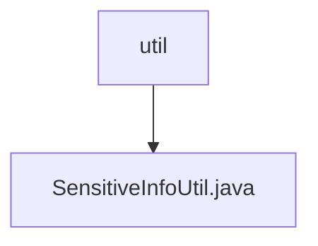

# 基础信息

|      |      |
|------|------|
| 名称 | util |
| 编码语言 | .java |
| 代码路径 | JeecgBoot/jeecg-boot/jeecg-boot-base-core/src/main/java/org/jeecg/common/desensitization/util |
| 包名 | JeecgBoot.jeecg-boot.jeecg-boot-base-core.src.main.java.org.jeecg.common.desensitization.util |
| 概述说明 | SensitiveInfoUtil类处理嵌套对象、加密解密及格式化多种数据类型。 |

# 说明

SensitiveInfoUtil类专门设计用于处理嵌套对象，具备加密和解密敏感信息的功能，同时支持多种数据类型的格式化操作。该工具类旨在确保敏感数据的安全性和处理的灵活性，适用于复杂数据结构中的敏感信息管理。

### 包内部结构视图

该流程图展示了路径的层级关系，`util` 是父节点，`SensitiveInfoUtil.java` 是其子节点。路径中的 `util` 文件夹包含了一个名为 `SensitiveInfoUtil.java` 的文件，表示该文件位于 `util` 文件夹下。

# 文件列表 File List

| 名称   | 类型  | 说明 |
|-------|------|-------------|
| [SensitiveInfoUtil.java](SensitiveInfoUtil.md) | file | SensitiveInfoUtil类处理嵌套对象、加密解密及格式化多种数据类型。 |

