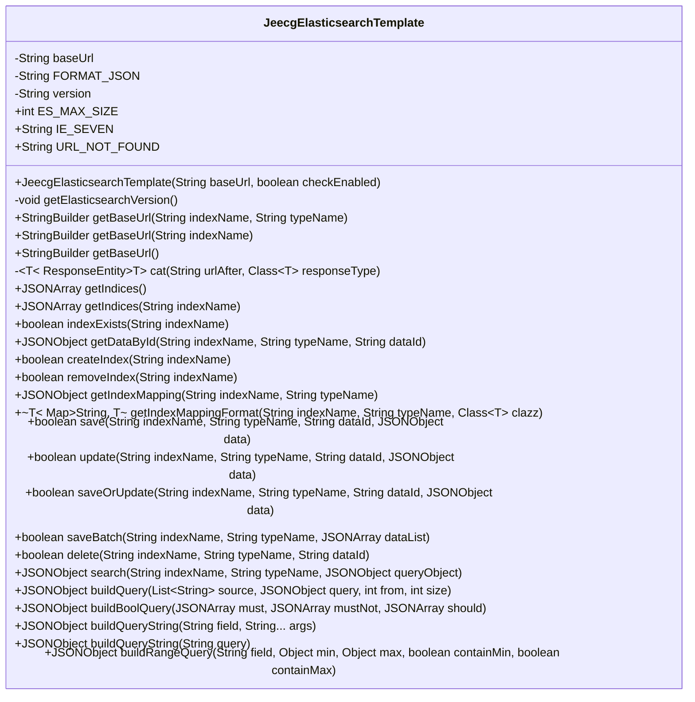

# 基础信息

|      |      |
|------|------|
| 名称 | JeecgElasticsearchTemplate |
| 编码语言 | .java |
| 代码路径 | JeecgBoot/jeecg-boot/jeecg-boot-base-core/src/main/java/org/jeecg/common/es/JeecgElasticsearchTemplate.java |
| 包名 | org.jeecg.common.es |
| 依赖项 | ['com.alibaba.fastjson.JSONArray', 'com.alibaba.fastjson.JSONObject', 'lombok.extern.slf4j.Slf4j', 'org.apache.commons.lang3.StringUtils', 'org.jeecg.common.util.RestUtil', 'org.jeecg.common.util.oConvertUtils', 'org.springframework.beans.factory.annotation.Value', 'org.springframework.boot.autoconfigure.condition.ConditionalOnProperty', 'org.springframework.http.HttpHeaders', 'org.springframework.http.HttpMethod', 'org.springframework.http.HttpStatus', 'org.springframework.http.ResponseEntity', 'org.springframework.stereotype.Component', 'java.util'] |
| 概述说明 | JeecgElasticsearchTemplate类管理Elasticsearch连接，支持索引操作与数据查询。 |

# 说明

JeecgElasticsearchTemplate类是一个用于管理Elasticsearch连接与操作的类，提供了对Elasticsearch索引的增删查改功能，并支持数据的保存、更新以及查询操作。该类封装了与Elasticsearch交互的核心功能，简化了开发者在应用中集成和使用Elasticsearch的流程。

# 类列表 Class Summary

| 名称   | 类型  | 说明 |
|-------|------|-------------|
| JeecgElasticsearchTemplate | class | JeecgElasticsearchTemplate类用于管理Elasticsearch连接与操作，支持索引增删查改、数据保存更新及查询功能。 |

## 类 JeecgElasticsearchTemplate

|      |      |
|------|------|
| 访问范围 | @Slf4j;@Component;@ConditionalOnProperty(prefix = "jeecg.elasticsearch", name = "cluster-nodes");public |
| 类型 | class |
| 名称 | JeecgElasticsearchTemplate |
| 说明 | JeecgElasticsearchTemplate类用于管理Elasticsearch连接与操作，支持索引增删查改、数据保存更新及查询功能。 |

### UML类图

**描述：**  
`JeecgElasticsearchTemplate` 是一个用于与 Elasticsearch 进行交互的工具类。它封装了与 Elasticsearch 集群的通信逻辑，提供了索引管理、数据查询、数据存储与更新等功能。通过该类，用户可以方便地执行诸如创建索引、删除索引、查询数据、保存数据等操作。该类还支持构建复杂的查询条件，如布尔查询、范围查询等，并提供了对 Elasticsearch 版本号的自动检测与兼容处理。

### 内部方法调用关系图

```mermaid
graph TD
    A["类JeecgElasticsearchTemplate"]
    B["属性: String baseUrl"]
    C["属性: String FORMAT_JSON"]
    D["属性: String version"]
    E["构造方法: JeecgElasticsearchTemplate(String baseUrl, boolean checkEnabled)"]
    F["方法: private void getElasticsearchVersion()"]
    G["方法: public StringBuilder getBaseUrl(String indexName, String typeName)"]
    H["方法: public StringBuilder getBaseUrl(String indexName)"]
    I["方法: public StringBuilder getBaseUrl()"]
    J["方法: private <T> ResponseEntity<T> cat(String urlAfter, Class<T> responseType)"]
    K["方法: public JSONArray getIndices()"]
    L["方法: public JSONArray getIndices(String indexName)"]
    M["方法: public boolean indexExists(String indexName)"]
    N["方法: public JSONObject getDataById(String indexName, String typeName, String dataId)"]
    O["方法: public boolean createIndex(String indexName)"]
    P["方法: public boolean removeIndex(String indexName)"]
    Q["方法: public JSONObject getIndexMapping(String indexName, String typeName)"]
    R["方法: public <T> Map<String, T> getIndexMappingFormat(String indexName, String typeName, Class<T> clazz)"]
    S["方法: public boolean save(String indexName, String typeName, String dataId, JSONObject data)"]
    T["方法: public boolean update(String indexName, String typeName, String dataId, JSONObject data)"]
    U["方法: public boolean saveOrUpdate(String indexName, String typeName, String dataId, JSONObject data)"]
    V["方法: public boolean saveBatch(String indexName, String typeName, JSONArray dataList)"]
    W["方法: public boolean delete(String indexName, String typeName, String dataId)"]
    X["方法: public JSONObject search(String indexName, String typeName, JSONObject queryObject)"]
    Y["方法: public JSONObject buildQuery(List<String> source, JSONObject query, int from, int size)"]
    Z["方法: public JSONObject buildBoolQuery(JSONArray must, JSONArray mustNot, JSONArray should)"]
    AA["方法: public JSONObject buildQueryString(String field, String... args)"]
    AB["方法: public JSONObject buildQueryString(String query)"]
    AC["方法: public JSONObject buildRangeQuery(String field, Object min, Object max, boolean containMin, boolean containMax)"]

    A --> B
    A --> C
    A --> D
    A --> E
    E --> F
    A --> G
    A --> H
    A --> I
    A --> J
    A --> K
    A --> L
    A --> M
    A --> N
    A --> O
    A --> P
    A --> Q
    A --> R
    A --> S
    A --> T
    A --> U
    A --> V
    A --> W
    A --> X
    A --> Y
    A --> Z
    A --> AA
    A --> AB
    A --> AC
```

**流程图描述：**

该流程图展示了`JeecgElasticsearchTemplate`类的结构及其方法调用关系。类包含多个属性，如`baseUrl`、`FORMAT_JSON`和`version`，以及构造方法和多个公共与私有方法。这些方法主要用于与Elasticsearch进行交互，包括获取版本信息、构建URL、查询索引、创建和删除索引、保存和更新数据等操作。流程图清晰地展示了类内部各方法之间的调用关系，帮助理解类的功能和工作流程。

### 字段列表 Field List

| 名称  | 类型  | 说明 |
|-------|-------|------|
| ES_MAX_SIZE = 10000 | int | ES_MAX_SIZE常量值为10000。 |
| baseUrl | String | 定义了一个私有字符串变量baseUrl。 |
| FORMAT_JSON = "format=json" | String | 定义私有常量字符串FORMAT_JSON，值为"format=json"。 |
| IE_SEVEN = "7" | String | 定义常量IE_SEVEN，值为字符串"7"。 |
| URL_NOT_FOUND = "404 Not Found" | String | 定义常量URL_NOT_FOUND表示404错误。 |
| version = null | String | 声明一个私有的字符串变量version，初始值为null。 |

### 方法列表 Method List

| 名称  | 类型  | 说明 |
|-------|-------|------|
| buildQueryString | JSONObject | 构建查询字符串并返回JSON对象。 |
| buildQueryString | JSONObject | 构建查询字符串方法，拼接字段和参数生成查询条件。 |
| buildQuery | JSONObject | 构建查询JSON对象，包含源、查询、起始位置和大小参数。 |
| getBaseUrl | StringBuilder | 该方法返回以"http://"开头的完整基础URL字符串。 |
| buildRangeQuery | JSONObject | 构建JSON范围查询，支持最小值和最大值的包含与排除。 |
| update | boolean | 更新指定索引、类型和ID的数据，返回操作结果。 |
| search | JSONObject | 方法搜索指定索引和类型，返回查询结果。 |
| getElasticsearchVersion | void | 获取Elasticsearch版本信息，若未获取则通过URL请求并解析结果。 |
| getIndexMappingFormat | Map<String, T> | 方法获取索引映射并转换为指定类型的Map。 |
| removeIndex | boolean | 删除指定索引，成功返回true，失败返回false，处理404异常。 |
| buildBoolQuery | JSONObject | 构建布尔查询，包含must、mustNot、should条件。 |
| createIndex | boolean | 方法创建索引，返回布尔值，处理异常和日志。 |
| getIndices | JSONArray | 获取索引的公共方法，调用带参方法返回JSONArray。 |
| getDataById | JSONObject | 通过ID从指定索引和类型获取数据，返回源数据或null。 |
| save | boolean | 保存或更新指定索引、类型和ID的JSON数据。 |
| getIndexMapping | JSONObject | 获取指定索引和类型的映射信息，兼容ES 7.x版本，返回JSON格式数据。 |
| delete | boolean | 删除指定索引和类型的文档，返回是否成功。 |
| getIndices | JSONArray | 获取指定索引信息的方法，通过拼接URL并调用cat接口返回JSONArray结果。 |
| getBaseUrl | StringBuilder | 方法`getBaseUrl`拼接基础URL与索引名称并返回。 |
| indexExists | boolean | 检查指定索引是否存在，存在返回true，否则返回false，异常时抛出。 |
| getBaseUrl | StringBuilder | 获取指定索引和类型的基URL，并拼接类型名。 |
| cat | ResponseEntity<T> | 私有方法`cat`通过拼接URL并调用`RestUtil.request`发起GET请求，返回指定类型的响应。 |
| saveOrUpdate | boolean | 方法保存或更新数据，剔除空值和上传控件字段，返回操作结果。 |
| saveBatch | boolean | 方法saveBatch用于批量保存数据，生成Bulk请求并发送至指定URL。 |

