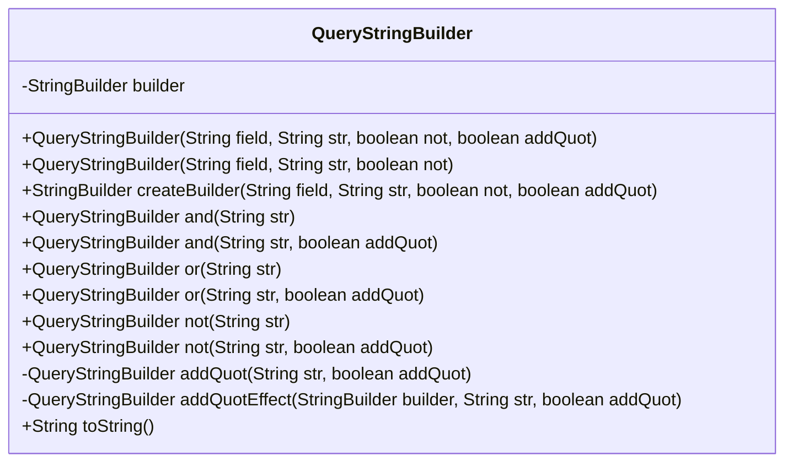
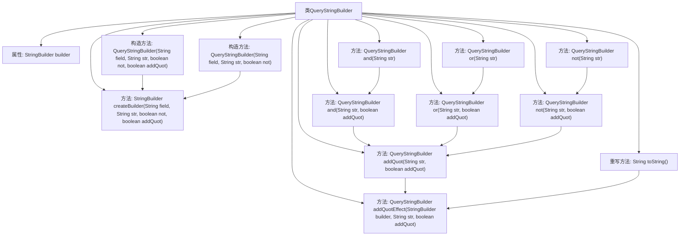

# 基础信息

|      |      |
|------|------|
| 名称 | QueryStringBuilder |
| 编码语言 | .java |
| 代码路径 | JeecgBoot/jeecg-boot/jeecg-boot-base-core/src/main/java/org/jeecg/common/es/QueryStringBuilder.java |
| 包名 | org.jeecg.common.es |
| 依赖项 | [] |
| 概述说明 | QueryStringBuilder类支持AND、OR、NOT逻辑操作，可添加双引号构建查询字符串。 |

# 说明

QueryStringBuilder类用于构建查询字符串，支持AND、OR、NOT三种逻辑操作，并可根据需要选择为查询字符串添加双引号。该类功能全面，便于用户灵活构建复杂的查询条件。

# 类列表 Class Summary

| 名称   | 类型  | 说明 |
|-------|------|-------------|
| QueryStringBuilder | class | QueryStringBuilder类用于构建查询字符串，支持AND、OR、NOT逻辑操作，并可选择添加双引号。 |

## 类 QueryStringBuilder

|      |      |
|------|------|
| 访问范围 | public |
| 类型 | class |
| 名称 | QueryStringBuilder |
| 说明 | QueryStringBuilder类用于构建查询字符串，支持AND、OR、NOT逻辑操作，并可选择添加双引号。 |

### UML类图

**描述：**
`QueryStringBuilder` 类用于构建查询字符串，支持通过 `and`、`or`、`not` 等逻辑操作符组合查询条件。类内部使用 `StringBuilder` 来动态构建查询字符串，并提供了灵活的方法来控制是否在查询条件中添加双引号。通过构造函数和方法的重载，类提供了多种方式来初始化和管理查询字符串的构建过程。

### 内部方法调用关系图

这段代码定义了一个`QueryStringBuilder`类，用于构建查询字符串。类中包含多个构造方法和实例方法，用于处理字段、字符串、逻辑操作符（如`AND`、`OR`、`NOT`）以及是否添加双引号的情况。`createBuilder`方法负责初始化`StringBuilder`，而`addQuotEffect`方法则根据参数决定是否在字符串两侧添加双引号。`toString`方法最终返回构建好的查询字符串。整个流程展示了如何通过链式调用逐步构建复杂的查询条件。

### 字段列表 Field List

| 名称  | 类型  | 说明 |
|-------|-------|------|
| builder | StringBuilder | 声明StringBuilder对象builder。 |

### 方法列表 Method List

| 名称  | 类型  | 说明 |
|-------|-------|------|
| not | QueryStringBuilder | QueryStringBuilder类中not方法，排除指定字符串。 |
| createBuilder | StringBuilder | 方法生成包含字段、字符串及条件的查询构建器。 |
| and | QueryStringBuilder | QueryStringBuilder类的and方法，接受字符串参数并返回自身实例。 |
| not | QueryStringBuilder | QueryStringBuilder方法not追加NOT并处理字符串引号。 |
| or | QueryStringBuilder | `or`方法将字符串参数与当前对象合并，默认启用条件。 |
| toString | String | 重写toString方法，返回builder追加")"后的字符串。 |
| addQuotEffect | QueryStringBuilder | 私有方法`addQuotEffect`根据`addQuot`参数决定是否在字符串`str`前后添加引号。 |
| addQuot | QueryStringBuilder | 方法`addQuot`用于在字符串`str`上添加引号，并根据`addQuot`参数决定是否生效。 |
| or | QueryStringBuilder | 方法or在QueryStringBuilder中添加"OR"并处理字符串引号。 |
| and | QueryStringBuilder | QueryStringBuilder方法：添加AND条件，可选引号。 |

