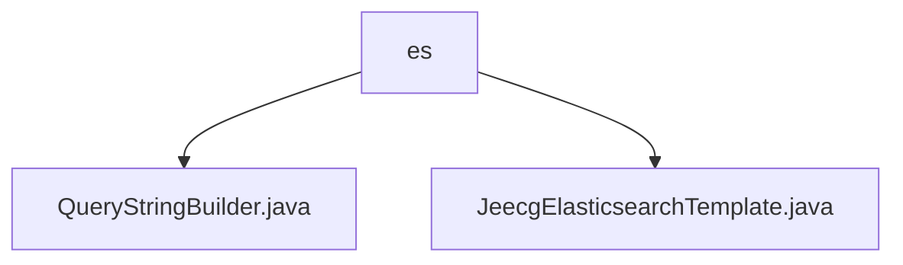

# 基础信息

|      |      |
|------|------|
| 名称 | es |
| 编码语言 | .java |
| 代码路径 | JeecgBoot/jeecg-boot/jeecg-boot-base-core/src/main/java/org/jeecg/common/es |
| 包名 | JeecgBoot.jeecg-boot.jeecg-boot-base-core.src.main.java.org.jeecg.common.es |
| 概述说明 | QueryStringBuilder类支持AND、OR、NOT逻辑操作，JeecgElasticsearchTemplate类管理Elasticsearch连接与操作。 |

# 说明

## 概述
该代码模块主要围绕Elasticsearch的集成与操作展开，提供了构建查询字符串和管理Elasticsearch连接的核心功能。模块包含两个主要类：`QueryStringBuilder`和`JeecgElasticsearchTemplate`。`QueryStringBuilder`类用于灵活构建复杂的查询条件，支持AND、OR、NOT三种逻辑操作，并可选择为查询字符串添加双引号。`JeecgElasticsearchTemplate`类则封装了与Elasticsearch交互的核心功能，包括索引的增删查改、数据的保存、更新以及查询操作，简化了开发者在应用中集成和使用Elasticsearch的流程。

## 主要业务场景
1. **复杂查询条件构建**：在需要构建复杂查询条件的场景中，`QueryStringBuilder`类提供了灵活的逻辑操作支持，便于开发者根据业务需求动态生成查询字符串。
2. **Elasticsearch数据管理**：在需要对Elasticsearch进行数据操作的场景中，`JeecgElasticsearchTemplate`类提供了完整的增删查改功能，支持数据的保存、更新和查询，帮助开发者高效管理Elasticsearch中的数据。
3. **Elasticsearch集成**：在需要将Elasticsearch集成到应用中的场景中，该模块通过封装核心功能，简化了与Elasticsearch的交互流程，降低了开发复杂度。

### 包内部结构视图

该流程图展示了路径2中的层级关系。`es`文件夹下包含两个文件：`QueryStringBuilder.java`和`JeecgElasticsearchTemplate.java`。这两个文件都位于`es`目录下，且没有进一步的子目录结构。

# 文件列表 File List

| 名称   | 类型  | 说明 |
|-------|------|-------------|
| [QueryStringBuilder.java](QueryStringBuilder.md) | file | QueryStringBuilder类支持AND、OR、NOT逻辑操作，可添加双引号构建查询字符串。 |
| [JeecgElasticsearchTemplate.java](JeecgElasticsearchTemplate.md) | file | JeecgElasticsearchTemplate类管理Elasticsearch连接，支持索引操作与数据查询。 |

