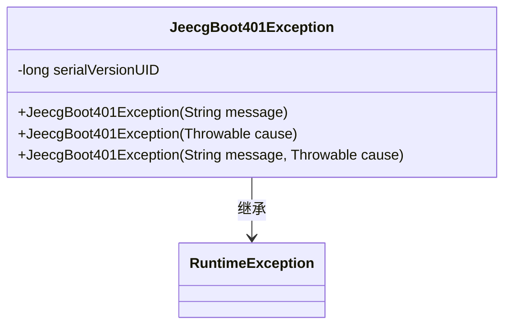
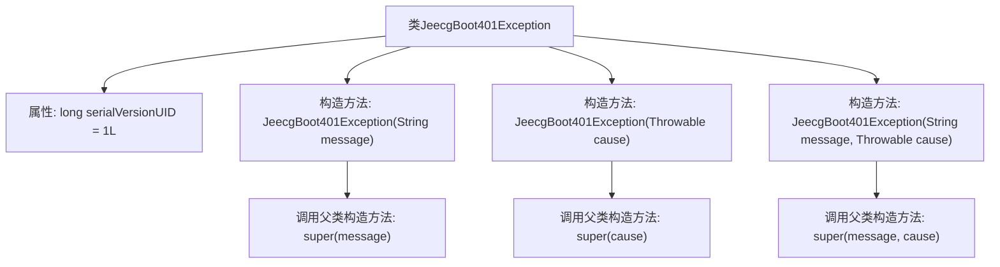

# 基础信息

|      |      |
|------|------|
| 名称 | JeecgBoot401Exception |
| 编码语言 | .java |
| 代码路径 | JeecgBoot/jeecg-boot/jeecg-boot-base-core/src/main/java/org/jeecg/common/exception/JeecgBoot401Exception.java |
| 包名 | org.jeecg.common.exception |
| 依赖项 | [] |
| 概述说明 | JeecgBoot401Exception继承RuntimeException，提供三种构造方法处理异常信息。 |

# 说明

JeecgBoot401Exception继承自RuntimeException，专门用于处理401异常情况。该异常类提供了三种构造方法，分别用于不同的异常信息处理场景。这些构造方法能够灵活地捕获和传递异常信息，确保在发生401错误时能够准确地抛出和处理异常。通过这种方式，JeecgBoot401Exception增强了代码的健壮性和可维护性，使得异常处理更加高效和清晰。

# 类列表 Class Summary

| 名称   | 类型  | 说明 |
|-------|------|-------------|
| JeecgBoot401Exception | class | JeecgBoot401Exception继承RuntimeException，提供三种构造方法处理异常信息。 |

## 类 JeecgBoot401Exception

|      |      |
|------|------|
| 访问范围 | public |
| 类型 | class |
| 名称 | JeecgBoot401Exception |
| 说明 | JeecgBoot401Exception继承RuntimeException，提供三种构造方法处理异常信息。 |

### UML类图

类图描述：
`JeecgBoot401Exception` 是一个自定义的运行时异常类，继承自 `RuntimeException`。它提供了三个构造函数，分别用于处理异常消息、异常原因以及同时包含消息和原因的情况。`serialVersionUID` 用于确保序列化时的版本一致性。该类主要用于在 JeecgBoot 框架中处理 401 未授权异常。

### 内部方法调用关系图

这段代码定义了一个名为`JeecgBoot401Exception`的异常类，它继承自`RuntimeException`。该类包含三个构造方法，分别用于处理不同的异常情况：传递异常消息、传递异常原因以及同时传递异常消息和原因。每个构造方法都调用了父类的相应构造方法来进行初始化。这个类的主要作用是提供一个自定义的运行时异常，以便在特定情况下抛出并捕获。

### 字段列表 Field List

| 名称  | 类型  | 说明 |
|-------|-------|------|
| serialVersionUID = 1L | long | 声明序列化版本号，确保类版本一致性。 |

### 方法列表 Method List

| 名称  | 类型  | 说明 |
|-------|-------|------|

