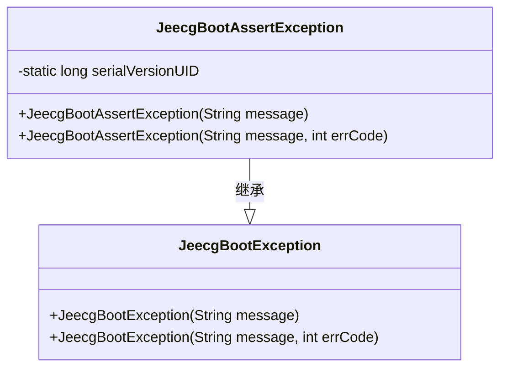
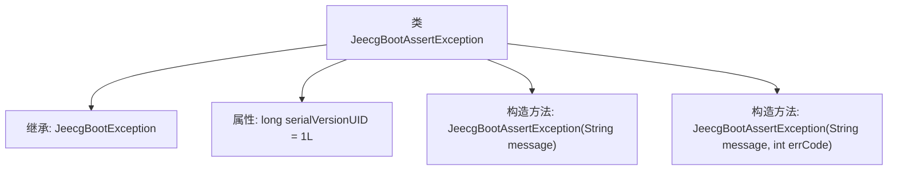

# 基础信息

|      |      |
|------|------|
| 名称 | JeecgBootAssertException |
| 编码语言 | .java |
| 代码路径 | JeecgBoot/jeecg-boot/jeecg-boot-base-core/src/main/java/org/jeecg/common/exception/JeecgBootAssertException.java |
| 包名 | org.jeecg.common.exception |
| 依赖项 | [] |
| 概述说明 | JeecgBootAssertException继承JeecgBootException，支持消息和错误码构造。 |

# 说明

JeecgBootAssertException是JeecgBootException的子类，主要用于处理断言异常。它包含一个构造方法，可以接受消息和错误码作为参数，以便在抛出异常时提供详细的错误信息和错误代码。这种设计使得异常处理更加灵活和具体，便于开发者快速定位和解决问题。

# 类列表 Class Summary

| 名称   | 类型  | 说明 |
|-------|------|-------------|
| JeecgBootAssertException | class | JeecgBootAssertException继承JeecgBootException，包含带消息和错误码的构造方法。 |

## 类 JeecgBootAssertException

|      |      |
|------|------|
| 访问范围 | public |
| 类型 | class |
| 名称 | JeecgBootAssertException |
| 说明 | JeecgBootAssertException继承JeecgBootException，包含带消息和错误码的构造方法。 |

### UML类图

类图描述：`JeecgBootAssertException` 是 `JeecgBootException` 的子类，继承自 `JeecgBootException`。它提供了两个构造函数，分别用于处理带有错误信息和带有错误信息及错误码的异常情况。`serialVersionUID` 是一个静态常量，用于序列化时的版本控制。

### 内部方法调用关系图

这段代码定义了一个名为`JeecgBootAssertException`的类，它继承自`JeecgBootException`。该类包含两个构造方法，分别用于初始化异常信息以及异常信息和错误代码。`serialVersionUID`属性用于确保序列化的一致性。流程图展示了类的继承关系以及构造方法的调用路径。

### 字段列表 Field List

| 名称  | 类型  | 说明 |
|-------|-------|------|
| serialVersionUID = 1L | long | 定义序列化版本UID为1L。 |

### 方法列表 Method List

| 名称  | 类型  | 说明 |
|-------|-------|------|

