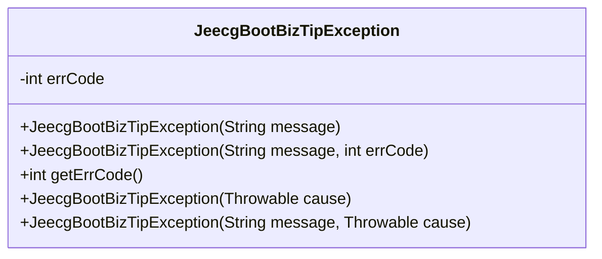
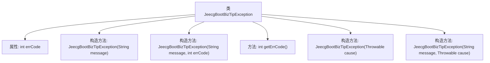

# 基础信息

|      |      |
|------|------|
| 名称 | JeecgBootBizTipException |
| 编码语言 | .java |
| 代码路径 | JeecgBoot/jeecg-boot/jeecg-boot-base-core/src/main/java/org/jeecg/common/exception/JeecgBootBizTipException.java |
| 包名 | org.jeecg.common.exception |
| 依赖项 | ['org.jeecg.common.constant.CommonConstant'] |
| 概述说明 | JeecgBootBizTipException继承RuntimeException，含错误码和多构造方法。 |

# 说明

JeecgBootBizTipException是一个继承自RuntimeException的异常类，主要用于处理业务逻辑中的错误提示。该异常类包含错误码，用于标识具体的错误类型，便于系统进行错误处理和日志记录。此外，JeecgBootBizTipException提供了多种构造方法，支持通过不同的参数进行初始化，如仅传递错误信息、同时传递错误码和错误信息等，增强了异常的灵活性和适用性。

# 类列表 Class Summary

| 名称   | 类型  | 说明 |
|-------|------|-------------|
| JeecgBootBizTipException | class | JeecgBootBizTipException继承RuntimeException，包含错误码和多种构造方法。 |

## 类 JeecgBootBizTipException

|      |      |
|------|------|
| 访问范围 | public |
| 类型 | class |
| 名称 | JeecgBootBizTipException |
| 说明 | JeecgBootBizTipException继承RuntimeException，包含错误码和多种构造方法。 |

### UML类图

JeecgBootBizTipException 是一个自定义的运行时异常类，继承自 RuntimeException。它包含一个错误码 errCode，用于返回给前端。该类提供了多个构造函数，允许通过不同的方式初始化异常对象，包括仅传递错误信息、同时传递错误信息和错误码、仅传递异常原因、以及同时传递错误信息和异常原因。这种设计使得异常处理更加灵活，能够适应不同的错误场景。

### 内部方法调用关系图

这段代码定义了一个名为 `JeecgBootBizTipException` 的异常类，继承自 `RuntimeException`。该类包含一个 `errCode` 属性，用于存储返回给前端的错误代码。类中提供了多个构造方法，允许通过不同的方式初始化异常对象，包括仅传递错误信息、传递错误信息和错误代码、传递异常原因，以及同时传递错误信息和异常原因。此外，还提供了一个 `getErrCode` 方法，用于获取 `errCode` 的值。

### 字段列表 Field List

| 名称  | 类型  | 说明 |
|-------|-------|------|
| serialVersionUID = 1L | long | 声明一个私有的静态最终长整型序列化版本号。 |
| errCode = CommonConstant.SC_INTERNAL_SERVER_ERROR_500 | int | 私有整型变量errCode初始化为500内部服务器错误。 |

### 方法列表 Method List

| 名称  | 类型  | 说明 |
|-------|-------|------|
| getErrCode | int | 获取错误码的方法，返回整数类型错误码。 |

