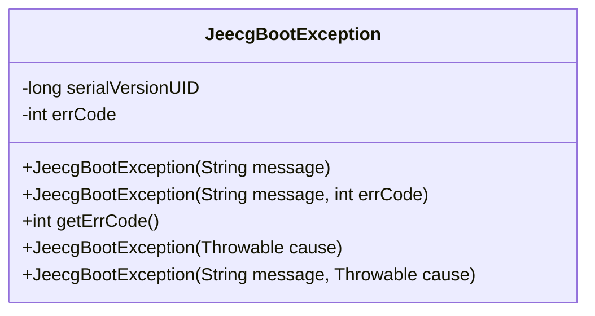
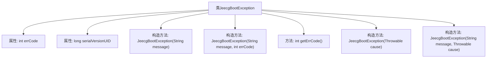

# 基础信息

|      |      |
|------|------|
| 名称 | JeecgBootException |
| 编码语言 | .java |
| 代码路径 | JeecgBoot/jeecg-boot/jeecg-boot-base-core/src/main/java/org/jeecg/common/exception/JeecgBootException.java |
| 包名 | org.jeecg.common.exception |
| 依赖项 | ['org.jeecg.common.constant.CommonConstant'] |
| 概述说明 | JeecgBootException继承RuntimeException，包含错误码及多种构造方法。 |

# 说明

JeecgBootException是一个继承自RuntimeException的异常类，主要用于处理JeecgBoot框架中的异常情况。该类包含一个错误码属性，用于标识具体的错误类型。此外，JeecgBootException提供了多种构造方法，允许开发者根据不同的需求进行异常实例化。这些构造方法可以接受错误码、错误信息、异常原因等参数，使得异常处理更加灵活和详细。通过这种方式，JeecgBootException能够更精确地捕获和传递异常信息，便于后续的调试和错误处理。

# 类列表 Class Summary

| 名称   | 类型  | 说明 |
|-------|------|-------------|
| JeecgBootException | class | JeecgBootException继承RuntimeException，包含错误码和多种构造方法。 |

## 类 JeecgBootException

|      |      |
|------|------|
| 访问范围 | public |
| 类型 | class |
| 名称 | JeecgBootException |
| 说明 | JeecgBootException继承RuntimeException，包含错误码和多种构造方法。 |

### UML类图

**描述**：`JeecgBootException` 是一个自定义的运行时异常类，继承自 `RuntimeException`。它包含一个用于标识错误代码的私有字段 `errCode`，并提供了多个构造函数来初始化异常信息和错误代码。该类还提供了获取错误代码的方法 `getErrCode()`，使得在处理异常时能够获取具体的错误信息。

### 内部方法调用关系图

这段代码定义了一个名为`JeecgBootException`的异常类，继承自`RuntimeException`。该类包含两个属性：`errCode`和`serialVersionUID`，分别表示返回给前端的错误代码和序列化版本号。类中提供了多个构造方法，用于初始化异常信息、错误代码和异常原因。`getErrCode`方法用于获取错误代码。流程图展示了类的属性和方法之间的调用关系，清晰地描述了类的结构。

### 字段列表 Field List

| 名称  | 类型  | 说明 |
|-------|-------|------|
| errCode = CommonConstant.SC_INTERNAL_SERVER_ERROR_500 | int | 定义私有整型变量errCode，初始值为500。 |
| serialVersionUID = 1L | long | 定义序列化版本号的静态常量。 |

### 方法列表 Method List

| 名称  | 类型  | 说明 |
|-------|-------|------|
| getErrCode | int | 方法getErrCode返回errCode的值。 |

