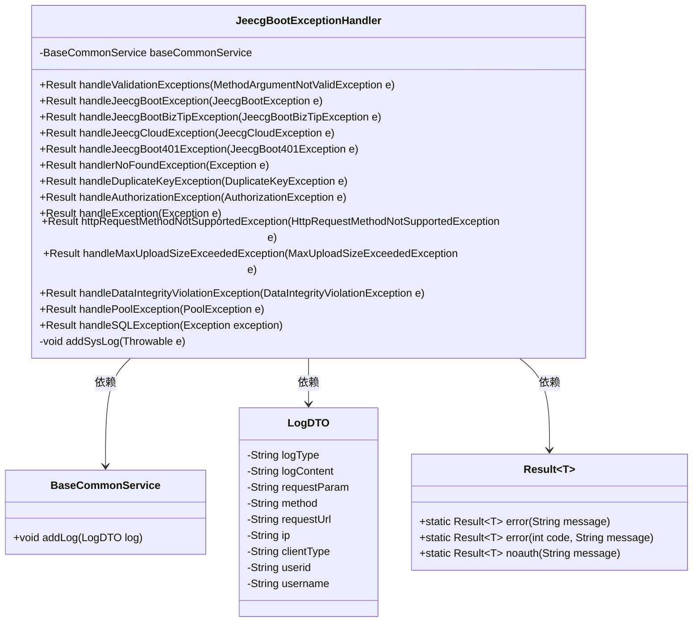

# 基础信息

|      |      |
|------|------|
| 名称 | JeecgBootExceptionHandler |
| 编码语言 | .java |
| 代码路径 | JeecgBoot/jeecg-boot/jeecg-boot-base-core/src/main/java/org/jeecg/common/exception/JeecgBootExceptionHandler.java |
| 包名 | org.jeecg.common.exception |
| 依赖项 | ['cn.hutool.core.util.ObjectUtil', 'lombok.extern.slf4j.Slf4j', 'org.apache.commons.lang3.exception.ExceptionUtils', 'org.apache.shiro.SecurityUtils', 'org.apache.shiro.authz.AuthorizationException', 'org.apache.shiro.authz.UnauthorizedException', 'org.jeecg.common.api.dto.LogDTO', 'org.jeecg.common.api.vo.Result', 'org.jeecg.common.constant.CommonConstant', 'org.jeecg.common.constant.enums.ClientTerminalTypeEnum', 'org.jeecg.common.enums.SentinelErrorInfoEnum', 'org.jeecg.common.system.vo.LoginUser', 'org.jeecg.common.util.BrowserUtils', 'org.jeecg.common.util.IpUtils', 'org.jeecg.common.util.SpringContextUtils', 'org.jeecg.common.util.oConvertUtils', 'org.jeecg.modules.base.service.BaseCommonService', 'org.springframework.beans.BeansException', 'org.springframework.dao.DataIntegrityViolationException', 'org.springframework.dao.DuplicateKeyException', 'org.springframework.data.redis.connection.PoolException', 'org.springframework.http.HttpStatus', 'org.springframework.util.CollectionUtils', 'org.springframework.validation.ObjectError', 'org.springframework.web.HttpRequestMethodNotSupportedException', 'org.springframework.web.bind.MethodArgumentNotValidException', 'org.springframework.web.bind.annotation.ExceptionHandler', 'org.springframework.web.bind.annotation.ResponseStatus', 'org.springframework.web.bind.annotation.RestControllerAdvice', 'org.springframework.web.multipart.MaxUploadSizeExceededException', 'org.springframework.web.servlet.NoHandlerFoundException', 'javax.annotation.Resource', 'javax.servlet.http.HttpServletRequest', 'java.util.Map', 'java.util.stream.Collectors'] |
| 概述说明 | JeecgBoot异常处理器处理多类异常，记录日志并返回错误信息。 |

# 说明

JeecgBoot异常处理器是一个专门用于捕获和处理多种异常的工具。它能够在系统运行过程中自动检测到各类异常情况，并对其进行详细的日志记录，以便后续分析和排查问题。同时，该处理器会根据不同类型的异常，返回相应的错误信息给用户或调用方，确保系统在遇到异常时能够提供明确的反馈和指导。通过这种方式，JeecgBoot异常处理器有效地提升了系统的稳定性和可维护性，减少了因异常导致的系统崩溃或功能失效的风险。

# 类列表 Class Summary

| 名称   | 类型  | 说明 |
|-------|------|-------------|
| JeecgBootExceptionHandler | class | JeecgBoot异常处理器，处理多种异常并记录日志，返回相应错误信息。 |

## 类 JeecgBootExceptionHandler

|      |      |
|------|------|
| 访问范围 | @RestControllerAdvice;@Slf4j;public |
| 类型 | class |
| 名称 | JeecgBootExceptionHandler |
| 说明 | JeecgBoot异常处理器，处理多种异常并记录日志，返回相应错误信息。 |

### UML类图

**描述：**
`JeecgBootExceptionHandler` 类是一个全局异常处理器，用于捕获和处理不同类型的异常，并将异常信息记录到系统日志中。它依赖于 `BaseCommonService` 来添加日志，使用 `LogDTO` 来封装日志信息，并返回 `Result` 对象作为处理结果。该类通过多个 `@ExceptionHandler` 方法来处理特定的异常，如参数校验异常、自定义业务异常、权限异常等，确保系统在遇到异常时能够优雅地处理并返回相应的错误信息。

### 内部方法调用关系图

```mermaid
graph TD
    A["类JeecgBootExceptionHandler"]
    B["属性: BaseCommonService baseCommonService"]
    C["方法: handleValidationExceptions(MethodArgumentNotValidException e)"]
    D["方法: handleJeecgBootException(JeecgBootException e)"]
    E["方法: handleJeecgBootBizTipException(JeecgBootBizTipException e)"]
    F["方法: handleJeecgCloudException(JeecgCloudException e)"]
    G["方法: handleJeecgBoot401Exception(JeecgBoot401Exception e)"]
    H["方法: handlerNoFoundException(Exception e)"]
    I["方法: handleDuplicateKeyException(DuplicateKeyException e)"]
    J["方法: handleAuthorizationException(AuthorizationException e)"]
    K["方法: handleException(Exception e)"]
    L["方法: httpRequestMethodNotSupportedException(HttpRequestMethodNotSupportedException e)"]
    M["方法: handleMaxUploadSizeExceededException(MaxUploadSizeExceededException e)"]
    N["方法: handleDataIntegrityViolationException(DataIntegrityViolationException e)"]
    O["方法: handlePoolException(PoolException e)"]
    P["方法: handleSQLException(Exception exception)"]
    Q["方法: addSysLog(Throwable e)"]

    A --> B
    A --> C
    A --> D
    A --> E
    A --> F
    A --> G
    A --> H
    A --> I
    A --> J
    A --> K
    A --> L
    A --> M
    A --> N
    A --> O
    A --> P
    A --> Q

    C --> Q
    D --> Q
    E --> Q
    F --> Q
    G --> Q
    H --> Q
    I --> Q
    J --> Q
    K --> Q
    L --> Q
    M --> Q
    N --> Q
    O --> Q
    P --> Q
```

这段代码是一个Spring Boot的全局异常处理器，用于捕获和处理不同类型的异常，并返回相应的错误信息。每个异常处理方法都会记录日志并调用`addSysLog`方法将异常信息添加到系统日志中。`addSysLog`方法负责构建日志对象，并设置日志类型、内容、请求参数、IP地址等信息，最后通过`baseCommonService`将日志保存到数据库中。

### 字段列表 Field List

| 名称  | 类型  | 说明 |
|-------|-------|------|
| baseCommonService | BaseCommonService | 引入基础通用服务实例baseCommonService。 |

### 方法列表 Method List

| 名称  | 类型  | 说明 |
|-------|-------|------|
| handleSQLException | Result<?> | 处理SQL注入异常，检查敏感信息并记录日志，返回错误提示。 |
| handlerNoFoundException | Result<?> | 处理未找到路径异常，记录日志并返回404错误信息。 |
| handleJeecgBoot401Exception | Result<?> | 处理JeecgBoot401异常，记录日志并返回401状态码及错误信息。 |
| handleAuthorizationException | Result<?> | 处理未授权异常，记录错误并返回无权限提示。 |
| handleJeecgBootException | Result<?> | 处理JeecgBoot异常，记录日志并返回错误结果。 |
| handleMaxUploadSizeExceededException | Result<?> | 处理文件超限异常，记录日志并返回错误信息。 |
| handleDataIntegrityViolationException | Result<?> | 处理数据库完整性异常，记录日志并返回错误提示。 |
| handleDuplicateKeyException | Result<?> | 处理重复键异常，记录错误并返回数据库记录已存在提示。 |
| handlePoolException | Result<?> | 处理PoolException异常，记录日志并返回Redis连接错误信息。 |
| handleException | Result<?> | 处理异常并记录日志，自定义Sentinel限流异常返回错误信息。 |
| httpRequestMethodNotSupportedException | Result<?> | 处理不支持的HTTP请求方法，记录错误并返回405状态码。 |
| handleJeecgBootBizTipException | Result<?> | 处理JeecgBootBizTipException异常，记录错误并返回错误结果。 |
| addSysLog | void | 方法记录系统日志，包括异常信息、请求参数、URL、IP、客户端类型及用户信息。 |
| handleJeecgCloudException | Result<?> | 处理JeecgCloudException异常，记录日志并返回错误信息。 |
| handleValidationExceptions | Result<?> | 处理校验异常，记录日志并返回错误信息。 |

