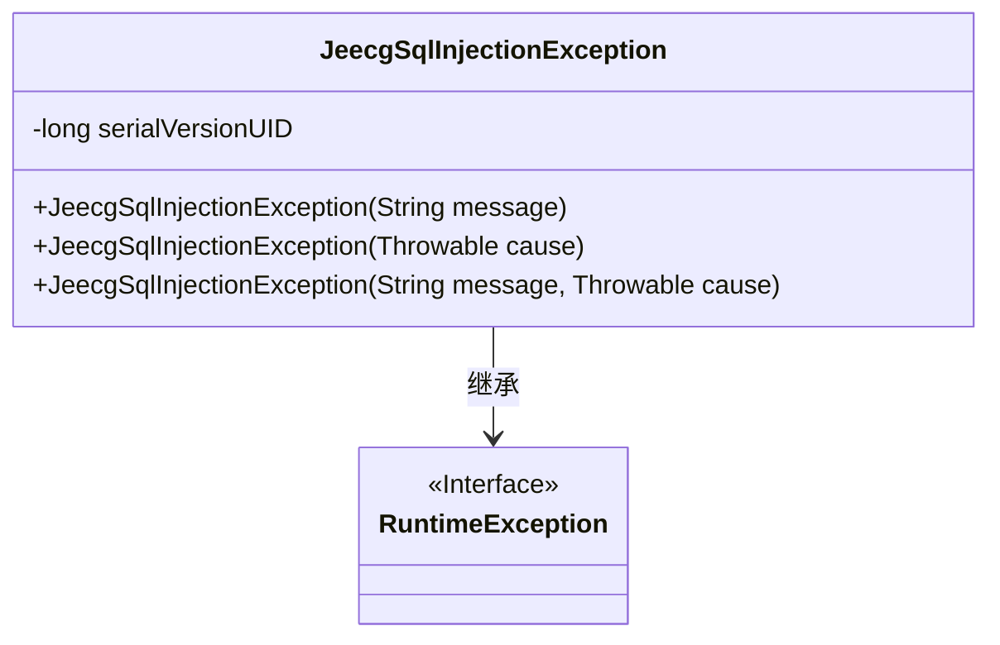
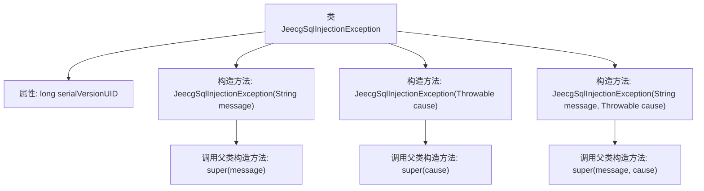

# 基础信息

|      |      |
|------|------|
| 名称 | JeecgSqlInjectionException |
| 编码语言 | .java |
| 代码路径 | JeecgBoot/jeecg-boot/jeecg-boot-base-core/src/main/java/org/jeecg/common/exception/JeecgSqlInjectionException.java |
| 包名 | org.jeecg.common.exception |
| 依赖项 | [] |
| 概述说明 | JeecgSqlInjectionException继承RuntimeException，提供三种构造方法处理SQL注入异常。 |

# 说明

JeecgSqlInjectionException是一个继承自RuntimeException的异常类，专门用于处理SQL注入异常。该类提供了三种构造方法，分别用于不同场景下的异常处理。这些构造方法使得开发者能够灵活地捕获和抛出SQL注入相关的异常，确保应用程序在遇到此类问题时能够及时响应并采取相应措施。通过这种方式，JeecgSqlInjectionException增强了代码的安全性和鲁棒性，有效防止SQL注入攻击对系统造成的影响。

# 类列表 Class Summary

| 名称   | 类型  | 说明 |
|-------|------|-------------|
| JeecgSqlInjectionException | class | JeecgSqlInjectionException继承RuntimeException，提供三种构造方法处理SQL注入异常。 |

## 类 JeecgSqlInjectionException

|      |      |
|------|------|
| 访问范围 | public |
| 类型 | class |
| 名称 | JeecgSqlInjectionException |
| 说明 | JeecgSqlInjectionException继承RuntimeException，提供三种构造方法处理SQL注入异常。 |

### UML类图

这段代码定义了一个名为 `JeecgSqlInjectionException` 的异常类，该类继承自 `RuntimeException`。`JeecgSqlInjectionException` 类提供了三个构造函数，分别用于处理不同的异常情况：仅传递异常消息、仅传递异常原因，以及同时传递异常消息和原因。该类主要用于处理SQL注入相关的异常，继承了 `RuntimeException` 的所有特性，并增加了自定义的构造函数以便更灵活地处理异常。

### 内部方法调用关系图

这段代码定义了一个名为 `JeecgSqlInjectionException` 的异常类，它继承自 `RuntimeException`。该类包含三个构造方法，分别用于处理不同的异常情况：仅传递错误信息、仅传递异常原因，以及同时传递错误信息和异常原因。每个构造方法都会调用父类的相应构造方法来初始化异常对象。

### 字段列表 Field List

| 名称  | 类型  | 说明 |
|-------|-------|------|
| serialVersionUID = 1L | long | 定义序列化版本号，确保类版本兼容性。 |

### 方法列表 Method List

| 名称  | 类型  | 说明 |
|-------|-------|------|

