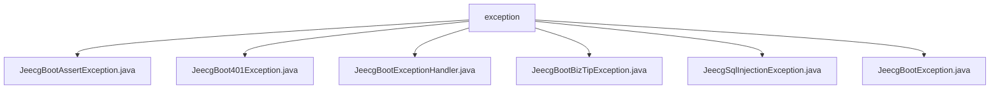

# 基础信息

|      |      |
|------|------|
| 名称 | exception |
| 编码语言 | .java |
| 代码路径 | JeecgBoot/jeecg-boot/jeecg-boot-base-core/src/main/java/org/jeecg/common/exception |
| 包名 | JeecgBoot.jeecg-boot.jeecg-boot-base-core.src.main.java.org.jeecg.common.exception |
| 概述说明 | JeecgBoot异常类用于处理断言、401错误、业务逻辑、SQL注入等异常，提供灵活构造方法和错误码，增强系统稳定性和安全性。 |

# 说明

## 概述
该代码模块是JeecgBoot框架中的异常处理核心模块，主要用于捕获、处理和记录系统运行过程中可能出现的各种异常情况。模块包含多个自定义异常类，分别针对不同的业务场景和错误类型进行设计，如断言异常、401异常、业务逻辑错误、SQL注入异常等。这些异常类均继承自`RuntimeException`，并通过多种构造方法提供灵活的异常信息传递方式。此外，模块还包含一个异常处理器，能够自动检测并处理异常，记录详细的日志信息，并向用户或调用方返回相应的错误信息，从而提升系统的稳定性、安全性和可维护性。

## 主要业务场景
1. **断言异常处理**：通过`JeecgBootAssertException`处理断言相关的异常，提供详细的错误信息和错误码，便于开发者快速定位和解决问题。
2. **401异常处理**：`JeecgBoot401Exception`专门用于处理401未授权异常，确保在发生此类错误时能够准确地抛出和处理异常，增强代码的健壮性。
3. **业务逻辑错误提示**：`JeecgBootBizTipException`用于处理业务逻辑中的错误提示，支持通过错误码和错误信息进行灵活的异常处理，便于系统记录和排查问题。
4. **SQL注入异常处理**：`JeecgSqlInjectionException`专门用于捕获和抛出SQL注入相关的异常，增强代码的安全性，防止SQL注入攻击对系统造成影响。
5. **通用异常处理**：`JeecgBootException`作为基础异常类，用于处理框架中的通用异常情况，支持通过错误码、错误信息和异常原因进行详细的异常信息传递。
6. **异常处理器**：`JeecgBootExceptionHandler`负责自动检测和处理各类异常，记录详细的日志信息，并向用户或调用方返回相应的错误信息，确保系统在遇到异常时能够提供明确的反馈和指导。

通过以上设计，该模块有效地提升了系统的异常处理能力，减少了因异常导致的系统崩溃或功能失效的风险，同时增强了代码的可维护性和安全性。

### 包内部结构视图

该流程图展示了`exception`文件夹下的所有文件层级关系。`exception`作为根节点，包含了多个异常处理类文件，如`JeecgBootAssertException.java`、`JeecgBoot401Exception.java`等。每个文件都是`exception`文件夹的直接子节点，清晰地反映了文件之间的层级结构。

# 文件列表 File List

| 名称   | 类型  | 说明 |
|-------|------|-------------|
| [JeecgBootBizTipException.java](JeecgBootBizTipException.md) | file | JeecgBootBizTipException继承RuntimeException，含错误码和多构造方法。 |
| [JeecgBootAssertException.java](JeecgBootAssertException.md) | file | JeecgBootAssertException继承JeecgBootException，支持消息和错误码构造。 |
| [JeecgBootException.java](JeecgBootException.md) | file | JeecgBootException继承RuntimeException，包含错误码及多种构造方法。 |
| [JeecgSqlInjectionException.java](JeecgSqlInjectionException.md) | file | JeecgSqlInjectionException继承RuntimeException，提供三种构造方法处理SQL注入异常。 |
| [JeecgBootExceptionHandler.java](JeecgBootExceptionHandler.md) | file | JeecgBoot异常处理器处理多类异常，记录日志并返回错误信息。 |
| [JeecgBoot401Exception.java](JeecgBoot401Exception.md) | file | JeecgBoot401Exception继承RuntimeException，提供三种构造方法处理异常信息。 |

