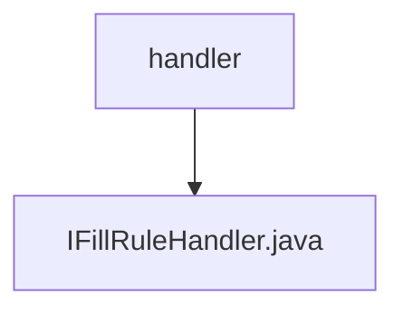

# 基础信息

|      |      |
|------|------|
| 名称 | handler |
| 编码语言 | .java |
| 代码路径 | JeecgBoot/jeecg-boot/jeecg-boot-base-core/src/main/java/org/jeecg/common/handler |
| 包名 | JeecgBoot.jeecg-boot.jeecg-boot-base-core.src.main.java.org.jeecg.common.handler |
| 概述说明 | 无内容，无法生成概要描述。 |

# 说明

内容为空，未提供具体信息或细节，无法进行总结描述。请提供相关文本或数据以便生成准确的描述。

### 包内部结构视图

该流程图展示了路径的层级关系，`handler` 是父节点，`IFillRuleHandler.java` 是其子节点。`handler` 是路径中的文件夹名称，而 `IFillRuleHandler.java` 是该文件夹下的文件。这种结构清晰地表示了文件与文件夹之间的从属关系，简洁明了地展示了路径的层级结构。

# 文件列表 File List

| 名称   | 类型  | 说明 |
|-------|------|-------------|
| [IFillRuleHandler.java](IFillRuleHandler.md) | file | 无内容，无法生成概要描述。 |

