# 基础信息

|      |      |
|------|------|
| 名称 | system |
| 编码语言 | .java |
| 代码路径 | JeecgBoot/jeecg-boot/jeecg-boot-base-core/src/main/java/org/jeecg/common/system |
| 包名 | JeecgBoot.jeecg-boot.jeecg-boot-base-core.src.main.java.org.jeecg.common.system |
| 概述说明 | 代码模块包含工具类，用于数据权限、枚举字典、SQL查询、JWT令牌处理，提升系统灵活性与安全性。 |

# 说明

## 概述
该代码模块是JeecgBoot框架的核心模块，提供了多种工具类和模型类，涵盖了数据权限管理、枚举类字典数据处理、SQL查询条件生成、JWT令牌处理、权限管理、数据查询、用户信息管理、部门管理、文件管理、数据源管理、字典管理、树形结构管理、组合数据管理、分类管理等多个方面。模块通过定义字段和方法，提供了对系统数据的结构化管理和操作支持，确保系统的安全性、合规性和高效性。此外，模块还提供了基础服务的实现，如Excel文件的导出与导入功能，以及MyBatis Plus查询条件的生成和处理，增强了代码的可扩展性和可维护性。

## 主要业务场景
1. **数据权限管理**：通过`JeecgDataAutorUtils`类处理数据权限和用户信息的管理，确保在查询和操作数据时，能够有效控制用户的访问权限。
2. **枚举类字典数据处理**：使用`ResourceUtil`类管理和操作枚举类相关的字典信息，支持字典翻译和实现类的获取。
3. **SQL查询条件生成**：`SqlConcatUtil`类用于根据不同的输入条件和数据源，灵活生成SQL查询语句，简化数据库操作中的查询条件生成过程。
4. **JWT令牌处理**：`JwtUtil`类用于生成、验证和提取JWT令牌，支持身份验证和授权相关的任务。
5. **权限管理**：通过`SysPermissionDataRuleModel`类定义和管理权限数据规则，确保系统的安全性和合规性。
6. **数据查询**：使用`DictQuery`类进行高效的数据查询操作，支持表名、存储列、显示列等属性的配置。
7. **用户信息管理**：通过`SysUserCacheInfo`、`UserAccountInfo`、`LoginUser`等类存储和管理用户的缓存信息、账户信息及登录信息。
8. **部门管理**：`SysDepartModel`类用于定义和管理部门信息，支持层级关系和部门属性的配置。
9. **文件管理**：`SysFilesModel`类用于管理系统文件，支持文件ID、名称、地址、类型等属性的管理。
10. **数据源管理**：`DynamicDataSourceModel`类用于动态配置和管理数据源，支持ID、编码、类型、驱动等属性的配置。
11. **字典管理**：`DictModel`和`DictModelMany`类用于管理和标识字典数据，支持数据值、文本描述、颜色等属性的配置。
12. **树形结构管理**：`SelectTreeModel`类用于表示和管理树形结构数据，支持节点标识、标题、父ID等属性的配置。
13. **组合数据管理**：`ComboModel`类用于存储和管理组合数据，支持ID、标题、选中状态、用户名等属性的配置。
14. **分类管理**：`SysCategoryModel`类用于定义和管理分类信息，支持主键、父节点、名称、编码等属性的配置。
15. **Excel文件处理**：`JeecgController`类提供了Excel文件的导出与导入功能，支持多sheet导出，允许用户自定义字段，并能够处理批量导入的数据。
16. **MyBatis Plus查询条件生成与处理**：`QueryGenerator`类用于生成MyBatis Plus的查询条件，支持区间查询、模糊查询、高级查询等常见查询需求，`QueryCondition`类用于封装查询条件，支持特殊字符处理和自定义查询规则。

这些业务场景共同构成了该模块的核心功能，为系统提供了全面的数据管理和业务逻辑支持。

### 包内部结构视图

```mermaid
graph TD
    system --> util
    system --> vo
    system --> annotation
    system --> enhance
    system --> base
    system --> query
    util --> JeecgDataAutorUtils.java
    util --> ResourceUtil.java
    util --> SqlConcatUtil.java
    util --> JwtUtil.java
    vo --> SysPermissionDataRuleModel.java
    vo --> DictQuery.java
    vo --> SysCategoryModel.java
    vo --> ComboModel.java
    vo --> SelectTreeModel.java
    vo --> SysUserCacheInfo.java
    vo --> DictModelMany.java
    vo --> DictModel.java
    vo --> SysDepartModel.java
    vo --> UserAccountInfo.java
    vo --> LoginUser.java
    vo --> SysFilesModel.java
    vo --> DynamicDataSourceModel.java
    annotation --> EnumDict.java
    enhance --> UserFilterEnhance.java
    base --> entity
    base --> controller
    base --> service
    base --> impl
    entity --> JeecgEntity.java
    controller --> JeecgController.java
    service --> JeecgService.java
    impl --> JeecgServiceImpl.java
    query --> QueryGenerator.java
    query --> QueryRuleEnum.java
    query --> MatchTypeEnum.java
    query --> QueryCondition.java
```

该流程图展示了JeecgBoot项目中`system`目录下的层级结构。`system`包含多个子目录，如`util`、`vo`、`annotation`等，每个子目录下又有具体的Java文件。例如，`util`目录下包含`JeecgDataAutorUtils.java`等文件，`vo`目录下包含`SysPermissionDataRuleModel.java`等文件。整体结构清晰，展示了各个模块及其所属文件的层级关系。

# 文件列表 File List

| 名称   | 类型  | 说明 |
|-------|------|-------------|
| [annotation](annotation/_module.md) | package | 信息为空，无法生成概要描述。 |
| [query](query/_module.md) | package | QueryGenerator类支持多种查询功能，处理特殊字符和自定义规则，QueryCondition类封装查询条件，灵活易维护。 |
| [base](base/_module.md) | package | JeecgEntity类含核心字段跟踪实体生命周期，JeecgController支持Excel导入导出，JeecgServiceImpl提供统一业务逻辑处理。 |
| [enhance](enhance/_module.md) | package | 信息为空，无法生成概要描述。 |
| [vo](vo/_module.md) | package | SysPermissionDataRuleModel管理权限规则，DictQuery执行数据查询，SysCategoryModel处理分类，ComboModel存储数据，SelectTreeModel表示树形结构，SysUserCacheInfo存储用户缓存，DictModelMany管理字典，DictModel处理数据，SysDepartModel定义部门，UserAccountInfo存储账户信息，LoginUser存储登录信息，SysFilesModel管理文件，DynamicDataSourceModel管理数据源。 |
| [util](util/_module.md) | package | Jeecg工具类集，包括数据权限管理、枚举字典处理、SQL条件生成及JWT操作功能。 |

