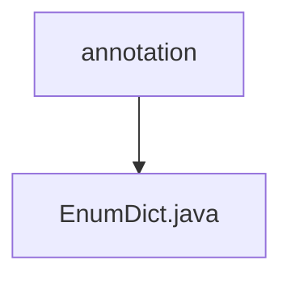

# 基础信息

|      |      |
|------|------|
| 名称 | annotation |
| 编码语言 | .java |
| 代码路径 | JeecgBoot/jeecg-boot/jeecg-boot-base-core/src/main/java/org/jeecg/common/system/annotation |
| 包名 | JeecgBoot.jeecg-boot.jeecg-boot-base-core.src.main.java.org.jeecg.common.system.annotation |
| 概述说明 | 信息为空，无法生成概要描述。 |

# 说明

提供的文本为空，没有包含任何具体内容或关键信息，因此无法进行总结描述。请提供具体内容以便生成相应的总结。

### 包内部结构视图

该流程图展示了路径的层级关系，`annotation` 是上级目录，`EnumDict.java` 是下级文件。路径结构简单，仅包含一个目录和一个文件，清晰地反映了文件在项目中的位置关系。

# 文件列表 File List

| 名称   | 类型  | 说明 |
|-------|------|-------------|
| [EnumDict.java](EnumDict.md) | file | 信息为空，无法生成概要描述。 |

