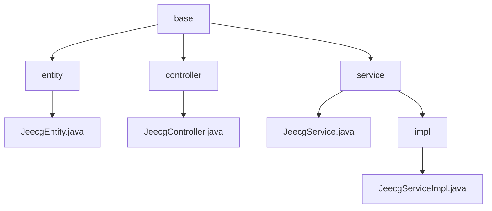

# 基础信息

|      |      |
|------|------|
| 名称 | base |
| 编码语言 | .java |
| 代码路径 | JeecgBoot/jeecg-boot/jeecg-boot-base-core/src/main/java/org/jeecg/common/system/base |
| 包名 | JeecgBoot.jeecg-boot.jeecg-boot-base-core.src.main.java.org.jeecg.common.system.base |
| 概述说明 | JeecgEntity类含核心字段跟踪实体生命周期，JeecgController支持Excel导入导出，JeecgServiceImpl提供统一业务逻辑处理。 |

# 说明

## 概述
该代码模块是JeecgBoot框架的核心基础模块之一，主要提供了一些基础服务的实现。模块中的`JeecgEntity`类是一个基础实体类，包含五个核心字段：ID、创建人、创建时间、更新人和更新时间，这些字段有助于跟踪实体的生命周期和变更历史。`JeecgController`类提供了Excel文件的导出与导入功能，支持多sheet导出，允许用户自定义字段，并能够处理批量导入的数据。`JeecgServiceImpl`类继承了`ServiceImpl`类，并实现了`JeecgService`接口，从而具备了`ServiceImpl`类的功能，并遵循了`JeecgService`接口的规范。这种设计模式增强了代码的可扩展性和可维护性。

## 主要业务场景
该模块主要用于处理系统的基础业务逻辑，特别是在服务层的实现上。通过继承和实现的方式，`JeecgServiceImpl`类能够提供统一的业务逻辑处理，适用于多种业务场景。`JeecgController`类的Excel导出与导入功能设计灵活，适用于多种数据处理场景，确保数据的高效管理与操作。这种设计使得业务逻辑的实现更加灵活，能够适应不同的业务需求，同时保持了代码的整洁和可维护性。

### 包内部结构视图

该流程图展示了JeecgBoot项目中`base`目录下的层级结构。`base`目录包含`entity`、`controller`和`service`三个子目录。`entity`目录下有一个`JeecgEntity.java`文件，`controller`目录下有一个`JeecgController.java`文件，`service`目录下有一个`JeecgService.java`文件和一个`impl`子目录，`impl`子目录下有一个`JeecgServiceImpl.java`文件。

# 文件列表 File List

| 名称   | 类型  | 说明 |
|-------|------|-------------|
| [service](service/_module.md) | package | JeecgServiceImpl继承ServiceImpl并实现JeecgService接口，增强扩展性和维护性。 |
| [controller](controller/_module.md) | package | JeecgController实现Excel多sheet导出、字段自定义及批量导入数据处理。 |
| [entity](entity/_module.md) | package | JeecgEntity类包含ID、创建人、创建时间、更新人、更新时间字段。 |

